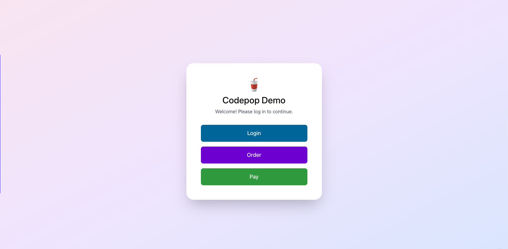
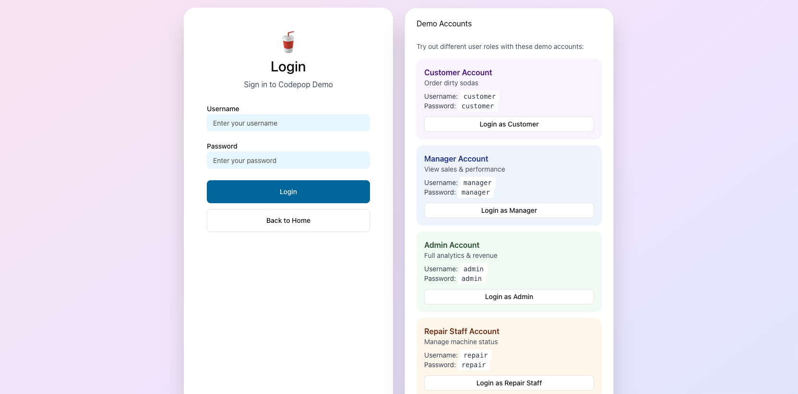
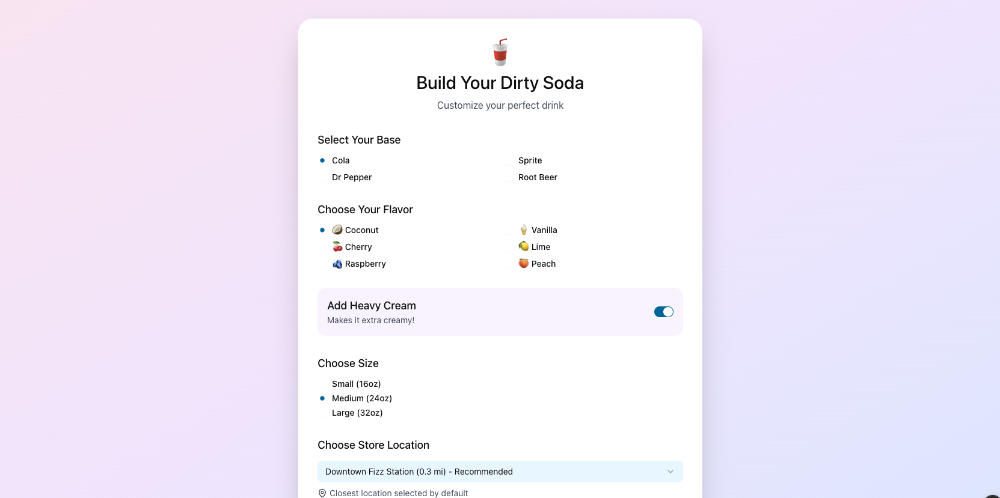
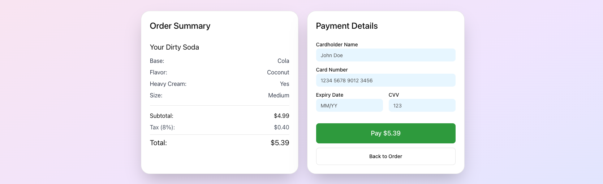
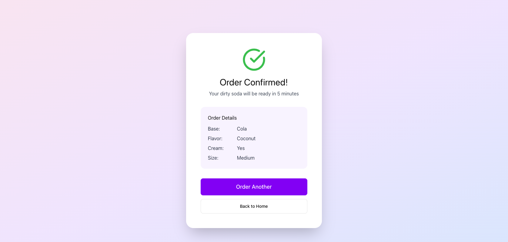
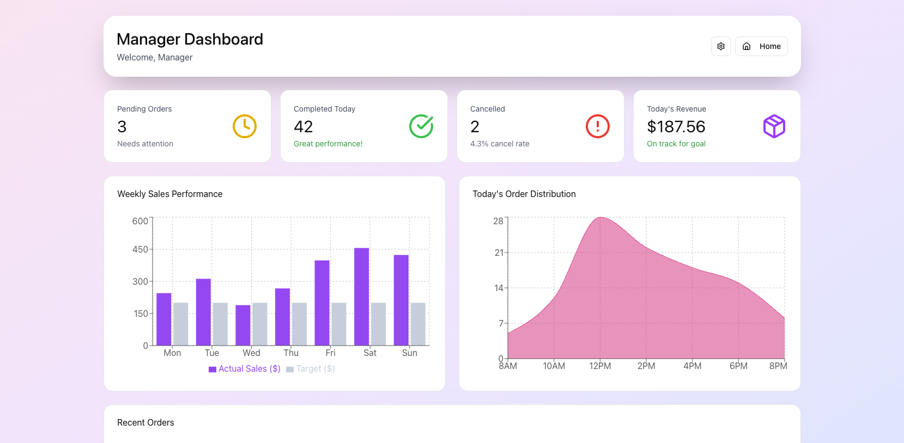
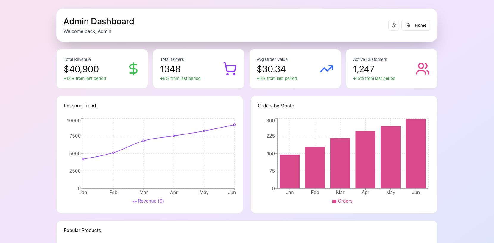
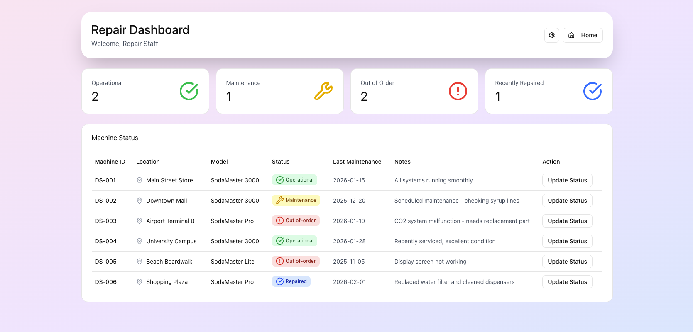
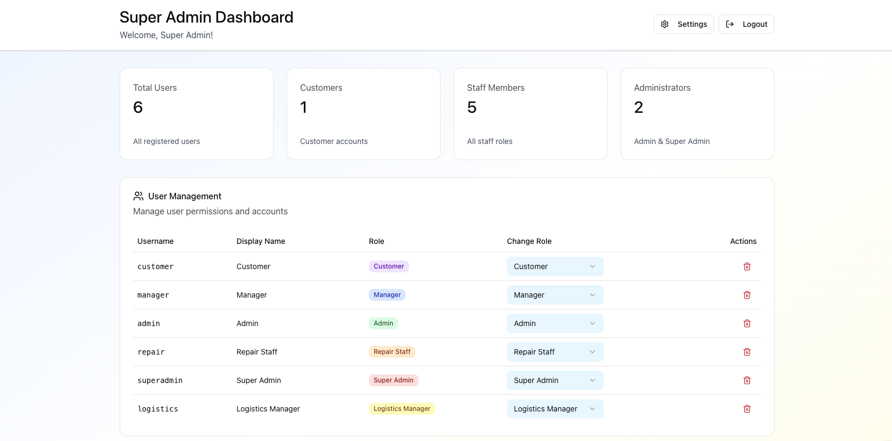
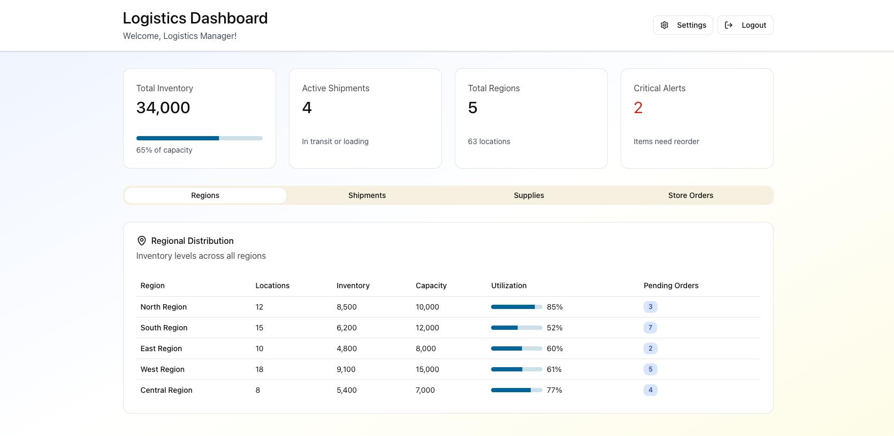

This document was created with assistance from ChatGPT.

# **Code Pop High-Level Design Document**

**Introduction**

* Purpose  
* Scope  
* Audience  
  **System Overview**  
* Problem Statement  
* Proposed Solution  
* Hardware Platform  
  * Mobile  
  * Laptop and Desktop

  **Architecture Design**

* Architecture Overview: Explanation of the overall architecture (monolithic, microservices, etc.)  
* Component Diagram: Diagram showing major system components and their relationships  
* Technology Stack: Technologies and frameworks used (e.g., languages, databases, servers)  
  * React Native  
  * Django  
  * PostgreSQL  
  * AI

  **Modules and Components (Internal Interfaces)**

* Module Overview: Description of key modules or components, their responsibilities, and interactions  
* Data Flow Diagram (DFD): Illustration of how data moves between components  
* Component Interaction: Details on how system components will communicate (e.g., APIs, web services)  
  **Data Design**  
* Data Model: High-level structure of data, including key entities and relationships  
* Database Design: Type of database used (relational, NoSQL, etc.), major tables, and relationships  
* Data Access Layer: Overview of how data is accessed, stored, and retrieved (e.g., ORM, SQL)  
  **Integration Points (External Interfaces)**  
* External Systems: Description of external systems or services the app will integrate with  
* APIs: List of public/external APIs, endpoints, methods, and data contracts  
  * Payment System: Stripe  
  * Geolocator: MapBox  
  * AI Chatbot: DialoGPT  
  * Notifications: Firebase Cloud Messaging (FCM)

  **User Interface (UI) Design Overview**

* UI/UX Principles: High-level UI/UX principles (e.g., responsiveness, accessibility)  
* Mockups: High-level mockups or wireframes of key screens  
* Navigation Flow: Overview of how users will navigate the app  
  **Input and Output (I/O)**  
* Input  
* Output  
  **Security and Privacy**  
* Authentication and Authorization: Description of user roles and permission management  
* Data Encryption: Explanation of how data will be encrypted (at rest and in transit)  
* Compliance: Relevant data protection laws (GDPR, HIPAA)  
* Privacy  
  **Testing Strategy**  
* Unit Testing  
* Manual Testing  
  **Risks and Mitigations**  
* Identified Risks: List of known risks (e.g., technology choice, dependencies)  
* Mitigation Plans: Strategies for addressing these risks  
  * User Geolocation  
  * User Input (AI)  
  * Payment Information  
  * Allergies  
  * User (Account) Information  
  * Location Revenue Information  
  * Legal Issues

---

## **1\. Introduction**

**Purpose**: This document exists to provide a reference for developers while working on the CodePop app to ensure that the development team can work independent of each other and still have code that will work together to form the final project at the end. 

**Scope**: This document has a large scope that encompasses just about every part of development, but it is more focused on the “why” of each design choice than the “how”. As such it won’t delve too deeply into the specific implementation detail.

**Audience**: This document is meant for developers and stakeholders of the project to ensure development is going in the right direction and everyone is on the same page.

## **2\. System Overview**

**Problem Statement**: In the world of dirty soda shops, there are too many options and many long lines, resulting in a confusing and overwhelming customer experience.

**Proposed Solution**: CodePop will provide a simple, AI-powered ordering experience to help eliminate the confusion and pressure typically associated with dirty soda shops.

**Hardware Platform**:  
CodePop is designed as a multi-store, distributed system operating across numerous locations throughout the United States. The platform must support a diverse range of users—from customers ordering drinks on mobile devices to managers overseeing multiple locations remotely, to logistics coordinators managing regional supply chains. This section outlines the hardware platforms CodePop will support, design priorities, and architectural considerations.

**Platform Architecture Overview**:  
Unlike traditional centralized applications, CodePop employs a **decentralized architecture** where there is no single central server controlling all operations. Each store maintains its own local operational data and communicates directly with other stores in its region, regional supply hubs, and users. This design choice ensures:
* **Autonomous operation**: Stores can continue processing orders, tracking inventory, and managing machines even during connectivity loss
* **Fault tolerance**: Network interruptions do not result in complete system failure
* **Scalability**: New stores can join the network through service discovery mechanisms without requiring system-wide reconfiguration
* **Reduced latency**: Users interact with their local store rather than routing through distant central servers

This decentralized model was chosen over alternatives (traditional client-server or fully centralized cloud architecture) because it better supports the business requirement for minimal human intervention while maintaining operational continuity across geographically distributed locations.

* **Mobile**:  
  * **Mobile Web Application (Priority)**:  
    CodePop's primary platform will be a mobile-optimized web application accessible through browsers on both Android and iOS devices. A web application was chosen over native mobile apps for several critical reasons:
    * **Cross-platform compatibility**: One codebase serves all mobile users regardless of device or operating system
    * **No installation required**: Users can access the system immediately without app store downloads, reducing friction for general users who may only order once
    * **Responsive design**: React Native allows us to build a responsive interface that adapts seamlessly to different screen sizes and orientations
    * **Lower development cost**: A single web application reduces the maintenance burden compared to separate iOS and Android native apps
    
    The mobile web app will support both account users (who access personalized features from any location) and general users (who order without creating accounts). Testing will initially focus on Android devices due to easier testing methods and broader device accessibility for the development team, but the application will be fully compatible with iOS from launch.
  * **Touchscreen Interaction**:  
    Touchscreen functionality is essential for accessibility and usability. The UI will be optimized for touch interactions with:
    * **Clear visual feedback**: All interactive elements will provide immediate visual response to touches (button press states, selection highlights)
    * **Avoiding complex gestures**: Touch-and-hold actions will be avoided in the initial version to reduce complexity and prevent user confusion, particularly for users with motor impairments
    
  * **Portrait vs. Landscape**:  
    The application will be optimized primarily for **portrait mode** because:
    * Most users hold phones vertically when ordering on-the-go, matching natural phone usage patterns
    * Portrait orientation allows one-handed operation, critical for users carrying items or multitasking
    
  * **Offline Capability & Security**:  
    While full offline ordering is not required (payment processing and store communication require connectivity), the mobile application will implement secure local caching:
    * **Cached data**: Menu items, user preferences (encrypted), and saved payment method metadata (tokens only, never full card numbers)
    * **Security considerations**: All cached sensitive data will be encrypted at rest using industry-standard encryption (AES-256)
    * **Benefits**: Faster load times and basic menu browsing during temporary connectivity issues
    * **Limitations**: Orders will require network connectivity to process payments through Stripe and communicate with store systems
    * **Data synchronization**: When connectivity is restored, the app will sync any user preference updates with the decentralized store network

* **Desktop/Laptop Platform (Secondary Support)**:  
  * **Web Application for Administrative Users**:  
    Desktop and laptop access is critical for administrative, managerial, and logistics personnel who need to oversee multiple locations, analyze data, and manage complex workflows. Unlike customer-facing mobile interfaces, desktop users require:
    * **Multi-window/multi-tab support**: Monitoring several stores simultaneously for super admins and logistics managers
    * **Larger screen real estate**: Viewing comprehensive reports, revenue data, inventory levels across regions, and maintenance schedules
    * **Keyboard shortcuts and mouse interactions**: Faster data entry, CSV imports/exports, and navigation through complex administrative tasks
    * **Data visualization**: Charts, graphs, and dashboards for analyzing trends across the multi-store network
    
    The desktop interface will share the same backend and data models as the mobile interface but will feature a different layout optimized for horizontal screens and extensive data visualization. Desktop users include:
    * **Super Admins**: Accessing system-wide data across all stores nationwide, monitoring network health, and managing high-level permissions
    * **Admins**: Managing individual store user accounts, handling account locks/unlocks, and viewing store-specific operations
    * **Managers**: Viewing revenue reports, inventory levels, and expense data for their assigned store locations
    * **Logistics Managers**: Coordinating supply distribution across seven regional hubs using interactive mapping tools (MapBox), CSV import/export for demand forecasting, and AI-assisted supply recommendations
    * **Repair Staff**: Scheduling maintenance visits, optimizing repair routes to minimize travel time, and tracking machine status across multiple locations
    
  * **Browser Compatibility & Security** (Must Have):  
    The web application must function consistently and securely across major browsers:
    * **Chrome** (primary development target) - version 90+
    * **Firefox** - version 88+
    * **Safari** - version 14+ (critical for macOS and iOS users)
    * **Edge** - version 90+ (Chromium-based)
    
    **Security considerations**:
    * All browsers must support modern TLS 1.3 for encrypted communications between stores and users
    * Token-based authentication (Django's built-in system) will work consistently across all browsers
    * Regular cross-browser testing will be performed throughout development to catch both compatibility and security issues early
    * Browser-specific security features (Content Security Policy, CORS) will be properly configured
    
  * **Touchscreen Laptops**:  
    While touchscreen laptops and 2-in-1 devices exist, they will not receive specialized optimization in the initial release. The standard responsive web design will provide adequate functionality, but touch targets and gestures will remain optimized for mobile form factors. Future iterations may include hybrid input modes if user data indicates significant touchscreen laptop usage among administrative staff.

* **Hardware Platform Justification & Security Architecture**:  
  The choice of web-based platforms (mobile-first, desktop-secondary) over native applications was made to:
  1. **Support the decentralized architecture**: Web technologies enable direct communication between distributed store nodes without app store gatekeeping or approval delays for critical security updates
  2. **Reduce development time**: A unified web codebase allows the team to focus on core functionality and security hardening rather than platform-specific implementations
  3. **Enable rapid iteration**: Web deployment allows instant security patches and feature updates across all stores and users simultaneously without requiring user action
  4. **Lower barriers to entry**: Users don't need to install anything to start ordering, reducing friction while maintaining security through HTTPS and token authentication
  5. **Simplify multi-store synchronization**: Web technologies and standard protocols (HTTPS, WebSockets) facilitate the secure store-to-store and store-to-hub communication required by the decentralized model
  6. **Enhanced security posture**: Web-based architecture allows centralized security policy enforcement while maintaining operational decentralization

## **3\. Architecture Design**

* **Architecture Overview**:   
  * This will be a client-server architecture where the app run on the phone will be a client that will communicate and get information from our server and then display that information for the user.  
* **Component Diagram**: Diagram showing major system components and their relationships.  
* **Technology Stack**:  
  Technologies and frameworks used (e.g., languages, databases, servers).  
  * **React Native (Frontend):**   
    * React native is a very popular front end development framework that is widely supported by most API’s and backend frameworks.  
    * React is based on javascript which offers the best integration and flexibility for a lightweight client-server integration.  
    * React’s hot reload feature offers much more flexibility to front end developers to see changes in real time, which leads to faster, more flexible front end development.   
  * **Django(Backend):**  
    * Django comes preloaded with user authentication and security built in which should help us save time in not having to develop those parts of the software.  
    * Django also is widely supported by most tools because of its popularity.  
  * **PostgreSQL(Database):**  
    * PostgreSQL is well suited for databases that have complex relationships.  
    * It is one of the most popular databases to be used with Django meaning there is a lot of community support and help for PostgreSQL.  
    * PostgreSQL is very scalable meaning it will function well with both large and small amounts of data  
  * **Artificial Intelligence (AI)**:  
    * **Scikit-Learn** will be the AI library we use for both of the AI Models listed below (Content-Based Model & Item-Based Collaborative Filtering Model). We have chosen this library for the following reasons:  
      * Is free  
      * Is protected under the BSD license, which allows for free usage in personal and commercial projects  
      * Easy to implement  
      * Works well for small datasets  
      * Is widely used in academia and industry, providing strong documentation for any of our future needs  
      * Uses Python  
    * **Content-Based AI Filtering Model by Scikit-Learn** will be used for the personalized drink suggestion for account users. We have decided this model for the following reasons:  
      * **Does not require large amounts of user data**:  
        As a startup, we will not have significant user data to rely on initially. This model allows for an enhanced customer experience from the start without the need for extensive data.  
      * **Allows for cold-starts for new users**:  
        Since the recommendations are item-based, the AI does not depend on other users for suggestions. This provides personalized recommendations to new users even before we gather large-scale user interaction.  
      * **Is highly personal and customizable**:  
        This model operates solely on user A’s data, not on data from users B or C. As a result, the recommendations for each user will be entirely different, offering a deeply personalized and unique experience.  
- The downside of this model is that it does not capture popularity trends.  
  * **Item-Based Collaborative Filtering Model (Optional) by Scikit-Learn** for the random drink suggestion.   
    * **Leverages User Behavior:** Identifies relationship between items and clicks, ratings, purchases, etc.  
      * **Diverse Recommendations:** Unlike the content-based model, this model suggests items that the users might not have considered on their own  
      * **Captures popularity trends**  
- The downsides of this model is that new items can’t be recommended to users until there has been enough interaction. For this reason, we decided to use the content-based filtering model for more personal suggestions (especially because our drink preference data will be very scattered at the beginning)  
  * **Gemini (AI Images)**  
    * AI images will be used for smaller items like Loading Screens, Icons, Logos, etc.  
      * Although AI is the future, we want to give our front-end team the opportunity to learn how to create a variety of custom images, animations, and backgrounds. AI Images will be a smaller part of the front-end team’s bigger creation.  
    *   
    * 
    
    
    

## **4\. Modules and Components (Internal Interfaces)** 

* **User Management Module:** Manages customer profiles, authentication, and user interactions.  
  * Responsibilities  
    * User registration and login  
      * Email confirmation (Django)  
    * Profile management  
    * Preferences and order history  
  * Components  
    * User service: Handles user data storage and retrieval  
    * Authentication service: Manages login, sessions, and secure password management  
    * Recommendation service: Manages preferences and order history  
    * Guest service: Manages generic users (users with no account) **NEW**
* **Soda Catalog Module:** Manages the inventory of soda products and custom drink options.  
  * Responsibilities  
    * Product listing and categorization  
    * Custom drink creation  
    * Inventory management  
  * Components  
    * Product service: Manages operations for soda products  
    * Customization service: Allows users to create custom sodas  
    * Inventory service: Tracks stock levels and alerts for low inventory  
    * Supply hub service: Track inventory shipments and delivery times and fulfillment **NEW**
* **Order Management Module:** Handles the order lifecycle from creation to delivery.  
  * Responsibilities  
    * Order placement and tracking  
    * Payment processing  
    * Order completion scheduling  
  * Components  
    * Order service: Manages order creation, updates, and status  
    * Payment service: Handles payment transactions  
    * Order completion service: Manages scheduling of orders and geolocation tracking  
* **AI Recommendation Module:** Provides personalized and randomized soda recommendations using AI.  
  * Responsibilities  
    * Analyze user preferences and behavior  
    * Generate product suggestions based on preferences  
    * Improve recommendations over time  
    * Generate random product suggestions  
  * Components  
    * Data Analysis Service: Analyzes user data and preferences for insights  
    * AI Model: Generates recommendations based on past behavior and trends
* **Maintenance Module:** Manages operational machines used in drink preparation and fulfillment **NEW**  
  * Responsibilities  
    * Track machine type and model  
    * Operational start date  
    * Current machine status  
    * Complete maintenance and repair history  
  * Components  
    * Repair services: Based on machine status dispatch a technician to repair  
    * Optimization services: Optimize repair and maintenance schedules using AI-assisted planning

### **Additional Internal Interfaces**

* **Component to Component Paths**
    * User Management Module <-> Soda Catalog Module <-> Order Management Module <-> AI Recommendation Module
    * Soda Catalog Module <-> Order Management Module
    * Order Management Module <-> User Management Module <-> Soda Catalog Module <-> AI Recommendation Module
    * AI Recommendation Module <-> User Management Module <-> Soda Catalog Module
    * Maintenance Module <-> Soda Catalog Module

* **Interaction Styles**
    * Use internal api/function calls to interact between different system components

* **Shared Data and/or Services**
    * User Management Module, Soda Catalog Module, and AI Recommendation module will share the following data
        * Inventory
        * User preferences

* **Error Handling**
    * Server errors should be handled server side and if it affects the user side display a simple message
    * User side errors should be handled on the user end and display a short but informative message
    * External service errors should be handled server side and if it affects the user side display a simple message

## **5\. Data Design**

### **Data Model:**

* **Key Entities**  
  * **User:** Represents a person who uses the application, whether as a general user or an account user. The User entity stores all the necessary information about the user, such as login credentials and profile details.  
    * **UserID:** (Primary Key) A unique identifier for each user.  
    * **Username:** The user's chosen name for logging in and identification within the app.  
    * **Password:** The user's password, stored securely  
      * Encryption: **Yes**   
    * **Email:** The user’s email address  
      * Encryption: **Yes**  
    * **UserRole:** Defines the role of the user (e.g., admin, manager, account user)  
    * **OrderHistory:** A reference to all orders made by the user.  
  * **Preference**: Stores individual drink preferences for each user. This table adheres to First Normal Form (1NF), meaning that each preference is stored as an atomic value rather than as a comma-separated list.  
    * **PreferenceID**: (Primary Key) A unique identifier for each preference entry.  
    * **UserID**: (Foreign Key) Links the preference to the user who selected it.  
    * **Preference**: A string representing the individual drink preference (e.g., "Strawberry", "Vanilla").  
    * Example:  
       
  * **Order:** Represents a purchase made by a user, containing details about the drinks ordered, their status, and payment information.  
    * **OrderID:** (Primary Key) A unique identifier for each order.  
    * **UserID:** (Foreign Key) Links the order to the user who placed it.  
    * **DrinkDetails:** Information about the drinks included in the order.  
    * **OrderStatus:** The current status of the order (e.g., pending, completed, canceled).  
    * **PaymentStatus:** Indicates whether payment has been completed, pending, or refunded.  
    * **PickupTime:** The scheduled or expected time for the order to be picked up.  
    * **CreationTime:** The time when the order was placed.  
  * **Drink:** Represents the various drink combinations that can be ordered by users. It includes information about the ingredients used and the drink's price.  
    * **DrinkID:** (Primary Key) A unique identifier for each drink.  
    * **SyrupsUsed:** A list of syrups included in the drink.  
    * **SodaUsed:** The type of soda used in the drink.  
    * **AddIns:** Any additional ingredients added to the drink (e.g., ice, fruit).  
    * **Rating:** Optional, allows users to rate the drink.  
    * **Price:** The cost of the drink.  
  * **Inventory:** Represents the items available in the store's inventory, including syrups, sodas, and add-ins. Tracks the quantity and threshold levels for restocking.  
    * **InventoryID:** (Primary Key) A unique identifier for each inventory item.  
    * **ItemName:** The name of the inventory item (e.g., a specific syrup or soda brand).  
    * **Quantity:** The current amount of the item in stock.  
    * **Threshold Level:** The minimum quantity before a restock notification is triggered.  
    * **LastUpdated:** The date and time when the inventory was last updated.  
  * **Payment:** Represents payment transactions associated with orders. It stores information about the payment process and its status.  
    * **PaymentID:** (Primary Key) A unique identifier for each payment transaction.  
    * **OrderID:** (Foreign Key) Links the payment to the specific order.  
    * **UserID:** (Foreign Key) Links the payment to the user who made it.  
    * **Amount:** The total amount paid.  
    * **PaymentMethod:** The method of payment used (e.g., credit card, PayPal)  
    * **PaymentStatus:** Indicates whether the payment was successful, pending, or failed.  
    * **RefundStatus:** Indicates if a refund has been issued  
      * Encryption: **Yes** (Sensitive information such as payment details should be encrypted).  
  * **Notifications:** Represents notifications sent to users, informing them of order status updates, inventory issues, or other important messages.  
    * **NotificationID:** (Primary Key) A unique identifier for each notification.  
    * **UserID:** (Foreign Key) Links the notification to the specific user.  
    * **Message:** The content of the notification.  
    * **Timestamp:** The time when the notification was sent.  
    * **Type:** The type of notification (e.g., order update, promotional message).  
  * **QRCode:**  
    * **QRCodeID:** (Primary Key) A unique identifier for each QR code entry.  
    * **OrderID:** (Foreign Key) Links the QR code to a specific order that contains soda.  
    * **QRCodeData:** The data or link that the QR code contains (e.g., a link to open the fridge).  
    * **ExpirationTime:** The time when the QR code expires and is no longer usable.  
  * **Revenue:**  
    * **RevenueID:** (Primary Key) A unique identifier for each revenue entry.  
    * **TotalAmount:** The total revenue generated from completed orders.  
    * **Date:** The date when the revenue was recorded (e.g., daily, weekly, or monthly).  
    * **ManagerID:** (Foreign Key) Links to the manager who has access to the revenue data.  
* **Relationships**  
  * **User to Order:** One-to-Many (A user an place multiple orders)  
  * **User to Preferences:** One-to-Many (Each user can have multiple preferences, and each preference is a unique value for that user).  
  * **Order to Drink:** Many-to-Many (An order and include multiple drinks, and a drink can be part of many orders)  
  * **Revenue to Order:** One-to-Many (Revenue is updated when an order is completed)  
  * **Revenue to User:** One-to-Many (Only a User with the Manager role has access to view revenue)  
  * **Inventory to Drink:** Many-to-Many (A drink can use multiple inventory items, and an inventory item can be used in multiple drinks.)  
  * **User to Payments:** One-to-Many (A user can have multiple payments)  
  * **User to notifications:** One-to-Many (A user can receive multiple notifications)  
  * **Order to QRCode:** One-to-One (A QR code is generated an order)  
  * **Notification to QRCode:** One-to-One (The QR code is sent to the user as  notification)

### **Database Design:**

* **Relational Database (PostgreSQL):** Well-suited for managing complex relationships and ensuring transactional integrity. PostgreSQL supports advanced features like JSONB fields, which can be useful for storing unstructured data like user preferences or dynamic order details  
* **Major Tables in PostgreSQL** (Mapped from Django Models):  
  * **Auth\_user Table:**  
    * Stores user data.   
    * Columns: id: username, email, password, role, dataJoined, lastLogin  
  * **Order Table**  
    * Stores order data.   
    * Columns: id, userId, status, paymentStatus pickupTime, createdAt  
  * **Drink Table**  
    * Stores drink details.   
    * Columns id, itemName, quantity, thresholdLevel, lastUpdated  
  * **Inventory Table:**  
    * Stores inventory data.   
    * Columns: id, itemName, quantity, thresholdLevel, lastUpdated  
  * **Payment Table:**  
    * Stores payment information.   
    * Columns: id orderId, userId, amount, paymentMethod, paymentStatus, createdAt  
  * **Notification Table:**  
    * Stores notifications.   
    * Columns: id, userId, message, timestamp, type  
  * **Preference Table:**   
    * Stores user preferences for drinks  
    * Columns: id, userID preferences  
  * **Revenu Table:**  
    * Stores store revenue data accessible to managers  
    * Columns: id, totalAmount, date, managerId  
  * **QRCode Table:**  
    * Stores QR codes for orders that include sodas. These codes allow users to open the fridge   
    * Columns: id, orderId, QRCodeData, expirationTime  
* **Relationships in PostgreSQL:**  
  * Defined through Foreign Keys and Many-to-Many relationships in Django models. Django automatically handles join tables for Many-to-Many relationships.  
* **Indexes**  
  * Django creates indexes on primary keys and foreign keys by default. You can create additional indexes using the db\_index=True option in model fields or Meta class options for performance optimization.


### **Data Access Layer:**

* In Django, the data access layer is primarily handled through the ORM, which abstracts SQL queries into Python code.  
* **Data Access Patterns:**   
  * **ORM Queries**: Django’s ORM allows you to perform CRUD operations (Create, Read, Update, Delete) directly through model methods. For instance  
    * *Order.objects.create(user=user, status='Pending', ...)*  
    * *Order.objects.filter(user=user).order\_by('-created\_at')*  
  * **Raw SQL Queries:** Django allows executing raw SQL if needed using *Model.objects.raw()* or *connection.cursor()*. This is useful for complex queries or optimizations.  
  * **Transitions:** Django provides transaction management via *transaction.atomic()*, ensuring that operations like placing an order and processing a payment are treated as a single transaction.  
  * **Caching:**  Use Django's caching framework with backends like Redis for improving performance on frequently accessed data (e.g., drink menus, user preferences)  
* **Migration Management:**  
  * Django handles database migrations through the makemigrations and migrate commands. This keeps the database schema in sync with your models.  
* **Data Encryption:**  
  * Django automatically hashes passwords using PBKDF2 by default, and you can enhance this with Argon2 or bcrypt.  
  * For sensitive data fields, consider using Django-encrypted-fields or custom encryption methods.  
* **Access Control:**  
  * Implement Django's built-in permissions and groups to enforce role-based access control.  
  * Use Django's middleware and decorators (@login\_required, @permission\_required) to secure views.  
* **Backup and Recovery:**  
  * Regularly back up the PostgreSQL database using tools like pg\_dump. Automate this process with cron jobs or Django management commands.  
  * Test recovery procedures to ensure data can be restored effectively.

## **6\. Integration Points (External Interfaces)**

### 6.1 Identify External Systems

CodePop integrates with seven external systems to deliver its complete feature set. These systems were selected based on market maturity, security compliance, cost-effectiveness, and developer ecosystem support.

| External System                    | Role                    | Criticality | Justification                                                                                                                                                                                                                                                                               |
| ---------------------------------- | ----------------------- | ----------- | ------------------------------------------------------------------------------------------------------------------------------------------------------------------------------------------------------------------------------------------------------------------------------------------- |
| **Stripe**                         | Payment processing      | Critical    | Industry-leading payment processor with PCI-DSS Level 1 certification, extensive documentation, and React Native SDK. Alternatives considered: Square (less mobile-focused), Braintree (steeper learning curve), PayPal (poor developer experience).                                        |
| **Mapbox**                         | Geolocation and mapping | High        | Superior mobile SDK performance and customization vs Google Maps; more generous free tier. Alternatives: Google Maps Platform (higher cost), Apple MapKit (iOS only), OpenStreetMap (requires self-hosting).                                                                                |
| **Firebase Cloud Messaging (FCM)** | Push notifications      | High        | Free, reliable cross-platform push notifications from Google. Native integration with Android; supports iOS via APNs. Alternatives: OneSignal (unnecessary third-party layer), AWS SNS (more complex), native APNs/FCM separately (redundant code).                                         |
| **Claude (Anthropic API)**         | AI assistant            | Medium      | State-of-the-art conversational AI with strong safety features; 200K context window supports rich drink recommendations with full ingredient lists. Alternatives: OpenAI GPT-4 (considered but higher cost per token), local models (insufficient quality), rule-based system (inflexible). |
| **Scikit-Learn**                   | ML library              | Medium      | Industry-standard Python ML library; runs in-process without API costs; mature demand forecasting capabilities. Alternatives: TensorFlow (overkill for tabular data), cloud ML services (adds latency and cost), manual forecasting (labor-intensive).                                      |
| **Django Email (SMTP)**            | Transactional email     | High        | Django's built-in email framework supports any SMTP provider, avoiding vendor lock-in. SMTP provider (SendGrid, AWS SES, etc.) selected at deployment. Alternatives: Twilio SendGrid API (vendor lock-in), Mailgun (similar but less configurable).                                         |
| **PostgreSQL**                     | Data storage            | Critical    | Open-source relational database with ACID compliance, JSON support, and proven scalability. Django ORM provides excellent integration. Alternatives: MySQL (weaker JSON support), MongoDB (poor fit for transactional data), SQLite (insufficient for production).                          |

**External Interface Architecture Diagram:**

```
┌─────────────────────────────────────────────────────────────────┐
│                        CodePop System                           │
│                                                                 │
│  ┌──────────────┐              ┌─────────────────┐            │
│  │ React Native │              │  Django Backend │            │
│  │   Frontend   │◄────────────►│   (Python)      │            │
│  └──────────────┘              └─────────────────┘            │
│         │                              │                       │
└─────────┼──────────────────────────────┼───────────────────────┘
          │                              │
          │ ┌────────────────────────────┼─────────────────┐
          │ │                            │                 │
          ▼ ▼                            ▼                 ▼
    ┌─────────────┐              ┌─────────────┐    ┌──────────┐
    │   Mapbox    │              │   Stripe    │    │PostgreSQL│
    │ (Map/Geo)   │              │  (Payment)  │    │   (DB)   │
    └─────────────┘              └─────────────┘    └──────────┘
          │                              │                 │
          │                              │                 │
    ┌─────────────┐              ┌─────────────┐          │
    │     FCM     │              │   Claude    │          │
    │  (Push)     │              │   (AI)      │          │
    └─────────────┘              └─────────────┘          │
          │                              │                 │
          │                       ┌─────────────┐         │
          │                       │Scikit-Learn │         │
          │                       │ (In-Process)│         │
          │                       └─────────────┘         │
          │                              │                 │
    ┌─────────────┐                     │                 │
    │ SMTP Server │◄────────────────────┘                 │
    │ (Email)     │◄──────────────────────────────────────┘
    └─────────────┘

Legend: ◄─► = Bidirectional    ▼ = Unidirectional
```

### 6.2 Define Purpose of Each Integration

Each external system serves a specific architectural purpose within CodePop. These integrations enable core functionality that would be impractical or cost-prohibitive to build in-house.

| External System  | Business Purpose                                                            | Technical Purpose                                                                                                  | Alternative Approach Rejected                                                                                                          |
| ---------------- | --------------------------------------------------------------------------- | ------------------------------------------------------------------------------------------------------------------ | -------------------------------------------------------------------------------------------------------------------------------------- |
| **Stripe**       | Accept customer payments securely without handling sensitive card data      | Offload PCI-DSS compliance burden; provide payment method tokenization; handle refunds and disputes                | Building in-house payment processing (requires PCI-DSS certification, card network agreements, fraud detection—infeasible for startup) |
| **Mapbox**       | Enable location-based order pickup; show users nearby store locations       | Provide real-time GPS tracking, geocoding, distance calculations, and interactive maps                             | Self-hosting maps (requires massive geographic data storage and map rendering infrastructure)                                          |
| **FCM**          | Notify customers when drinks are ready; send promotional messages           | Cross-platform push notification delivery without maintaining device connections                                   | Maintaining persistent WebSocket connections (drains battery, requires complex infrastructure, unreliable on mobile networks)          |
| **Claude**       | Provide intelligent customer support and personalized drink recommendations | Natural language understanding for complaints; context-aware recommendations considering allergies and preferences | Rule-based chatbot (inflexible, poor user experience) or human-only support (doesn't scale, high labor cost)                           |
| **Scikit-Learn** | Forecast ingredient demand to optimize inventory and reduce waste           | Time-series forecasting and regression models for supply chain optimization                                        | Manual forecasting spreadsheets (error-prone, time-consuming) or cloud ML APIs (adds latency and ongoing costs)                        |
| **Django Email** | Verify user accounts and enable password recovery                           | SMTP abstraction for vendor-neutral email delivery                                                                 | No email verification (security risk, spam accounts) or hard-coded to single provider (vendor lock-in)                                 |
| **PostgreSQL**   | Store all application data persistently and reliably                        | ACID-compliant transactional storage with relational integrity and Django ORM integration                          | NoSQL database (poor fit for relational order/inventory data) or cloud-only database (vendor lock-in, higher cost)                     |

### 6.3 Identify Interface Type

Each integration uses an interface protocol appropriate to its data patterns, latency requirements, and security model.

| External System  | Interface Type                             | Protocol Details                                                                          | Authentication Method                                                                | Data Flow Pattern                                                                                               |
| ---------------- | ------------------------------------------ | ----------------------------------------------------------------------------------------- | ------------------------------------------------------------------------------------ | --------------------------------------------------------------------------------------------------------------- |
| **Stripe**       | RESTful HTTPS API + Webhooks               | REST over TLS 1.3; JSON payloads; idempotent requests with idempotency keys               | API keys (secret for server, publishable for client); HMAC-SHA256 webhook signatures | **Bidirectional**: Frontend initiates payment; Stripe pushes webhook events to backend for payment confirmation |
| **Mapbox**       | RESTful HTTPS API + Client SDK             | REST API for geocoding/routing; WebGL-based map SDK for rendering                         | Bearer token authentication (public token for client, secret token for server)       | **Hybrid**: Client SDK renders maps using public token; backend queries directions API with private token       |
| **FCM**          | RESTful HTTPS API / Admin SDK              | HTTP/2-based FCM v1 API; JSON message format; supports data and notification payloads     | OAuth 2.0 with service account credentials (JSON key file)                           | **Unidirectional push**: Backend sends messages to FCM; FCM delivers to devices                                 |
| **Claude**       | RESTful HTTPS API                          | REST over TLS 1.3; streaming and non-streaming response modes; JSON request/response      | API key in `x-api-key` header                                                        | **Request-response**: Backend sends prompt with conversation history; Claude returns AI-generated text          |
| **Scikit-Learn** | In-process Python library                  | Direct function calls within Django process; NumPy array/Pandas DataFrame data structures | None (local library)                                                                 | **In-process**: Django loads serialized model from disk; invokes prediction methods directly                    |
| **Django Email** | SMTP over TLS                              | SMTP protocol (RFC 5321) over TLS-encrypted connection (port 587 or 465)                  | Username/password or API key (provider-dependent)                                    | **Unidirectional send**: Django sends SMTP commands to mail server; server delivers to recipient                |
| **PostgreSQL**   | Database wire protocol (PostgreSQL native) | Binary protocol over TCP/IP; parameterized queries via psycopg2 adapter                   | Username/password authentication; optionally certificate-based                       | **Synchronous query-response**: Django ORM sends SQL queries; PostgreSQL returns result sets                    |

**Why these protocols:**
- **REST APIs**: Stripe, Mapbox, FCM, Claude use REST because it's stateless, widely supported, and works across firewalls. Webhooks enable asynchronous payment confirmation without polling.
- **SMTP**: Email requires a standardized protocol for interoperability across providers; SMTP is the universal email transmission standard.
- **In-process library**: Scikit-Learn runs in-process to minimize latency (predictions in <10ms) and eliminate network dependencies for non-critical background forecasting.
- **Native database protocol**: PostgreSQL's binary protocol is far more efficient than layering a REST API over database queries.

### 6.4 Capture Security and Compliance Considerations

External integrations introduce security and compliance requirements that CodePop must satisfy. Each system has been evaluated for data sensitivity, regulatory compliance, and attack surface.

| External System  | Security Controls                                                                                                                                                                                                                                                                                | Compliance Requirements                                                                                                                                                                                                         | Data Sensitivity                                                          | Attack Vectors Mitigated                                                                                                                                                              |
| ---------------- | ------------------------------------------------------------------------------------------------------------------------------------------------------------------------------------------------------------------------------------------------------------------------------------------------ | ------------------------------------------------------------------------------------------------------------------------------------------------------------------------------------------------------------------------------- | ------------------------------------------------------------------------- | ------------------------------------------------------------------------------------------------------------------------------------------------------------------------------------- |
| **Stripe**       | • Never store raw card data (use Stripe tokens only)<br>• TLS 1.3 for all API calls<br>• Verify webhook signatures with HMAC-SHA256<br>• Rotate API keys quarterly<br>• Environment-specific keys (dev/staging/prod)                                                                             | **PCI-DSS**: Stripe handles Level 1 compliance; CodePop remains out of scope by never touching card data<br>**GDPR/CCPA**: Store only transaction IDs, not payment details                                                      | **High**: Payment information                                             | • Card data interception (via TLS)<br>• Webhook spoofing (via signature verification)<br>• Key compromise (via rotation)                                                              |
| **Mapbox**       | • Separate public/private tokens<br>• Public token scoped to map viewing only<br>• Location data encrypted at rest (AES-256)<br>• Delete location data 24 hours after order completion<br>• Explicit user opt-in before tracking                                                                 | **GDPR/CCPA**: Location is PII; requires consent, disclosure in privacy policy, and data deletion on request<br>**Local privacy laws**: Comply with geolocation tracking regulations                                            | **High**: Personally identifiable location data                           | • Unauthorized location access (via token scoping)<br>• Persistent tracking (via 24-hour deletion)<br>• Non-consensual tracking (via explicit opt-in)                                 |
| **FCM**          | • Service account credentials stored in environment variables<br>• Minimal permissions (messaging only, no Firebase DB access)<br>• Rotate credentials every 90 days<br>• Never put sensitive data in notification payloads<br>• Respect user opt-out immediately                                | **GDPR/CCPA**: Must obtain consent for marketing messages; transactional messages exempt<br>**CAN-SPAM**: Provide opt-out for promotional messages                                                                              | **Low**: Device tokens are non-sensitive; notification content is public  | • Credential exposure (via environment variables)<br>• Unauthorized message sending (via minimal permissions)<br>• Privacy violations (via non-sensitive payloads)                    |
| **Claude**       | • Never send PII, payment info, or passwords to Claude<br>• Validate and sanitize user input (prevent prompt injection)<br>• System prompts prohibit revealing internal info<br>• Log all AI interactions for audit<br>• Rate-limit requests to prevent abuse<br>• Set response timeouts (10s)   | **GDPR/CCPA**: AI may process user preferences (not PII); log retention limits apply<br>**AI safety**: Monitor for harmful outputs; human escalation path<br>**IP protection**: Never include proprietary algorithms in prompts | **Medium**: Dietary preferences and complaint text (not highly sensitive) | • Prompt injection attacks (via input validation)<br>• PII leakage (via content filtering)<br>• System disclosure (via system prompt restrictions)<br>• Abuse/DoS (via rate limiting) |
| **Scikit-Learn** | • Train only on anonymized aggregate data<br>• Remove PII from training datasets<br>• Model files stored with access controls<br>• Validate model outputs before serving<br>• Version control models to enable rollback                                                                          | **GDPR/CCPA**: Training data must be anonymized; models must not memorize individual users<br>**Fairness**: Monitor for bias in recommendations                                                                                 | **Low**: Models trained on anonymized data                                | • Model inversion attacks (via anonymization)<br>• Data poisoning (via input validation)<br>• Biased predictions (via fairness monitoring)                                            |
| **Django Email** | • SMTP credentials in environment variables only<br>• Enforce TLS for SMTP connections (reject plaintext)<br>• Use app-specific passwords, not primary credentials<br>• Rotate SMTP credentials quarterly<br>• Never send passwords or secrets via email                                         | **CAN-SPAM**: Include unsubscribe link for marketing emails<br>**GDPR/CCPA**: User consent required for newsletters; email is PII                                                                                               | **Medium**: Email addresses are PII                                       | • Credential theft (via environment variables)<br>• MITM attacks (via TLS enforcement)<br>• Spam/abuse (via CAN-SPAM compliance)                                                      |
| **PostgreSQL**   | • TLS-encrypted connections required (reject plaintext)<br>• Least-privilege database user (no superuser)<br>• Separate read-only user for analytics<br>• Hash passwords with Argon2<br>• Encrypt sensitive fields at application level<br>• Firewall: database accessible only from app servers | **GDPR/CCPA**: Must support data deletion (right to erasure) and data export (portability)<br>**SOC 2** (future): Encrypt data at rest, audit logging                                                                           | **Critical**: Contains all user data, orders, payments                    | • SQL injection (via Django ORM parameterization)<br>• Credential compromise (via least-privilege)<br>• Plaintext interception (via TLS)<br>• Unauthorized access (via firewall)      |

**Overall Security Posture:**
- **Defense in depth**: TLS for transport, access controls for authentication, input validation for application layer, encryption for data at rest
- **Principle of least privilege**: API keys, database users, and service accounts granted minimal necessary permissions
- **Compliance by design**: GDPR, CCPA, and PCI-DSS requirements embedded from the start, not retrofitted

### 6.5 Identify Dependency Risks

External dependencies introduce availability, performance, and operational risks. Each system represents a potential point of failure requiring mitigation strategies.

| External System  | Dependency Risk                                                                                                                                                                          | Impact if Unavailable                                                                           | Likelihood                                    | Mitigation Strategy                                                                                                                                                                                                                                                                              | Fallback Approach                                                                                                                           |
| ---------------- | ---------------------------------------------------------------------------------------------------------------------------------------------------------------------------------------- | ----------------------------------------------------------------------------------------------- | --------------------------------------------- | ------------------------------------------------------------------------------------------------------------------------------------------------------------------------------------------------------------------------------------------------------------------------------------------------ | ------------------------------------------------------------------------------------------------------------------------------------------- |
| **Stripe**       | • API downtime<br>• Rate limiting during peak traffic<br>• API version deprecation<br>• Webhook delivery failure<br>• Key compromise                                                     | **Critical**: Customers cannot complete purchases; revenue loss                                 | Low (99.99% uptime SLA)                       | • Graceful error messages: "Payment system temporarily unavailable"<br>• Queue failed payments for retry<br>• Webhook retry with exponential backoff<br>• Poll Stripe API as backup to webhooks<br>• Monitor Stripe status page<br>• Test against staging API before prod updates                | Store order with `PAYMENT_PENDING` status; retry payment when Stripe recovers; notify user via email when payment succeeds                  |
| **Mapbox**       | • API downtime<br>• Rate limit exhaustion (600 req/min free tier)<br>• GPS inaccuracy<br>• Network loss during transit<br>• Token compromise                                             | **Medium**: Location-based pickup unavailable; fallback to time-based pickup                    | Medium (rate limits likely during growth)     | • Cache distance calculations client-side<br>• Batch API requests<br>• Implement time-based pickup as fallback<br>• Upgrade to paid tier proactively<br>• Rotate tokens quarterly<br>• Client-side caching of map tiles                                                                          | Automatically switch to time-based pickup ("Pick up in 15 minutes") when Mapbox unavailable; user experience degraded but functional        |
| **FCM**          | • Firebase/Google Cloud outage<br>• Invalid device tokens<br>• Notification delivery delays<br>• Firebase configuration errors<br>• App uninstalls leaving stale tokens                  | **Low**: Users don't receive push notifications; non-critical since order status visible in app | Medium (token invalidation common)            | • Queue failed notifications for retry<br>• Remove invalid tokens on delivery failure<br>• Display in-app message as backup: "Your order is ready!"<br>• Test FCM in staging environment<br>• Monitor delivery rates (target >98%)                                                               | Email notification as fallback for order-ready events; in-app status always reflects truth regardless of push delivery                      |
| **Claude**       | • Anthropic API downtime<br>• Rate limit exceeded (50K tokens/min)<br>• High inference latency (>10s)<br>• Inaccurate/unsafe responses<br>• Prompt injection attacks                     | **Low**: AI features unavailable; human escalation required                                     | Medium (AI APIs less mature than payment/DB)  | • Set 10-second timeout on requests<br>• Fallback to canned responses for common questions<br>• Easy "Talk to human" escalation button<br>• Queue requests during downtime<br>• Cache common recommendations<br>• Monitor API status and token usage<br>• Validate all outputs before displaying | Display pre-written FAQ responses for complaints; suggest top-5 popular drinks for recommendations; always provide "Contact support" option |
| **Scikit-Learn** | • Corrupted model file<br>• Retraining job failure<br>• Model staleness<br>• Insufficient training data for new products<br>• Feature engineering bugs                                   | **Low**: Demand forecasts unavailable; managers use manual estimates                            | Medium (model drift inevitable)               | • Model checksum validation before loading<br>• Maintain backup model versions<br>• Alert on retraining failures<br>• Rollback to previous model version<br>• Hybrid approach: rules + ML<br>• Version control all model code                                                                    | Fall back to rule-based forecasting (e.g., "order 20% more than last week's sales"); managers can override predictions manually             |
| **Django Email** | • SMTP server downtime<br>• Rate limiting (email provider)<br>• Emails marked as spam<br>• Credentials compromised<br>• Invalid user email addresses                                     | **High**: Users cannot verify accounts or reset passwords                                       | Medium (email deliverability challenging)     | • Retry with exponential backoff<br>• Queue emails during outage<br>• Configure SPF, DKIM, DMARC records<br>• Monitor bounce rates<br>• Rotate credentials quarterly<br>• Validate email format before sending                                                                                   | Allow manual account verification by support team; implement SMS verification as future enhancement for critical accounts                   |
| **PostgreSQL**   | • Database crash/corruption<br>• Connection pool exhaustion<br>• Slow queries degrading performance<br>• Disk space exhaustion<br>• Credential compromise<br>• Network connectivity loss | **Critical**: Entire application down; no operations possible                                   | Low (mature, stable database) but HIGH impact | • Automated daily backups (pg_dump)<br>• Connection pooling with PgBouncer<br>• Monitor slow query log; optimize N+1 queries<br>• Disk usage alerts at 80%<br>• Database replication for failover<br>• Test backup restoration monthly<br>• Firewall restricts access to app servers only        | **No fallback**: Database is critical dependency. Focus on redundancy (replication) and rapid recovery (tested backups with <4hr RTO)       |

**Risk Prioritization:**
1. **Tier 1 (Critical)**: PostgreSQL, Stripe—system inoperable without these; require redundancy and rapid recovery
2. **Tier 2 (High)**: FCM, Django Email, Mapbox—degraded experience but core ordering still functions with fallbacks
3. **Tier 3 (Low)**: Claude, Scikit-Learn—optional features; easy workarounds available

**Dependency Monitoring:**
- Subscribe to status pages: Stripe, Mapbox, Firebase, Anthropic
- Implement health checks: probe each external API every 5 minutes
- Alert on-call engineer: if critical dependency unavailable >5 minutes or error rate >5%
- Post-mortem procedure: document all external dependency outages and improve mitigation

## **2. Appendices (External Interfaces)**

### 2.1 Dependency Matrix & Risk Scoring

#### Criticality Ranking

| System       | Criticality | Downtime Impact                     | Data Loss Impact            | User-Facing           |
| ------------ | ----------- | ----------------------------------- | --------------------------- | --------------------- |
| PostgreSQL   | CRITICAL    | Complete service unavailability     | Catastrophic                | Yes                   |
| Stripe       | CRITICAL    | Cannot process payments             | Minor (data stored locally) | Yes                   |
| Firebase FCM | HIGH        | Users don't get order notifications | None                        | Yes (non-critical)    |
| Mapbox       | MEDIUM      | Time-based pickup only              | None                        | Yes (optional)        |
| Django Email | HIGH        | Registration fails                  | None                        | Yes                   |
| Claude       | LOW         | Escalate to human agent             | None                        | No (optional feature) |
| Scikit-Learn | MEDIUM      | Generic recommendations             | None                        | Yes (optional)        |

#### Dependency Chain Risk

```
Stripe Payment Flow:
  ├─ Network/TLS Encryption (Critical)
  ├─ Stripe API Availability (Critical)
  ├─ Database Transaction (Critical)
  └─ Payment Webhook Processing (High)

User Location Flow:
  ├─ Device GPS (External)
  ├─ Mapbox API (High)
  ├─ Network Connectivity (Critical)
  └─ Database Store (Critical)

Notification Flow:
  ├─ Order Ready Logic (Critical)
  ├─ Firebase FCM API (High)
  ├─ Device Token Validity (Medium)
  └─ Network Connectivity (Critical)

Recommendation Engine:
   ├─ Claude API Availability (Low)
   ├─ Prompt/Response Validation (Medium)
   └─ Database Preference Lookup (Medium)
```

### 2.2 Security & Compliance Summary

#### Data Classification & Handling

| Data Type          | Classification | Handling                         | Encryption     | Retention            |
| ------------------ | -------------- | -------------------------------- | -------------- | -------------------- |
| User Password      | CONFIDENTIAL   | Hash with Argon2                 | N/A (hashed)   | Until account delete |
| Email Address      | RESTRICTED     | Encrypted at rest                | AES-256        | Until account delete |
| Payment Info       | RESTRICTED     | Never stored (Stripe token only) | N/A (external) | Per Stripe retention |
| Geolocation        | RESTRICTED     | Encrypted; deleted after order   | AES-256        | 24 hours post-order  |
| Order History      | INTERNAL       | Database encryption              | At rest        | 7 years (compliance) |
| Revenue Data       | INTERNAL       | Encrypted; restricted access     | AES-256        | 7 years (compliance) |
| Machine Status     | INTERNAL       | Not sensitive                    | Optional       | Until replaced       |
| Device Token (FCM) | INTERNAL       | Secure tokens                    | TLS in transit | Until app uninstall  |

#### Security Controls by Layer

**Network Layer**
- TLS 1.3 encryption for all API communications
- Certificate pinning for critical services (optional)
- VPN/private networks for database connections

**Application Layer**
- Input validation and sanitization
- SQL injection prevention (Django ORM + parameterized queries)
- CSRF protection (Django middleware)
- XSS prevention (framework built-in)
- Rate limiting on sensitive endpoints

**Authentication Layer**
- Session-based authentication (Django)
- Token-based API authentication (future services)
- Multi-factor authentication (optional enhancement)
- Password requirements enforcement

**Data Layer**
- Database encryption at rest
- Sensitive field encryption (application-level)
- Secure secrets management (environment variables)
- Regular security audit of data access

### 2.3 Monitoring & Observability

#### Key Metrics to Monitor

| System   | Metric                      | Threshold | Alert Action                  |
| -------- | --------------------------- | --------- | ----------------------------- |
| Stripe   | Payment Success Rate        | < 95%     | Page oncall; check API status |
| Stripe   | API Latency                 | > 5s      | Log; monitor trend            |
| Firebase | Notification Delivery Rate  | < 98%     | Page oncall; check FCM status |
| Mapbox   | Distance Calc Latency       | > 3s      | Log; check API quota          |
| Database | Connection Pool Utilization | > 80%     | Alert; check for leaks        |
| Database | Query Latency (p99)         | > 5s      | Investigate slow query log    |
| Database | Disk Usage                  | > 80%     | Alert; plan archival          |
| Claude   | Response Latency            | > 10s     | Log; consider timeout         |
| Email    | Delivery Failure Rate       | > 1%      | Alert; check SMTP provider    |

#### Logging & Alerting

1. **Central Logging**: Collect all external API calls to centralized log service
2. **Metrics**: Track success rates, latencies, error codes for each external system
3. **Alerts**: PagerDuty/similar for critical system failures
4. **Dashboards**: Grafana dashboard showing health of all external dependencies
5. **Post-Mortems**: Document outages and lessons learned

---

## **7\. User Interface (UI) Design Overview**

* **UI/UX Principles**: High-level UI/UX principles (e.g., responsiveness, accessibility).  
  * We aim to keep the app simple and intuitive so as to provide a frustration free user experience for all our users as our app has a wide target audience.  
  * The design focus will be primarily for a phone application but we will also make sure the interface is responsive and compatible with any interface. We will utilize flex-box in the CSS design to ensure this because it is good for responsive design.   
  * Design color choices and navigation style will stay consistent for all types of users including managers and admin accounts so users remain familiar with the layout.   
  * Navigation will primarily happen through a nav bar containing descriptive graphic icons that will persist on all pages of the app. With this, a user is able to access all the app’s functionality more easily from one to two clicks.   
    * Some exceptions to this include obvious and brightly colored buttons for navigation to pages such as the account creation page or the payment page which is accessed from the cart.   
  * Accessibility  
    * Color blindness  
      * The color palette chosen is shown in the following graphics as seen by some of the more common forms of color blindness.   
      * Based on this analysis, colors like teal and purple will not be used right next to each other in the app so as to keep easy readability for all users.   
       
      
    * Each page will have screen-reader compatibility and tab-controlled navigation options.   
    * Web Content Accessibility Guidelines (WCAG) 
    
* **Mockups**: High-level mockups or wireframes of key screens.  
  * Color way  
    * The color way has been chosen specifically to reflect the bright colorful nature of the app while also providing good contrast for useability.   
    * Hex values (L-R)  
      * D30C7B  
      * 8DF1D3  
      * C6C8EE  
      * F92758  
      * FFA686  
  * Style Guide  
    * Corners of boxes and buttons will be rounded.
    

* **Navigation Flow**: Overview of how users will navigate the app.  
  * Pages will not be more than 2-3 clicks deep  
  * Pages:  
    * Home page  
      * Nav bar  
        * Cart button \- link to cart page  
        * Link to drink design page  
        * Link to Account user home page  
        * Link to complaints page  
      * Seasonal drinks menu carousel  
      * Generate random button (from AI)  
      * Create account button (for non-account users)  
    * Sign in page  
      * Simple page with text entry boxes for username and password  
      * Login button  
      * Automatically displayed error message or taken to home page after login  
    * Complaints page  
      * Simple page with a text entry box with a complaint prompt \- users will receive AI generated response messages after entering complaints  
    * Account user home page  
      * Saved drinks  
      * Update preferences button  
        * Favorite drinks and favorite ingredients for users to take into account  
        * Option to enable/disable geolocation  
    * Payment page  
      * User is taken here from the “checkout” button in the cart  
      * Stripe API used to take user payment information  
      * After payment information is submitted, there is a notification for users   
      * Option for user to track with geolocation (default selected) or select a time for it to be ready  
        * If geolocation is disabled this button should be grayed out and there should be a message letting the user know how to enable geolocation  
    * Cart page  
      * Drinks   
      * Options to remove things from cart  
      * Button to checkout  
    * Confirmation page  
      * After a user pays for their drink, they are taken to a page with a link to the complaints page (Didn’t get their drink?” button) as well as a rate your drink section where a user can rate their drink out of 5\.   
    * Drink design page  
      * generative/responsive graphic created when a user makes drinks  
      * Add-in options are displayed with easily identifiable graphics instead of a list so options are easy to choose  
      * There is a way to search for options  
      * A van bar for different add in options  
      * Also a way to remove options \- have the graphics be selected (added) or unselected (removed) with a visible difference for ingredients that are added  
      * Drink graphic, nav bar (soda (can choose more than one), syrups, juices (lemon, lime, pineapple, coconut etc.), ice (light, regular), extra, no ice), search bar  
      * An add to cart button  
      * A size and soda selection are required to add to cart, everything else is optional and the default is “none”. An error will pop up if the user tries to add a drink to the cart without selecting a drink size or soda.   
    * Manager dashboard  
      * A dashboard that contains links to a store revenue report and a store inventory report.   
        * Data such as total revenue, inventory costs, total user accounts will be displayed in an easily understandable format  
      * AI will be used to estimate when supplies need to be ordered to notify the manager and also find the best places to purchase ingredients.  
    * Admin dashboard  
      * A simple dashboard to view all functional user accounts with options to delete, disable, and reinstate accounts. An admin also has the permissions necessary to create manager accounts and grant managers permission to view certain data.   
    * Loading screens  
      * Typical loading screen:  
      
      * Loading screen for customer service:  
        * Bob  
      
      *   
  * UI diagrams:  
  
  
  
  
  
  
  
  
  
  


## **8. Input and Output (I/O)**

Note: Much of this section may be a repeat of what has already been documented, but it is repeated here to make I/O items easier to find and relate to each other.

### **Input**

#### **Customer-Facing Inputs**

* **User Information**
  * Username
  * Email
  * Password
  * Preferences
  * Payment Method
  * Customer Complaints
  * Disliked ingredients

* **Geolocation (MapBox)**
  * User proximity to store location
  * "I'm ready" button or scheduled pickup time (if geolocation declined)
  * Preferred store location selection

* **Stripe**
  * Payment confirmation

* **AI**
  * User responses to AI chatbot
  * Confirm or rerandomize AI drink recommendations

* **Drink Customization**
  * Drink size selection
  * Soda selection (required)
  * Syrup selections
  * Add-in selections
  * Favorite drink marking/unmarking
  * Drink ratings (1-5 stars)

#### **Multi-Store & Decentralized Architecture Inputs**

* **Inter-Store Communication**
  * Inventory synchronization data between stores in the same region
  * Order status updates shared between regional stores
  * Data synchronization for regional coordination
  * Conflict detection during synchronization

* **Service Discovery**
  * New store registration and handshake data (automatic upon deployment)
  * Regional peer discovery when connectivity is restored

* **Regional Supply Hub Coordination**
  * Supply hub inventory levels and availability queries
  * Delivery assignment requests
  * Cross-region fulfillment requests (within 1000-mile radius)
  * Supplier lead time updates

#### **Supply & Logistics System Inputs**

* **CSV File Imports (Logistics Manager)**
  * Historical supply usage data via CSV files containing:
    * Date
    * Item name (syrup, soda, add-in, etc.)
    * Quantity used
    * Store location
    * Region identifier
  * Used for AI-assisted demand prediction and forecasting

* **Supply Management**
  * Current store inventory levels
  * In-transit shipment tracking data
  * Supplier lead times and fulfillment capacity
  * Reorder requests and recommendations
  * Supply transfer coordination between local stores and regional suppliers
  * Real-time usage trends
  * Seasonal demand factors
  * Store-specific usage patterns

#### **Machine Maintenance Tracking Inputs**

* **CSV File Imports (Repair Staff)**
  * Repair schedule imports via CSV files containing:
    * Store location (address field)
    * Machine type (enumerated code)
    * Machine ID (optional)
    * Machine status (normal, warning, repair-start, repair-end, error, out-of-order, schedule-service)
    * Status date
    * Notes (optional)

* **Machine Status Updates**
  * Manual status updates from repair staff
  * Machine status transitions (with timestamps and responsible personnel)
  * Technician availability and scheduling data
  * Geographic location data for travel optimization

* **Repair Schedule Optimization Inputs**
  * Maximum time allowed between service visits
  * Maximum time a machine in warning state can remain operational
  * Technician availability windows
  * Store geographic coordinates
  * Machine priority levels

#### **Role-Specific Administrative Inputs**

* **Logistics Manager**
  * Supply distribution commands within assigned region
  * Delivery assignments from supply hubs to stores
  * Regional supply coordination decisions
  * Cross-region fulfillment approvals (up to 1000 miles)
  * AI demand forecast review and adjustments

* **Repair Staff**
  * Repair schedule updates
  * Machine status change confirmations
  * Travel route planning inputs
  * Service completion confirmations
  * Maintenance record updates

* **Super Admin**
  * Cross-store data access requests
  * System-wide configuration changes
  * Multi-store performance queries
  * Regional and national trend analysis requests

* **Manager**
  * Store-specific inventory management
  * Low inventory threshold configurations
  * Store revenue report generation requests
  * Per-location financial performance queries

* **Admin**
  * Store-specific user account management
  * Manager account creation and permission grants
  * Store-specific data access

### **Output**

#### **Customer-Facing Outputs**

* **Notifications**
  * Email notifications (sign up confirmation)
  * Push notifications (drink ready, events, seasonal menu changes)
  * Order status updates
  * QR codes for fridge access

* **Geolocation (MapBox)**
  * Location tracking (after user consent)
  * Store location suggestions based on current location and preferences

* **Stripe**
  * Payment processing
  * Payment confirmations
  * Refund processing confirmations

* **AI**
  * AI chatbot responses to customer complaints
  * Personalized drink recommendations based on user preferences and history
  * AI training data from user ratings

* **UI Output**
  * Store selection interface showing nearby locations
  * Favorite drinks list
  * Seasonal drink menu carousel
  * Drink customization interface

#### **Multi-Store & Decentralized Architecture Outputs**

* **Inter-Store Synchronization & Data Consistency**
  * Synchronization status indicators
  * Connection status to regional peers
  * Automatic synchronization confirmations when connectivity is restored
  * Data conflict resolution notifications
  * Timestamp-based conflict resolution results
  * Priority-based reconciliation outcomes
  * Synchronization completion notifications

* **Service Discovery**
  * New store registration confirmations
  * Regional peer connection confirmations

#### **Supply Hub & Logistics Outputs**

* **Supply Hub Dashboards (Logistics Manager)**
  * Real-time inventory levels across all stores in assigned region
  * Delivery schedules and routing information
  * Hub availability and fulfillment capacity displays
  * In-transit shipment tracking
  * Cross-region fulfillment recommendations

* **AI Demand Prediction Outputs**
  * Supply demand forecasts with confidence intervals
  * Suggested reorder quantities
  * Optimal sourcing location recommendations (local supplier vs. supply hub)
  * Recommended reorder timing to prevent shortages
  * Alerts when projected demand exceeds available regional supply

* **Supply Management Outputs**
  * Low inventory alerts to logistics managers
  * Supply transfer recommendations between stores
  * Supplier lead time displays
  * Regional supply availability maps

#### **Machine Maintenance Outputs**

* **Maintenance Dashboards (Repair Staff)**
  * Machine status displays for all assigned store locations
  * Current maintenance status of each machine (normal, warning, repair-start, repair-end, error, out-of-order, schedule-service)
  * Historical maintenance records
  * Service visit compliance reports

* **Repair Schedule Optimization Outputs**
  * Optimized repair schedules minimizing travel time
  * Prioritized repair queues based on machine status severity
  * Travel route recommendations
  * Service visit scheduling respecting maximum time constraints

* **Maintenance Alerts**
  * Warnings when machines in warning state approach maximum allowed operational time
  * Alerts for machines requiring scheduled maintenance
  * Critical error notifications requiring immediate attention
  * Preventive maintenance reminders

#### **Store Information & Reporting Outputs**

* **Manager Dashboards**
  * Store revenue reports (real-time and historical)
  * Inventory levels and usage data
  * Stock inventory displays
  * User payment information (store-specific)
  * Low inventory notifications with recommended order quantities
  * AI-generated supply ordering recommendations

* **Admin Dashboards**
  * Store-specific user account listings
  * Account management capabilities (delete, disable, reinstate)
  * Manager account creation interface
  * Permission management interface
  * Store-specific data access

* **Super Admin Dashboards**
  * Cross-store data access for any store location
  * System-wide performance metrics
  * Multi-store comparison dashboards
  * Regional and national trend analysis
  * Supply hub activity monitoring across all regions
  * Access to any page that other roles can access

* **API Outputs**
  * RESTful API responses for store revenue graphs
  * Stock inventory data via API
  * Multi-store comparison data
  * Regional performance metrics

#### **Security & Communication Outputs**

* **Digital Signature Verification**
  * PKI (Public Key Infrastructure) verification results for inter-store communications
  * Sender identity confirmation before processing supply or maintenance updates
  * Cryptographic signature validation status

* **Transaction Logging**
  * Immutable transaction log entries at each node
  * Timestamped actions by logistics_manager and repair_staff
  * Cryptographically signed log entries to prevent tampering
  * Audit trail confirmations

* **Data Encryption Confirmations**
  * Encryption status for sensitive data (payment information, email, geolocation)
  * Secure transmission confirmations for inter-store communications
## **9. UML Diagrams**

This section contains all Unified Modeling Language (UML) diagrams that illustrate various aspects of the CodePop system architecture, including class structures, system behavior sequences, and use cases for different user roles.

### **Class Diagram**

The following class diagram shows the overall structure and relationships between major classes in the CodePop system:


### **Sequence Diagrams**

Sequence diagrams illustrate the interactions and message flow between different components for critical system operations:

#### **User Registration Sequence**


#### **Order Processing Sequence**


#### **Order Pickup Sequence**


#### **AI Drink Recommendation Sequence**


#### **Inventory Management Sequence**


#### **Machine Repair Sequence**


### **Use Case Diagrams**

Use case diagrams show the interactions between different user roles and system functionality:

#### **Customer Use Cases**


#### **Manager Use Cases**


#### **Admin Use Cases**


#### **Super Admin Use Cases**


#### **Logistics Manager Use Cases**


#### **Repair Staff Use Cases**
