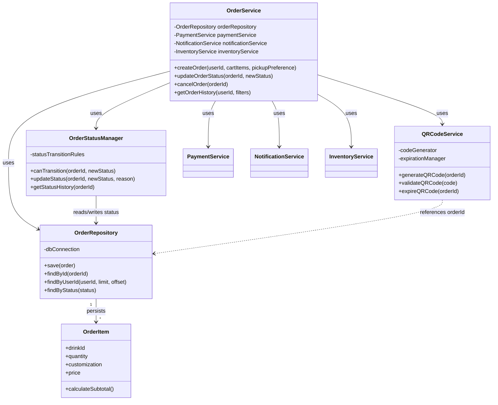
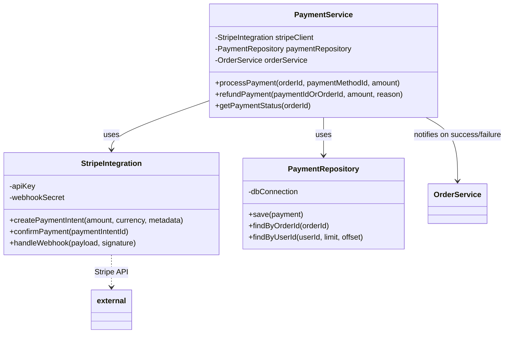
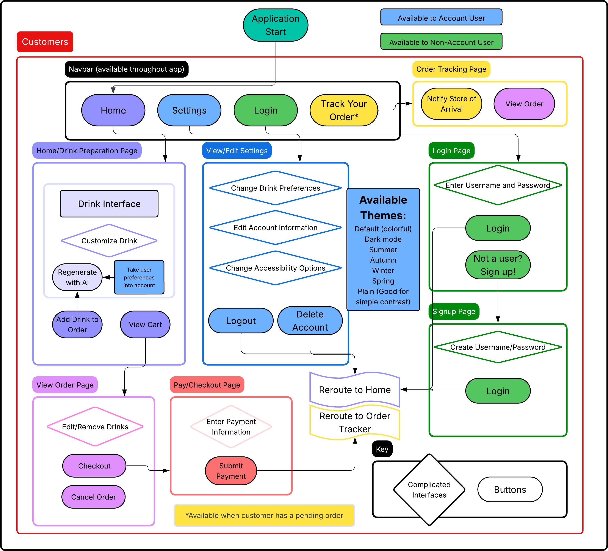
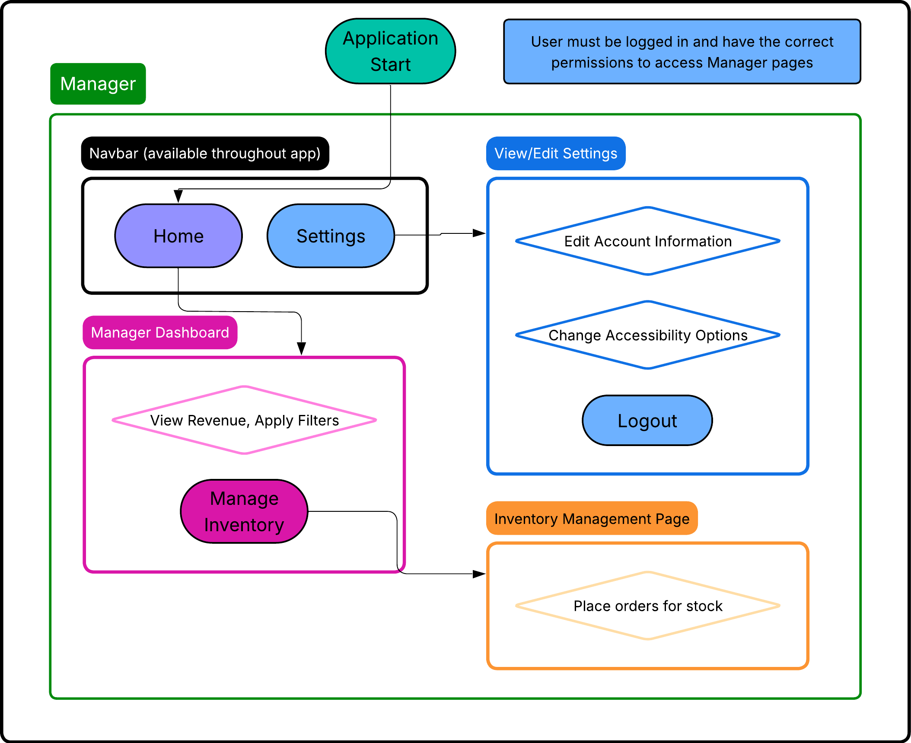
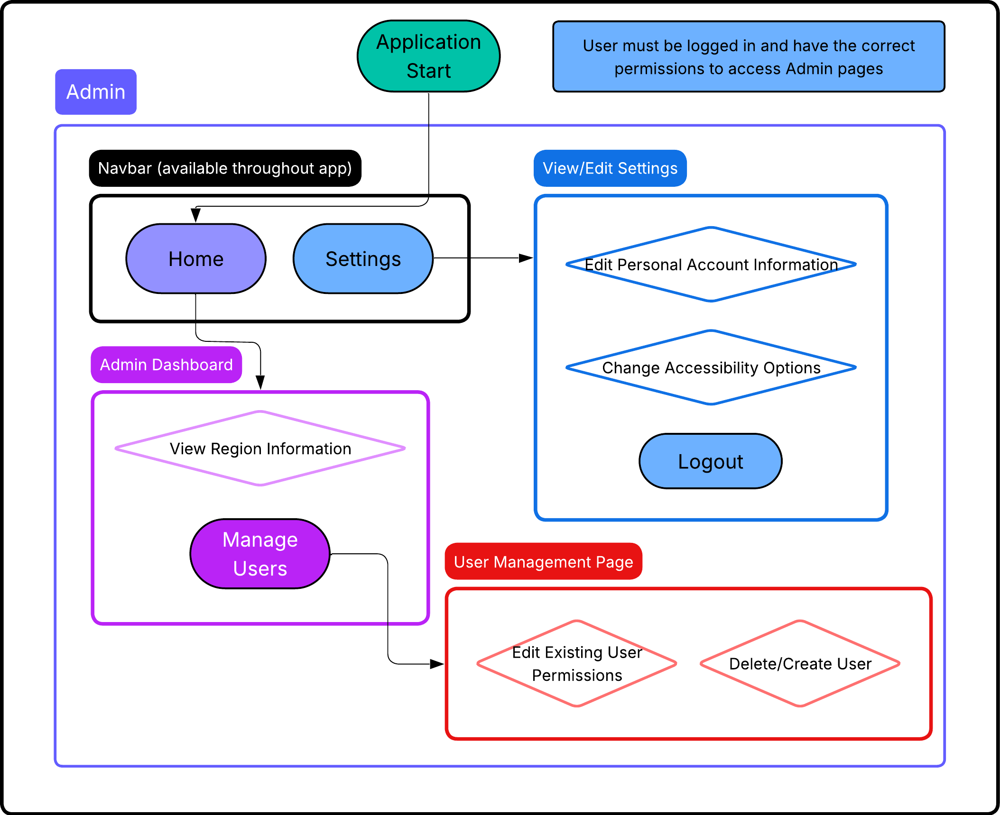
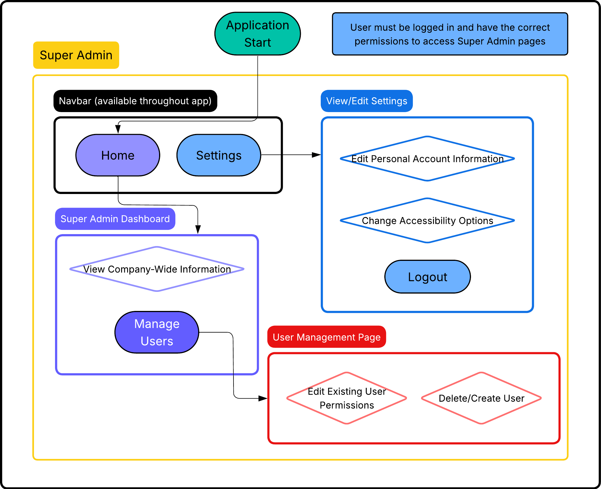
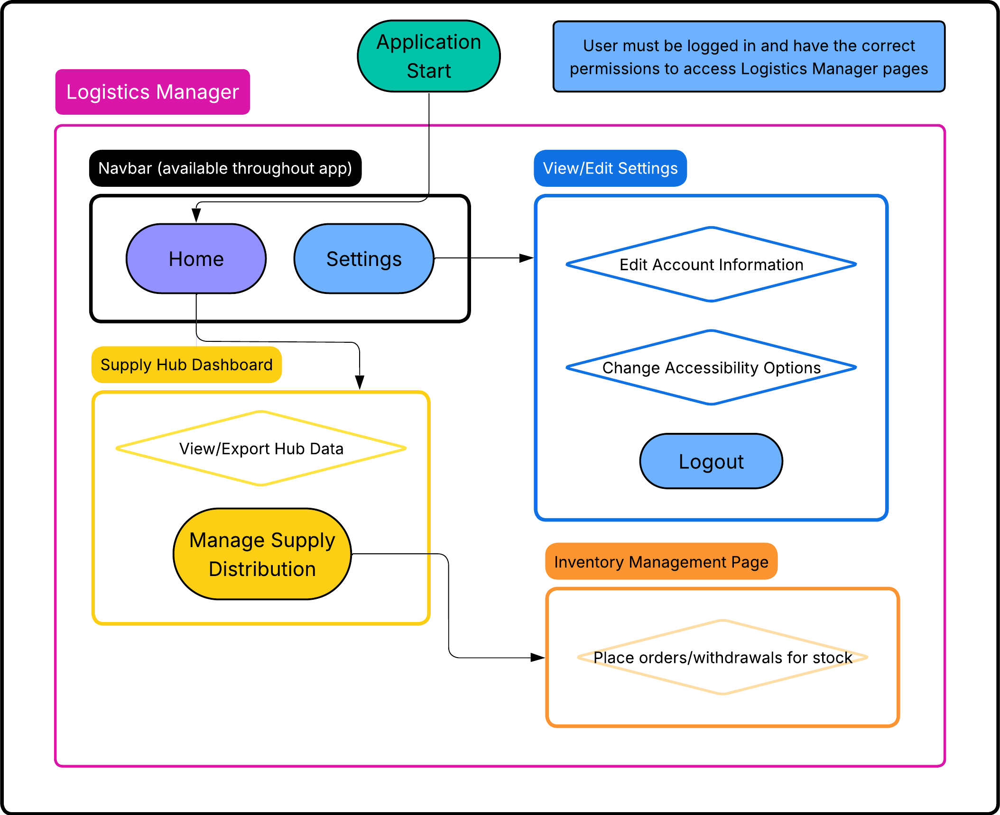
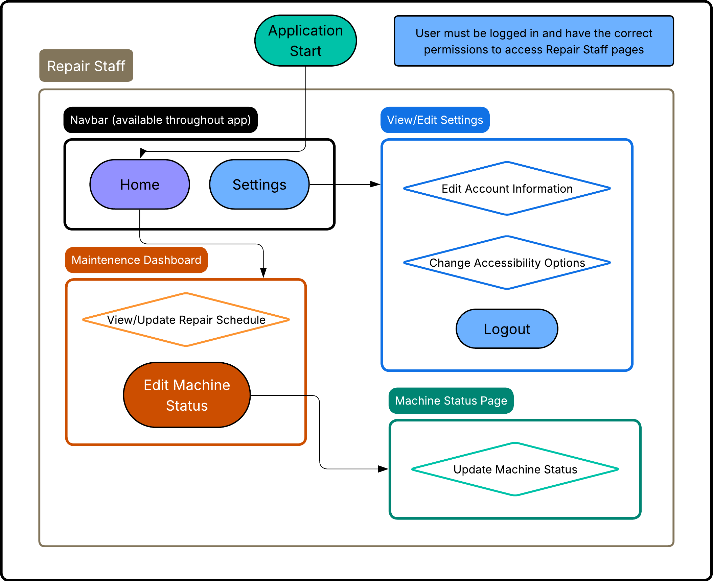

# CodePop Low-Level Design Document

## Document Overview & Introduction

This document is the **Low-Level Design (LLD)** which outlines the current mobile app, dashboard, decentralized backend, and the remaining Django/Python support workflows. It translates the High-Level Design into concrete technical specifications for the stack that exists now, while keeping not-yet-implemented modules clearly labeled as partial or future work.

This revision intentionally emphasizes workflow diagrams, pseudocode, data structures, and algorithms rather than long implementation samples, so the document stays at the design level.

The LLD covers:

- **System architecture** — Multi-app layout with a mobile client, a Next.js dashboard, an OrbitDB/libp2p backend, and Python/Django support workflows.
- **Subsystem designs** — User management, orders, payments, catalog, inventory, and AI recommendations, with class-level responsibilities and interfaces.
- **Data and persistence** — Database schema (PostgreSQL), tables, normalization, indexes, and data access patterns.
- **Cross-cutting concerns** — Security, performance, monitoring, deployment, and consistency (naming, docs, testing).

Each major area is specified with classes, methods, relationships, design choices, and (where applicable) UML diagrams and ERDs, so the team can build from a single, consistent blueprint.

---

### **Section 1: System Architecture & User Management Subsystem**

---

#### 1.1 System Architecture Overview

**Architecture style and tiers**

CodePop is best described as a distributed multi-app architecture rather than a single client-server product:

- **Mobile presentation tier** — Expo React Native app serving the customer ordering experience, including cart, checkout, complaints, and maps.
- **Dashboard presentation tier** — Next.js app serving managers, logistics staff, repair staff, and administrators with role-based views.
- **Backend tier** — OrbitDB/libp2p/Express peer services for authentication, orders, inventory, logistics, maintenance, stripe, and revenue routes.
- **Support tier** — Django and Python tooling remain in the workspace for smoke tests, seeding, and backend-related workflows.

**Core runtime components**

| Component                      | Responsibility                                                    | Technology / Interaction                                           |
| ----------------------------- | ----------------------------------------------------------------- | ------------------------------------------------------------------ |
| Mobile app                    | Customer UI, cart, checkout, complaints, map flow                | Expo React Native; HTTP/JSON to backend                            |
| Dashboard                     | Manager/admin UI, role-based dashboards                          | Next.js 16 + React 19 + next-auth; HTTP/JSON to backend            |
| OrbitDB peer API              | Request routing, auth, business logic, peer coordination         | Express + OrbitDB + libp2p + Helia                                 |
| Support workflows             | Seeding, data tooling                                | Django 5.1 + Python scripts                                         |
| User Management module        | Registration, login, profiles, preferences, guests                | Backend service layer; uses `users`, `preferences` tables (Section 4) |
| Order Management module       | Order lifecycle, status, QR codes                                 | Backend service layer; depends on User Management, Catalog, Payment |
| Payment module                | Payment processing, refunds                                       | Backend service layer; integrates with Stripe                      |
| Catalog module                | Products, drinks, customization                                   | Backend service layer; uses catalog and inventory data             |
| Inventory module              | Stock levels, alerts, restock                                     | Backend service layer                                                |
| AI Recommendation module      | Personalized recommendations, chatbot                             | Backend service layer; uses preferences; calls external AI API     |
| PostgreSQL                    | Persistent storage                                                | Accessed where the current deployment stack requires it             |
| Stripe                        | Payment processing                                                | HTTPS API; webhooks for async events                                |
| Email / notification service  | Verification, password reset, order/alert notifications           | HTTPS or SMTP from backend                                          |
| AI provider (e.g., Claude API)| Recommendation and complaint chatbot                             | HTTPS API from backend                                              |
| Maps / geolocation provider   | Store locator, delivery/pickup                                    | HTTPS API from frontend or backend                                  |


**Request/response flow — User login and authenticated request**

1. User submits login credentials from the React login form.
2. Frontend sends `POST /api/auth/login` with credentials (e.g., email + password) over HTTPS.
3. Django API receives the request; middleware may attach CORS and security headers.
4. `AuthenticationService.login(credentials)` is invoked: credentials are validated (e.g., against hashed password in `users` table via `UserRepository`); on success, a session or token is created and stored (e.g., Django session in DB or signed cookie).
5. Backend returns success response with session cookie or token (and optionally user profile summary).
6. For a subsequent authenticated request (e.g., "Get my profile"): frontend sends `GET /api/users/me` with session cookie or `Authorization` token.
7. `AuthenticationService.validateToken(sessionOrToken)` (or Django auth middleware) resolves the current user; `UserService` or a profile endpoint returns the user's profile from `UserRepository.findById(userId)`.
8. Response is returned as JSON to the frontend.

**Request/response flow — User signup**

1. User submits registration form (email, username, password, optional profile fields).
2. Frontend sends `POST /api/auth/register` (or `/api/users/`) with payload.
3. Backend invokes `UserService.createUser(dto)`: validates input, checks uniqueness (e.g., `UserRepository.findByEmail`, `findByUsername`), hashes password, persists user via `UserRepository.save()`; optionally triggers `emailService` for verification email.
4. Backend automatically logs in the user: calls `AuthenticationService.login(credentials)` (or issues a session/token for the new user), then returns the same kind of auth payload as login (session/token + user summary) so the client can stay in an authenticated state without a separate login request.


**Architecture justification**

- **Client–server and three-tier** — Fits project scope and team size: clear separation of UI, business logic, and data; single backend simplifies deployment, security, and consistency. Aligns with typical course/assignment expectations for a full-stack application.
- **Monolithic backend (Django) rather than microservices** — Reduces operational and networking complexity; shared database and in-process calls simplify transactions and debugging. Microservices would add deployment and coordination overhead without clear benefit at current scale.
- **No serverless for core logic** — Keeps control flow and state in one place; serverless is reserved for optional/event-driven use cases if needed. Detailed technology comparisons are in **Section 6**.

**Technology stack summary**

- **Frontend:** React, with HTTP client for REST API calls.
- **Backend:** Django (Python), REST API (Django REST framework or equivalent), PostgreSQL driver/ORM.
- **Database:** PostgreSQL (see Section 4 for schema).
- **External:** Stripe (payments), AI provider (e.g., Claude API), email service, maps/geolocation (e.g., Mapbox).

Detailed justifications for framework and service choices are in **Section 6**.

---

#### 1.2 User Management Subsystem

**Subsystem overview**

The User Management subsystem is responsible for identity, authentication, profile management, drink preferences, and guest sessions. It ensures that only authorized users (or designated guest sessions) can perform actions that require identity (e.g., placing orders, viewing history, managing preferences).

- **Purpose and responsibilities**
  - User registration and account lifecycle (create, update, delete).
  - Authentication: login, logout, session or token issuance and validation.
  - Profile management: read/update of user attributes (name, contact, role, etc.).
  - Drink preference CRUD and retrieval for use by the Catalog and AI Recommendation subsystems.
  - Guest session creation and lookup so unauthenticated users can browse and build orders before optionally converting to a registered account.

- **Dependencies**
  - **Database:** `users` (and any extended/auth tables), `preferences`; see **Section 4.2** for table definitions.
  - **External:** Email service (verification, password reset); optionally notification service for account-related alerts.
  - **Internal:** Order Management (orders tied to `user_id`); AI Recommendation (consumes preferences via `PreferenceService` or shared interfaces).

- **Key interfaces (API surface)**
  - `POST /api/auth/register` — Create new user (calls `UserService.createUser`); on success, auto-login and return session/token + user (same shape as login).
  - `POST /api/auth/login` — Login (calls `AuthenticationService.login`).
  - `POST /api/auth/logout` — Logout (calls `AuthenticationService.logout`).
  - `GET /api/users/me`, `PATCH /api/users/me` — Current user profile (calls `UserService` / `UserRepository`).
  - `GET /api/preferences/`, `POST /api/preferences/`, `DELETE /api/preferences/:id` — Preferences (calls `PreferenceService`).
  - Guest endpoints (e.g., `POST /api/guest/session`, `GET /api/guest/session`) — `GuestService.createGuestSession`, `getGuestSession`.

Security hardening (password hashing, RBAC, rate limiting, session configuration) is detailed in **Section 5**.

**Detailed class breakdown**

**UserService**

- **Responsibility:** Orchestrates user CRUD and profile operations; delegates persistence to `UserRepository`, auth to `AuthenticationService`, and outbound email to `EmailService`. Does not perform password hashing directly—relies on auth layer or Django's user model.
- **Fields:**
  - `userRepository` (UserRepository) — Data access for user entities.
  - `authService` (AuthenticationService) — For token/session creation after registration or login.
  - `emailService` (interface to email provider) — Sends verification or password-reset emails.
- **Methods:**
  - `createUser(dto: CreateUserDto): User` — Validates dto (email format, username uniqueness, password policy); checks uniqueness via `userRepository.findByEmail`, `findByUsername`; creates user entity (password hashed by auth/django); `userRepository.save(user)`; optionally sends verification email via `emailService`; returns created user (or throws on validation/duplicate); The register API handler calls `AuthenticationService.login(credentials)` after a successful `createUser()` and returns the resulting AuthResult to the client.”.
  - `authenticateUser(credentials: LoginCredentials): AuthResult` — Delegates to `authService.login(credentials)`; returns session/token and user summary.
  - `updateUserProfile(userId: Id, profileDto: UpdateProfileDto): User` — Ensures caller is authorized for `userId`; updates allowed profile fields; `userRepository.save(user)`; returns updated user.
  - `deleteUser(userId: Id): void` — Ensures authorization; performs soft delete or hard delete per policy; clears or anonymizes related data as defined (e.g., preferences, orders reference); `userRepository.delete(userId)`.
- **Error handling:** Validation errors and duplicate email/username return client-friendly errors; not-found and unauthorized return appropriate HTTP status codes.

**AuthenticationService**

- **Responsibility:** Verifies credentials, issues and invalidates sessions or tokens, and validates incoming requests. Encapsulates whether the system uses Django sessions, JWT, or both.
- **Fields:**
  - `tokenGenerator` (or session backend) — Creates and signs tokens or session identifiers.
  - `sessionManager` — Stores and retrieves session data (e.g., DB-backed sessions, or token blocklist for logout).
- **Methods:**
  - `login(credentials: LoginCredentials): AuthResult` — Looks up user (e.g., via `UserRepository.findByEmail`); verifies password (Django/auth library); creates session or token via `tokenGenerator`; stores session via `sessionManager`; returns `AuthResult` (token/session id + user summary).
  - `logout(userContext: UserContext): void` — Invalidates session or token (e.g., remove from store or add to blocklist).
  - `refreshToken(refreshToken: string): AuthResult` — If refresh tokens are used: validates refresh token, issues new access token/session; returns new `AuthResult`.
  - `validateToken(tokenOrSessionId: string): UserContext | null` — Verifies signature and expiry; resolves user id; returns `UserContext` for downstream use or `null` if invalid/expired.
- **Integration:** Used by Django middleware or view layer to set `request.user` for protected endpoints.

**UserRepository**

- **Responsibility:** Single place for all persistence operations on the `users` table (and any Django auth tables). Abstracts Django ORM or raw SQL; returns domain entities or ORM models as agreed.
- **Fields:**
  - `dbConnection` or ORM handle — Django model layer / database connection.
- **Methods:**
  - `findById(id: Id): User | null` — Returns user by primary key; null if not found.
  - `findByEmail(email: string): User | null` — Returns user by email (unique).
  - `findByUsername(username: string): User | null` — Returns user by username (unique).
  - `save(user: User): User` — Inserts or updates user; returns saved entity (e.g., with generated id).
  - `delete(userId: Id): void` — Deletes or soft-deletes user by id.
- **Conventions:** Methods raise an exception or return null for "not found" consistently; constraint violations (e.g., duplicate email) surface as specific errors for the service layer to map to HTTP responses.

**PreferenceService**

- **Responsibility:** Manages per-user drink preferences (e.g., favorite base sodas, syrups, or saved customizations). Used by the AI Recommendation subsystem to personalize suggestions; by Catalog/UI to prefill or highlight options.
- **Fields:**
  - `preferenceRepository` — Data access for `preferences` table (Section 4.2).
  - `userRepository` — To validate that the user exists and to enforce ownership.
- **Methods:**
  - `addPreference(userId: Id, preferenceDto: PreferenceDto): Preference` — Validates user exists; validates preference payload; persists via `preferenceRepository.save`; returns created preference.
  - `removePreference(userId: Id, preferenceId: Id): void` — Ensures preference belongs to `userId`; deletes or soft-deletes.
  - `getUserPreferences(userId: Id): List<Preference>` — Returns all active preferences for the user (e.g., for profile page or recommendation engine).
- **Dependencies:** AI Recommendation (Section 3) may call `getUserPreferences` or consume preference data via a shared interface or API.

**GuestService**

- **Responsibility:** Creates and retrieves guest sessions so unauthenticated users can have a temporary identity (e.g., for cart or preferences stored server-side). Supports upgrade path: when a guest registers or logs in, their session data can be merged into the new or existing user.
- **Fields:**
  - `sessionStorage` — Backing store for guest session data (e.g., Django session keyed by guest id, or Redis/DB keyed by `guest_session_id`). Stores minimal data: guest id, created_at, optional cart/preference snapshot.
- **Methods:**
  - `createGuestSession(): GuestSession` — Generates a unique guest session id; stores a new record in `sessionStorage`; returns `GuestSession` (id, optional expiry).
  - `getGuestSession(sessionId: string): GuestSession | null` — Looks up session by id; returns session or null if expired/invalid.
- **Upgrade path:** When guest converts to user (register/login), the application layer merges guest cart/preferences into the user and then invalidates or disassociates the guest session. Order history is attached to the user from that point forward.

**UML class diagram — User Management Subsystem**


*Note:* `EmailService` and `PreferenceRepository` are interfaces or external modules; their implementations may live in other packages. Section 4 describes the `users` and `preferences` table schemas.


**Design decisions**

- **Django built-in User model vs custom User model**
  - **Choice:** Use Django's built-in `User` model (and `AbstractUser` extension if extra fields are needed, e.g., `role`, `phone_number`).
  - **Rationale:** Built-in model provides battle-tested password hashing, group/permission hooks, and admin integration; reduces custom security code. Extending with a one-to-one or subclass satisfies CodePop's need for roles and contact info without maintaining a full custom auth stack.

- **Token-based vs session-based auth**
  - **Choice:** Session-based auth (Django sessions stored in DB or cache) for the primary web app; optional JWT or signed tokens for mobile or third-party API access if required later.
  - **Rationale:** Sessions simplify logout (invalidate server-side), CSRF handling with cookies, and integration with Django middleware. Tokens are stateless but require explicit refresh/revocation and storage considerations.

- **Guest user handling**
  - **Choice:** Server-side guest sessions: backend issues a guest session id (e.g., in a cookie or returned to client); cart and temporary preferences stored keyed by that id. On register/login, merge guest data into the authenticated user and retire the guest session.
  - **Rationale:** Allows "continue as guest" without polluting the `users` table; clear upgrade path and single source of truth for active cart/state. Limits abuse by tying sessions to a short-lived or single-device identity.

---

### **Section 2: Order Management & Payment Subsystem**

---

## 2.1 Order Management Subsystem

### Subsystem Overview

The Order Management Subsystem is responsible for the full order lifecycle from creation through completion. It ensures that orders are created consistently, status changes follow valid transitions, and customers receive pickup credentials (QR codes) and notifications at the right times.

- **Purpose**: Handle order lifecycle from creation to completion; coordinate cart → payment → fulfillment → pickup.
- **Integration points**:
  - **User Management**: Resolve user/guest for order ownership and notifications.
  - **Catalog**: Resolve drink/product details and pricing for order items.
  - **Payment**: Trigger payment and react to payment success/failure before confirming the order.
  - **Notifications**: Send status updates (e.g., order confirmed, ready for pickup).
- **Key interfaces**: Order creation (cart + user + pickup preference), status updates (internal and from external triggers), and QR code generation/validation for pickup.


- **Fields**
  - `orderRepository`: OrderRepository — persistence of orders and order items.
- **Methods**
  - `createOrder(userId, cartItems, pickupPreference)`: Validates cart, checks inventory, creates order in PENDING state, triggers payment flow; on payment success finalizes order and triggers notification and QR generation.
  - `updateOrderStatus(orderId, newStatus)`: Delegates to OrderStatusManager for validity, then persists and sends notifications.

#### `OrderRepository` class

- **Methods**
  - `save(order)`: Persists order and its OrderItems; used for create and update.
  - `findById(orderId)`: Returns order with items by primary key.
- **Responsibilities**: Order and order-item data persistence; no business rules.

#### `OrderItem` class

- **Fields**
  - `drinkId`: Reference to catalog/drink.
  - `quantity`: int.
  - `customization`: JSON or structured object (e.g., syrups, add-ins).
  - `price`: Decimal (unit price at time of order).
- **Methods**
  - `calculateSubtotal()`: Returns `quantity * price` (or sum of line-level adjustments if any).
- **Responsibilities**: Represent a single line item in an order; immutable after order confirmation for auditability.

#### `OrderStatusManager` class

- **Fields**
  - `statusTransitionRules`: Map or table of allowed (currentStatus → newStatus) transitions.
  - `getStatusHistory(orderId)`: Returns chronological list of status changes for the order.
- **Responsibilities**: Enforce order status state machine; prevent invalid transitions (e.g., CANCELLED → IN_PROGRESS).

  - `expirationManager`: Tracks and enforces QR expiration (e.g., time-to-live after “ready for pickup”).
- **Methods**
  - `generateQRCode(orderId)`: Creates unique code, stores mapping orderId ↔ code and expiration, returns code/payload for display.
  - `validateQRCode(code)`: Returns orderId and validity (e.g., not expired, not already used); used at pickup.
  - `expireQRCode(orderId)`: Marks code as used or expired so it cannot be reused.
- **Responsibilities**: QR code generation and validation for pickup; no payment or order-creation logic.

### UML Class Diagram — Order Management Subsystem



- **Relationships**: OrderService orchestrates repositories and external services. OrderRepository persists aggregates that include OrderItems. OrderStatusManager and QRCodeService are used by OrderService and may interact with the same persistence (orders table) for status and QR metadata.

### Workflow pseudocode — Order Management

Plain Python samples; can be adapted to Django ORM. Persistence is in-memory for illustration.

```text
Pseudocode:
- Follow the workflow described in the surrounding subsection.
- Keep validation, persistence, and error handling in separate layers.
```

---

## 2.2 Payment Integration Subsystem

### Subsystem Overview

The Payment Integration Subsystem handles all payment processing for orders. It uses Stripe as the payment provider, keeps a local record of transactions for reconciliation and support, and supports refunds and webhook-driven status updates.

- **Purpose**: Process payments for orders, manage refunds, and keep payment status in sync with Stripe (e.g., via webhooks).
- **Integration**: Tight integration with Order Management—payment is triggered after order creation (pending) and order confirmation depends on payment success.
- **Key interfaces**: Create payment intent, confirm payment, handle Stripe webhooks, and query payment status for an order.

### Detailed Class Breakdown

#### `PaymentService` class

- **Fields**
  - `stripeClient`: StripeIntegration — Stripe API and webhook handling.
  - `paymentRepository`: PaymentRepository — local payment transaction records.
  - `orderService`: OrderService — to confirm or cancel order based on payment outcome.
- **Methods**
  - `processPayment(orderId, paymentMethodId, amount)`: Creates/confirms PaymentIntent via StripeIntegration, persists result in PaymentRepository; on success notifies OrderService to confirm order; on failure returns error for client.
  - `refundPayment(paymentId | orderId, amount?, reason?)`: Calls Stripe refund API, updates local record and optionally triggers order cancellation/partial refund flow via OrderService.
  - `getPaymentStatus(orderId)`: Returns current payment status for the order (from PaymentRepository, optionally refreshed from Stripe for disputed states).
- **Responsibilities**: Payment processing orchestration; single place for the rest of the app to request payments or refunds.

#### `StripeIntegration` class

- **Fields**
  - `apiKey`: Stripe secret key (from environment).
  - `webhookSecret`: Stripe webhook signing secret for verifying incoming events.
- **Methods**
  - `createPaymentIntent(amount, currency, metadata)`: Calls Stripe API; returns client_secret and payment_intent id for client-side confirmation.
  - `confirmPayment(paymentIntentId)`: Confirms the PaymentIntent server-side if needed; returns final status.
  - `handleWebhook(payload, signature)`: Verifies signature, parses event (e.g., payment_intent.succeeded, payment_intent.payment_failed), updates PaymentRepository and may call back into PaymentService/OrderService for order state updates.
- **Responsibilities**: All Stripe API communication and webhook verification; no direct order or business logic.

#### `PaymentRepository` class

- **Fields**
  - `dbConnection`: Database connection/ORM.
- **Methods**
  - `save(payment)`: Persists payment record (orderId, amount, stripe_payment_intent_id, status, etc.).
  - `findByOrderId(orderId)`: Returns payment(s) for an order (typically one per order).
  - `findByUserId(userId, limit, offset)`: Returns payment history for a user (e.g., receipts, support).
- **Responsibilities**: Payment transaction persistence; no card data stored (Stripe tokens/IDs only).

### UML Class Diagram — Payment Subsystem



- **Integration with Order Management**: PaymentService calls OrderService to confirm order on payment success or to support cancellation/refund flows. Order Management triggers PaymentService.processPayment when the user completes checkout.
- **External dependency**: StripeIntegration is the only class that talks to Stripe; all secrets and API details are encapsulated there.

### Workflow pseudocode — Payment Integration

Stripe calls are stubbed; replace with real Stripe SDK in production.

```text
Pseudocode:
- Follow the workflow described in the surrounding subsection.
- Keep validation, persistence, and error handling in separate layers.
```

---

## Design Decisions & Alternatives

### Stripe vs Square vs PayPal

- **Choice**: Stripe.
- **Rationale**: Strong API and documentation, Payment Intents API suitable for SCA and mobile flows, robust webhooks, and we do not store card data (PCI scope minimized). Square fits in-person POS; PayPal adds a different UX. Stripe was chosen for consistent in-app UX and developer experience.
- **Alternatives**: Square (if physical terminals are needed); PayPal (if buyer preference is strong). Both can be integrated behind the same PaymentService interface later.

### Payment tokenization approach

- **Choice**: Stripe Elements / Stripe.js on the client to tokenize card data; server only receives `payment_method` ID or similar and never touches raw card numbers.
- **Rationale**: Keeps the application and database out of PCI scope for card data; Stripe handles storage and tokenization. Server creates PaymentIntent and optionally confirms it; client uses Stripe’s SDK to confirm with 3DS if required.
- **Alternatives**: Custom tokenization on our server (increases PCI scope and risk—rejected). Stored payment methods (Stripe Customer + PaymentMethod) can be added later for “save card” without changing this tokenization approach.

### Webhook handling strategy

- **Choice**: Idempotent webhook handler that verifies signature, parses event type, and updates PaymentRepository and order state (via PaymentService/OrderService) in a single transaction where possible; duplicate events (same Stripe event id) are ignored or applied idempotently.
- **Rationale**: Stripe may retry webhooks; duplicate handling must be safe. Signature verification prevents spoofing. Updating our DB and order status in one place keeps order and payment consistent.
- **Implementation notes**: Store processed Stripe event IDs to reject duplicates; handle at least `payment_intent.succeeded`, `payment_intent.payment_failed`; consider idempotent order confirmation (e.g., “confirm order if still PENDING”) to avoid double-processing.
- **Alternatives**: Polling Stripe for status (higher latency and load; used only as fallback if webhooks are unreliable). Queue (e.g., Celery) for webhook handling to avoid timeouts and enable retries without blocking Stripe’s retry schedule.

---

### **Section 3: Catalog, Inventory & AI Recommendation Subsystems**

---

## 3.1 Overview

This section covers the Catalog, Inventory, and AI Recommendation subsystems that support product management, stock tracking, supply coordination, and personalized recommendations. The Catalog subsystem manages drinks and customizations; the Inventory subsystem tracks stock and supply hubs; the AI Recommendation subsystem provides personalized suggestions and chatbot support. These subsystems integrate with User Management (preferences) and Order Management (cart, fulfillment).

## 3.2 Catalog Subsystem

The Catalog subsystem is responsible for product and drink management, pricing, and customization options. It exposes drink data to the frontend and to Order Management for cart and order items. Key components include product/drink data access, customization validation, and pricing logic. Catalog integrates with Inventory for ingredient availability. Detailed class-level design for Catalog (e.g., CatalogService, ProductRepository, DrinkBuilder, CustomizationService) aligns with the architecture described in Section 1 and the database schema in Section 4.

---

## 3.3 Inventory Management Subsystem

### 3.3.1 Subsystem Overview

**Purpose:** Track stock levels across stores, manage thresholds, coordinate supply hubs, and automate reordering.

**Key Features:**
- Real-time inventory tracking per store
- Threshold-based low-stock alerts
- Multi-store supply hub network (7 regional hubs)
- Automated inventory deduction on order fulfillment
- Physical item tracking (cups, lids, straws)

**Integration Points:**
- Provides ingredient availability to Catalog
- Deducts stock on Order completion
- Coordinates with Supply Hub network for restocking
- Feeds data to AI Demand Prediction

### 3.3.2 Class Architecture

#### 3.3.2.1 InventoryService

**Responsibilities:** Orchestrate inventory operations, coordinate stock updates, and manage alerts.

**Fields:**
```text
Pseudocode:
- Follow the workflow described in the surrounding subsection.
- Keep validation, persistence, and error handling in separate layers.
```

**Methods:**
```text
Pseudocode:
- Follow the workflow described in the surrounding subsection.
- Keep validation, persistence, and error handling in separate layers.
```

**Transaction Handling:**
```text
Pseudocode:
- Follow the workflow described in the surrounding subsection.
- Keep validation, persistence, and error handling in separate layers.
```

#### 3.3.2.2 InventoryRepository

**Responsibilities:** Data access for inventory entities.

**Fields:**
```text
Pseudocode:
- Follow the workflow described in the surrounding subsection.
- Keep validation, persistence, and error handling in separate layers.
```

**Methods:**
```text
Pseudocode:
- Follow the workflow described in the surrounding subsection.
- Keep validation, persistence, and error handling in separate layers.
```

#### 3.3.2.3 StockAlertService

**Responsibilities:** Monitor thresholds and trigger notifications for low stock.

**Fields:**
```text
Pseudocode:
- Follow the workflow described in the surrounding subsection.
- Keep validation, persistence, and error handling in separate layers.
```

**Methods:**
```text
Pseudocode:
- Follow the workflow described in the surrounding subsection.
- Keep validation, persistence, and error handling in separate layers.
```

**Alert Trigger Logic:**
```text
Pseudocode:
- Follow the workflow described in the surrounding subsection.
- Keep validation, persistence, and error handling in separate layers.
```

#### 3.3.2.4 SupplyHubService

**Responsibilities:** Coordinate supply distribution from regional hubs to stores.

**Fields:**
```text
Pseudocode:
- Follow the workflow described in the surrounding subsection.
- Keep validation, persistence, and error handling in separate layers.
```

**Methods:**
```text
Pseudocode:
- Follow the workflow described in the surrounding subsection.
- Keep validation, persistence, and error handling in separate layers.
```

**Hub Selection Algorithm:**
```text
Pseudocode:
- Follow the workflow described in the surrounding subsection.
- Keep validation, persistence, and error handling in separate layers.
```

#### 3.3.2.5 SupplyCoordinator

**Responsibilities:** Automate supply requests based on inventory levels and demand predictions.

**Fields:**
```text
Pseudocode:
- Follow the workflow described in the surrounding subsection.
- Keep validation, persistence, and error handling in separate layers.
```

**Methods:**
```text
Pseudocode:
- Follow the workflow described in the surrounding subsection.
- Keep validation, persistence, and error handling in separate layers.
```

**Auto-Reorder Logic:**
```text
Pseudocode:
- Follow the workflow described in the surrounding subsection.
- Keep validation, persistence, and error handling in separate layers.
```

### 3.3.3 Database Schema - Inventory Tables

#### 3.3.3.1 Inventory Table

**Table Name:** `inventory`

| Column | Data Type | Constraints | Purpose |
|--------|-----------|-------------|---------|
| InventoryID | SERIAL | PRIMARY KEY | Unique identifier |
| ItemName | VARCHAR(100) | NOT NULL | Ingredient/item name |
| ItemType | VARCHAR(50) | NOT NULL, CHECK | 'Soda', 'Syrup', 'Add In', 'Physical' |
| Quantity | INTEGER | NOT NULL, CHECK (Quantity >= 0) | Current stock level |
| ThresholdLevel | INTEGER | NOT NULL, CHECK (ThresholdLevel >= 0) | Reorder point |
| UnitCost | NUMERIC(6,2) | NULLABLE | Cost per unit (for revenue calc) |
| StoreID | INTEGER | NOT NULL, FOREIGN KEY(stores) | Multi-store support |
| LastUpdated | TIMESTAMP | DEFAULT CURRENT_TIMESTAMP | Auto-updated on changes |
| LastRestockedAt | TIMESTAMP | NULLABLE | Last restock timestamp |

**Indexes:**
```sql
CREATE INDEX idx_inventory_store ON inventory(StoreID);
CREATE INDEX idx_inventory_type ON inventory(ItemType);
CREATE INDEX idx_inventory_low_stock ON inventory(Quantity) WHERE Quantity <= ThresholdLevel;
CREATE INDEX idx_inventory_name_store ON inventory(ItemName, StoreID);  -- Composite for lookups
```

#### 3.3.3.2 Supply Hubs Table (NEW - Required)

**Table Name:** `supply_hubs`

| Column | Data Type | Constraints | Purpose |
|--------|-----------|-------------|---------|
| HubID | SERIAL | PRIMARY KEY | Unique hub identifier |
| Region | CHAR(1) | NOT NULL, UNIQUE, CHECK | Region code ('A'-'G') |
| LocationName | VARCHAR(100) | NOT NULL | City name (e.g., "Chicago") |
| Latitude | NUMERIC(9,6) | NOT NULL | GPS coordinate |
| Longitude | NUMERIC(9,6) | NOT NULL | GPS coordinate |
| MaxCapacity | INTEGER | NOT NULL | Max units storable |
| CurrentLoad | INTEGER | DEFAULT 0 | Current inventory count |
| OperatingStatus | VARCHAR(20) | DEFAULT 'active' | 'active', 'maintenance', 'offline' |
| CreatedAt | TIMESTAMP | DEFAULT CURRENT_TIMESTAMP | Record creation |

**Data:**
```sql
INSERT INTO supply_hubs (Region, LocationName, Latitude, Longitude, MaxCapacity) VALUES
('A', 'Chicago', 41.8781, -87.6298, 100000),
('B', 'Newark NJ', 40.7357, -74.1724, 100000),
('C', 'Logan UT', 41.7370, -111.8338, 80000),
('D', 'Dallas', 32.7767, -96.7970, 100000),
('E', 'Atlanta', 33.7490, -84.3880, 100000),
('F', 'Phoenix', 33.4484, -112.0740, 90000),
('G', 'Boise', 43.6150, -116.2023, 70000);
```

#### 3.3.3.3 Stock Transfers Table (NEW - Required)

**Table Name:** `stock_transfers`

| Column | Data Type | Constraints | Purpose |
|--------|-----------|-------------|---------|
| TransferID | SERIAL | PRIMARY KEY | Unique transfer ID |
| FromHubID | INTEGER | NOT NULL, FOREIGN KEY(supply_hubs) | Source hub |
| ToStoreID | INTEGER | NOT NULL, FOREIGN KEY(stores) | Destination store |
| ItemName | VARCHAR(100) | NOT NULL | Item being transferred |
| Quantity | INTEGER | NOT NULL, CHECK (Quantity > 0) | Units transferred |
| Status | VARCHAR(20) | DEFAULT 'pending' | 'pending', 'in_transit', 'delivered', 'failed' |
| RequestedAt | TIMESTAMP | DEFAULT CURRENT_TIMESTAMP | Request timestamp |
| DeliveredAt | TIMESTAMP | NULLABLE | Actual delivery time |
| EstimatedDelivery | TIMESTAMP | NOT NULL | Predicted delivery |
| Priority | VARCHAR(10) | DEFAULT 'normal' | 'critical', 'high', 'normal', 'low' |

**Indexes:**
```sql
CREATE INDEX idx_transfers_store ON stock_transfers(ToStoreID);
CREATE INDEX idx_transfers_status ON stock_transfers(Status);
CREATE INDEX idx_transfers_requested ON stock_transfers(RequestedAt DESC);
```

#### 3.3.3.4 Stores Table (NEW - Required)

**Table Name:** `stores`

| Column | Data Type | Constraints | Purpose |
|--------|-----------|-------------|---------|
| StoreID | SERIAL | PRIMARY KEY | Unique store identifier |
| StoreName | VARCHAR(100) | NOT NULL | Store display name |
| Region | CHAR(1) | NOT NULL, CHECK | Assigned region ('A'-'G') |
| Address | VARCHAR(255) | NOT NULL | Physical address |
| Latitude | NUMERIC(9,6) | NOT NULL | GPS coordinate |
| Longitude | NUMERIC(9,6) | NOT NULL | GPS coordinate |
| OperatingStatus | VARCHAR(20) | DEFAULT 'operational' | 'operational', 'maintenance', 'closed' |
| OpenedAt | DATE | NOT NULL | Store opening date |

**Normalization Check (3NF):**
- ✅ **1NF:** All columns atomic, primary key exists
- ✅ **2NF:** No partial dependencies (single PK)
- ✅ **3NF:** No transitive dependencies (Region doesn't determine Location; both are independent attributes)

### 3.3.4 UML Class Diagram - Inventory Subsystem

```
┌─────────────────────────────────────────────────────────────────────┐
│                       InventoryService                              │
├─────────────────────────────────────────────────────────────────────┤
│ - inventoryRepository: InventoryRepository                          │
│ - stockAlertService: StockAlertService                              │
│ - supplyHubService: SupplyHubService                                │
├─────────────────────────────────────────────────────────────────────┤
│ + updateInventory(itemId, qty): Inventory                          │
│ + deductInventory(itemName, qty, storeId): bool                    │
│ + getLowStockItems(storeId): List[Inventory]                       │
│ + bulkDeduct(items, storeId): bool                                 │
└──────────┬──────────────────────┬────────────────────┬─────────────┘
           │ uses                 │ uses               │ uses
           ▼                      ▼                    ▼
┌──────────────────────┐  ┌──────────────────┐  ┌────────────────────┐
│ InventoryRepository  │  │ StockAlertService│  │ SupplyHubService   │
├──────────────────────┤  ├──────────────────┤  ├────────────────────┤
│ + findByName()       │  │ + checkThresholds│  │ + requestSupply()  │
│ + findBelowThreshold │  │ + sendAlert()    │  │ + findNearestHub() │
└──────────┬───────────┘  └─────────┬────────┘  └─────────┬──────────┘
           │ returns               │ monitors            │ coordinates
           ▼                       ▼                     ▼
┌──────────────────────────────────────────┐  ┌────────────────────────┐
│       <<Entity>> Inventory               │  │  <<Entity>> SupplyHub  │
├──────────────────────────────────────────┤  ├────────────────────────┤
│ - InventoryID: int                       │  │ - HubID: int           │
│ - ItemName: string                       │  │ - Region: char         │
│ - ItemType: string                       │  │ - LocationName: string │
│ - Quantity: int                          │  │ - MaxCapacity: int     │
│ - ThresholdLevel: int                    │  │ - CurrentLoad: int     │
│ - StoreID: int [FK]                      │  ├────────────────────────┤
├──────────────────────────────────────────┤  │ + hasCapacity(): bool  │
│ + isOutOfStock(): bool                   │  │ + getDistanceTo(): int │
│ + needsRestock(): bool                   │  └────────────────────────┘
└──────────────────────────────────────────┘
           △
           │ generates
           │
┌──────────┴────────────────────────────────────────────────────┐
│                    SupplyCoordinator                          │
├───────────────────────────────────────────────────────────────┤
│ - supplyHubService: SupplyHubService                          │
│ - demandPredictor: DemandPredictionService                    │
├───────────────────────────────────────────────────────────────┤
│ + autoReorder(storeId): List[StockTransfer]                  │
│ + calculateReorderQuantity(itemName, storeId): int           │
│ + optimizeBatchOrders(storeId): BatchOrder                   │
└───────────────────────────────────────────────────────────────┘
           │ creates
           ▼
┌─────────────────────────────────────────────────────────────┐
│            <<Entity>> StockTransfer                         │
├─────────────────────────────────────────────────────────────┤
│ - TransferID: int                                           │
│ - FromHubID: int [FK]                                       │
│ - ToStoreID: int [FK]                                       │
│ - ItemName: string                                          │
│ - Quantity: int                                             │
│ - Status: string                                            │
├─────────────────────────────────────────────────────────────┤
│ + updateStatus(newStatus): void                            │
│ + estimateDelivery(): datetime                             │
└─────────────────────────────────────────────────────────────┘

**Relationships:**
- InventoryService **aggregates** StockAlertService, SupplyHubService
- InventoryRepository **returns** Inventory entities
- StockAlertService **monitors** Inventory levels
- SupplyHubService **coordinates** SupplyHub entities
- SupplyCoordinator **creates** StockTransfer records
```

---

## 3.4 AI Recommendation Subsystem

### 3.4.1 Subsystem Overview

**Purpose:** Provide personalized drink recommendations and AI-powered customer service through conversational chatbot.

**Key Features:**
- Content-based filtering for personalized suggestions
- Cold-start capability (works for new users)
- Conversational chatbot for complaints and refunds
- AI demand prediction for supply forecasting (NEW)

**Integration Points:**
- Fetches user preferences from User Management
- Queries drink catalog for recommendations
- Accesses order history for complaint resolution
- Provides demand forecasts to Inventory Management

### 3.4.2 Class Architecture

#### 3.4.2.1 RecommendationService

**Responsibilities:** Orchestrate recommendation generation and coordinate AI models.

**Fields:**
```text
Pseudocode:
- Follow the workflow described in the surrounding subsection.
- Keep validation, persistence, and error handling in separate layers.
```

**Methods:**
```text
Pseudocode:
- Follow the workflow described in the surrounding subsection.
- Keep validation, persistence, and error handling in separate layers.
```

**Algorithm Flow:**
```text
Pseudocode:
- Follow the workflow described in the surrounding subsection.
- Keep validation, persistence, and error handling in separate layers.
```

#### 3.4.2.2 ContentBasedFilter

**Responsibilities:** Implement Scikit-Learn content-based recommendation algorithm.

**Fields:**
```text
Pseudocode:
- Follow the workflow described in the surrounding subsection.
- Keep validation, persistence, and error handling in separate layers.
```

**Methods:**
```text
Pseudocode:
- Follow the workflow described in the surrounding subsection.
- Keep validation, persistence, and error handling in separate layers.
```

**Scikit-Learn Implementation:**

```text
Pseudocode:
- Follow the workflow described in the surrounding subsection.
- Keep validation, persistence, and error handling in separate layers.
```

**Design Rationale:**
- **Chosen:** Content-based filtering with cosine similarity
- **Alternatives:**
  - **Collaborative Filtering (User-User):** Requires large user base, doesn't work for new users
  - **Collaborative Filtering (Item-Item):** Needs extensive rating data
  - **Matrix Factorization (SVD):** Overkill for ingredient matching problem
  - **Deep Learning (Neural CF):** Training complexity, data requirements
- **Justification:** Content-based works immediately without needing other users' data, solves cold-start problem, leverages ingredient properties encoded in CSV files

#### 3.4.2.3 AIChatbotService

**Responsibilities:** Handle customer service conversations, complaint routing, refunds, and remakes.

**Fields:**
```text
Pseudocode:
- Follow the workflow described in the surrounding subsection.
- Keep validation, persistence, and error handling in separate layers.
```

**Methods:**
```text
Pseudocode:
- Follow the workflow described in the surrounding subsection.
- Keep validation, persistence, and error handling in separate layers.
```

**State Machine for Complaint Handling:**

```text
Pseudocode:
- Follow the workflow described in the surrounding subsection.
- Keep validation, persistence, and error handling in separate layers.
```

**DialoGPT Implementation:**

```text
Pseudocode:
- Follow the workflow described in the surrounding subsection.
- Keep validation, persistence, and error handling in separate layers.
```

**Design Decision: DialoGPT vs Claude API**

**Chosen:** DialoGPT (microsoft/DialoGPT-medium)

**Alternative:** Claude API by Anthropic (mentioned in requirements)

**Comparison:**

| Factor | DialoGPT | Claude API |
|--------|----------|------------|
| **Cost** | Free (open-source) | Paid ($8-24 per 1M tokens) |
| **Latency** | Local inference (~500ms) | API call (~1-2s + network) |
| **Quality** | Good for simple conversations | Excellent, nuanced responses |
| **Customization** | Can fine-tune | Prompt engineering only |
| **Offline** | Works offline | Requires internet |
| **Model Size** | 350M parameters | Unknown (proprietary) |

**Justification:**
- For MVP, DialoGPT sufficient for structured complaint handling (state machine handles flow)
- Cost-effective for startup phase (no API fees)
- State machine ensures correct workflow regardless of response quality
- Can upgrade to Claude in production if response quality becomes critical
- **Trade-off:** Less natural language understanding, requires more rigid prompt engineering

#### 3.4.2.4 DemandPredictionService (NEW - Required)

**Responsibilities:** Forecast demand for inventory items using historical sales data.

**Fields:**
```text
Pseudocode:
- Follow the workflow described in the surrounding subsection.
- Keep validation, persistence, and error handling in separate layers.
```

**Methods:**
```text
Pseudocode:
- Follow the workflow described in the surrounding subsection.
- Keep validation, persistence, and error handling in separate layers.
```

**Algorithm (Scikit-Learn Random Forest):**

```text
Pseudocode:
- Follow the workflow described in the surrounding subsection.
- Keep validation, persistence, and error handling in separate layers.
```

**CSV Import Format:**

```csv
date,item_name,store_id,quantity_sold,temperature,promotions,day_of_week,is_weekend
2026-01-01,Coke,1,45,72,0,3,0
2026-01-01,Vanilla Syrup,1,32,72,0,3,0
2026-01-02,Coke,1,67,75,1,4,0
2026-01-06,Coke,1,120,78,0,1,1
```

**Features:**
- Date-based: month, day of week, weekend flag
- Item-specific: item name (one-hot encoded)
- Store-specific: store ID (one-hot encoded)
- External factors: temperature, promotions

### 3.4.3 Database Schema - AI Tables

#### 3.4.3.1 Preferences Table (Existing)

**Table Name:** `preferences`

| Column | Data Type | Constraints | Purpose |
|--------|-----------|-------------|---------|
| PreferenceID | SERIAL | PRIMARY KEY | Unique identifier |
| user_id | INTEGER | NOT NULL, FOREIGN KEY(users) | User who created preference |
| Preference | VARCHAR(100) | NOT NULL | Ingredient name (validated) |

**Normalization (1NF):** One preference per row (not comma-separated list)

**Validation:** Django serializer ensures only valid ingredients from inventory catalog

#### 3.4.3.2 Drink Recommendations Table (NEW - Analytics)

**Table Name:** `drink_recommendations`

| Column | Data Type | Constraints | Purpose |
|--------|-----------|-------------|---------|
| RecommendationID | SERIAL | PRIMARY KEY | Unique identifier |
| user_id | INTEGER | NOT NULL, FOREIGN KEY(users) | User who received rec |
| drink_id | INTEGER | NULLABLE, FOREIGN KEY(drinks) | Recommended drink (if accepted) |
| Score | NUMERIC(5,4) | NULLABLE | Similarity score |
| Accepted | BOOLEAN | DEFAULT false | User added to cart? |
| GeneratedAt | TIMESTAMP | DEFAULT CURRENT_TIMESTAMP | Recommendation time |

**Purpose:** Track recommendation performance for model improvement

### 3.4.4 UML Class Diagram - AI Recommendation Subsystem

```
┌─────────────────────────────────────────────────────────────────────┐
│                    RecommendationService                            │
├─────────────────────────────────────────────────────────────────────┤
│ - contentBasedModel: ContentBasedFilter                             │
│ - userPreferenceService: PreferenceService                          │
│ - cacheManager: CacheManager                                        │
├─────────────────────────────────────────────────────────────────────┤
│ + getPersonalizedRecommendations(userId, count): List[Drink]       │
│ + generateFromPreferences(prefs): dict                              │
│ + trainModel(data): bool                                            │
└────────────┬────────────────────────────┬───────────────────────────┘
             │ uses                       │ uses
             ▼                            ▼
┌───────────────────────────┐   ┌────────────────────────────────────┐
│   ContentBasedFilter      │   │      AIChatbotService              │
├───────────────────────────┤   ├────────────────────────────────────┤
│ - cvVectorizer            │   │ - model: DialoGPT                  │
│ - syrupData: DataFrame    │   │ - tokenizer: AutoTokenizer         │
│ - sodaData: DataFrame     │   │ - stateMachine                     │
├───────────────────────────┤   ├────────────────────────────────────┤
│ + generateDrink()         │   │ + processMessage(): ChatResponse   │
│ + findSimilarSyrups()     │   │ + handleComplaint(): Resolution    │
│ + findBestSoda()          │   │ + processRefund(): bool            │
│ + computeSimilarity()     │   │ + processDrinkRemake(): Order      │
└───────────────────────────┘   └────────────────────────────────────┘
             │                              │
             │ reads CSV                    │ accesses
             ▼                              ▼
┌───────────────────────────┐   ┌────────────────────────────────────┐
│    CSV Data Files         │   │      ComplaintStateMachine         │
├───────────────────────────┤   ├────────────────────────────────────┤
│ - Syrups.csv              │   │ + currentPhase: string             │
│ - Sodas.csv               │   │ + context: dict                    │
│ - AddIns.csv              │   ├────────────────────────────────────┤
└───────────────────────────┘   │ + detectIntent(): Intent           │
                                 │ + transitionState(): State         │
                                 │ + extractOrderNumber(): int        │
                                 └────────────────────────────────────┘
             
┌─────────────────────────────────────────────────────────────────────┐
│                 DemandPredictionService (NEW)                       │
├─────────────────────────────────────────────────────────────────────┤
│ - model: RandomForestRegressor                                      │
│ - historicalData: DataFrame                                         │
├─────────────────────────────────────────────────────────────────────┤
│ + predictDemand(item, store, days): float                          │
│ + trainModel(csvPath): bool                                         │
│ + generateReorderRecommendations(storeId): List[ReorderRec]        │
└─────────────────────────────────────────────────────────────────────┘

**Relationships:**
- RecommendationService **uses** ContentBasedFilter for drink generation
- RecommendationService **aggregates** AIChatbotService for customer support
- ContentBasedFilter **depends on** CSV data files for similarity computation
- AIChatbotService **composes** ComplaintStateMachine for conversation flow
- DemandPredictionService **standalone** service used by SupplyCoordinator
```

---

## 3.5 Database Schema Summary

### 3.5.1 Entity Relationship Diagram (ERD)

```
┌──────────────┐         ┌──────────────┐         ┌──────────────┐
│    users     │────────<│ preferences  │         │   drinks     │
│              │  1:N    │              │         │              │
│ - id (PK)    │         │ - user_id(FK) │         │ - drink_id(PK)│
└──────┬───────┘         │ - Preference │         │ - Name       │
       │                 └──────────────┘         │ - SyrupsUsed │
       │ 1:N                                      │ - Price      │
       │                                          └──────┬───────┘
       │                 ┌──────────────┐                │
       │                 │ drink_       │                │ M:N
       └────────────────<│ favorites    │>───────────────┘
                         │ (junction)   │
                         └──────────────┘

┌──────────────┐         ┌──────────────┐         ┌──────────────┐
│   stores     │────────<│  inventory   │         │ supply_hubs  │
│              │  1:N    │              │         │              │
│ - StoreID(PK)│         │ - StoreID(FK)│<───┐    │ - HubID (PK) │
│ - Region     │         │ - ItemName   │    │    │ - Region     │
└──────────────┘         │ - Quantity   │    │    └──────┬───────┘
                         │ - Threshold  │    │           │
                         └──────────────┘    │ M:N       │ 1:N
                                             │           │
                         ┌──────────────┐    │           │
                         │ stock_       │<───┴───────────┘
                         │ transfers    │
                         │              │
                         │ - FromHub(FK)│
                         │ - ToStore(FK)│
                         └──────────────┘

┌──────────────┐         ┌──────────────┐
│   orders     │────────<│ order_items  │
│              │  1:N    │              │
│ - order_id(PK)│         │ - drink_id(FK)│
│ - user_id(FK) │         │ - order_id(FK)│
└──────────────┘         └──────────────┘
```

### 3.5.2 Normalization Verification (3NF)

**Checklist:**
- ✅ **1NF:** All tables have atomic values, primary keys defined
- ✅ **2NF:** No partial dependencies (all PKs are single column or properly designed)
- ✅ **3NF:** No transitive dependencies verified:
  - `drinks.Price` does NOT depend on `drinks.Size` (pre-calculated)
  - `inventory.LastUpdated` auto-updates (not derived from other fields)
  - `stock_transfers.Status` is independent attribute (not derived)
  - `supply_hubs.Region` and `LocationName` are independent (region doesn't determine name uniquely)

---

## 3.6 Integration Points

### 3.6.1 Catalog ↔ Inventory Integration

**Use Case:** Validate ingredient availability during drink creation

**Implementation:**
```text
Pseudocode:
- Follow the workflow described in the surrounding subsection.
- Keep validation, persistence, and error handling in separate layers.
```

**API Endpoint:**
```
GET /backend/inventory/?store_id=1&available_only=true
```

### 3.6.2 Inventory ↔ Orders Integration (CRITICAL - MISSING)

**Use Case:** Automatically deduct inventory when order is completed

**Required Implementation:**

```text
Pseudocode:
- Follow the workflow described in the surrounding subsection.
- Keep validation, persistence, and error handling in separate layers.
```

**Current Status:** ❌ Not implemented (manual PATCH endpoint only)

**Priority:** ⚠️ CRITICAL - Must implement before production

### 3.6.3 AI ↔ Preferences Integration

**Use Case:** Fetch user preferences for personalized recommendations

**Implementation:**
```text
Pseudocode:
- Follow the workflow described in the surrounding subsection.
- Keep validation, persistence, and error handling in separate layers.
```

**API Flow:**
```
1. Frontend: GET /backend/generate/<user_id>/
2. Backend: Fetch preferences from database
3. Backend: Call drinkAI.generate_soda(preferences)
4. Backend: Return drink JSON
5. Frontend: Display in AIAlert modal
```

### 3.6.4 Supply Hub ↔ Inventory Integration (NEW)

**Use Case:** Automate restock requests from stores to regional hubs

**Implementation:**
```text
Pseudocode:
- Follow the workflow described in the surrounding subsection.
- Keep validation, persistence, and error handling in separate layers.
```

---

## 3.7 Performance & Security

### 3.7.1 Performance Bottlenecks

#### Bottleneck 1: CSV File I/O on Every AI Request

**Problem:**
- AI recommendation reads 3 CSV files (Syrups.csv, Sodas.csv, AddIns.csv) on every request
- File I/O overhead: ~50-100ms per read
- Total: ~150-300ms added latency per recommendation

**Current Load:**
- Expected: 10-50 recommendations/second during peak

**Solution:**
```text
Pseudocode:
- Follow the workflow described in the surrounding subsection.
- Keep validation, persistence, and error handling in separate layers.
```

**Impact:**
- Reduces latency from ~300ms to ~5ms (in-memory read)
- 60x performance improvement

**Priority:** HIGH - Implement before production launch

#### Bottleneck 2: N+1 Query Problem in Cart Page

**Problem:**
- Frontend fetches each drink individually in loop
- 5 drinks = 5 separate API calls

**Current Code:**
```text
Pseudocode:
- Follow the workflow described in the surrounding subsection.
- Keep validation, persistence, and error handling in separate layers.
```

**Solution:**
```text
Pseudocode:
- Follow the workflow described in the surrounding subsection.
- Keep validation, persistence, and error handling in separate layers.
```

**Impact:**
- Reduces requests from N to 1
- Latency: ~50ms per request × 5 = 250ms → 50ms (5x improvement)

**Priority:** MEDIUM

#### Bottleneck 3: Dynamic CSV Writes (Thread Safety)

**Problem:**
- `drinkAI.py` writes temporary rows to CSV files during similarity computation
- Not thread-safe: concurrent requests cause race conditions
- Potential data corruption

**Current Code:**
```text
Pseudocode:
- Follow the workflow described in the surrounding subsection.
- Keep validation, persistence, and error handling in separate layers.
```

**Solution:**
```text
Pseudocode:
- Follow the workflow described in the surrounding subsection.
- Keep validation, persistence, and error handling in separate layers.
```

**Impact:**
- Eliminates file I/O (faster)
- Thread-safe (no shared file state)
- Prevents data corruption

**Priority:** HIGH - Critical for multi-threaded production

#### Bottleneck 4: Multi-Store Inventory Aggregation

**Problem:**
- Super Admin dashboard queries all stores' inventory
- 100 stores × 80 items = 8,000 rows to aggregate

**Query:**
```text
Pseudocode:
- Follow the workflow described in the surrounding subsection.
- Keep validation, persistence, and error handling in separate layers.
```

**Solution:**
```sql
-- Create materialized view refreshed every 5 minutes
CREATE MATERIALIZED VIEW inventory_summary AS
SELECT 
    ItemName,
    ItemType,
    SUM(Quantity) as TotalQuantity,
    COUNT(DISTINCT StoreID) as StoresInStock,
    AVG(ThresholdLevel) as AvgThreshold
FROM inventory
GROUP BY ItemName, ItemType;

CREATE INDEX idx_inv_summary_name ON inventory_summary(ItemName);

-- Refresh job
REFRESH MATERIALIZED VIEW CONCURRENTLY inventory_summary;
```

**Django ORM:**
```text
Pseudocode:
- Follow the workflow described in the surrounding subsection.
- Keep validation, persistence, and error handling in separate layers.
```

**Impact:**
- Query time: 5-10 seconds → 50ms (100x improvement)

**Priority:** MEDIUM (implement when multi-store deployed)

### 3.7.2 Security Risks & Mitigations

#### Risk 1: CSV Injection via Ingredient Names

**Attack Vector:**
- Malicious user creates preference with CSV formula: `=CMD|'/C calc'!A1`
- When exported to CSV, executes code on admin's machine

**Mitigation:**
```text
Pseudocode:
- Follow the workflow described in the surrounding subsection.
- Keep validation, persistence, and error handling in separate layers.
```

**Status:** ✅ Already implemented in serializers.py

#### Risk 2: Inventory Manipulation

**Attack Vector:**
- Unauthorized PATCH to `/backend/inventory/<id>/` with arbitrary quantities
- Attacker increases stock to hide theft or manipulate reports

**Current Issue:**
```text
Pseudocode:
- Follow the workflow described in the surrounding subsection.
- Keep validation, persistence, and error handling in separate layers.
```

**Mitigation:**
```text
Pseudocode:
- Follow the workflow described in the surrounding subsection.
- Keep validation, persistence, and error handling in separate layers.
```

**Priority:** ⚠️ CRITICAL - Implement immediately

#### Risk 3: AI Model Poisoning

**Attack Vector:**
- Attacker creates 1000s of preferences with rare ingredients
- Biases recommendations toward unavailable items

**Mitigation:**
```text
Pseudocode:
- Follow the workflow described in the surrounding subsection.
- Keep validation, persistence, and error handling in separate layers.
```

**Priority:** MEDIUM

#### Risk 4: DialoGPT Inappropriate Responses

**Attack Vector:**
- User provides offensive prompts
- DialoGPT generates inappropriate business responses

**Mitigation:**
```text
Pseudocode:
- Follow the workflow described in the surrounding subsection.
- Keep validation, persistence, and error handling in separate layers.
```

**Implementation:**
```text
Pseudocode:
- Follow the workflow described in the surrounding subsection.
- Keep validation, persistence, and error handling in separate layers.
```

**Priority:** HIGH - Implement before chatbot launch

---

## 3.8 Implementation Tasks

### 3.8.1 Task Prioritization (MoSCoW)

| Task | Priority | Team | Effort | Dependencies |
|------|----------|------|--------|--------------|
| Multi-store database schema | MUST | Database | 1 week | None |
| Supply hub network implementation | MUST | Backend | 3 weeks | Multi-store schema |
| Automated inventory deduction | MUST | Backend | 1 week | Order system |
| AI demand prediction service | MUST | Backend | 2 weeks | Historical data |
| Redis caching for CSV data | SHOULD | Backend | 1 week | Redis setup |
| Bulk drink fetch endpoint | SHOULD | Backend | 2 days | None |
| Inventory permissions & audit | MUST | Backend | 1 week | Auth system |
| Logistics Manager dashboard | MUST | Frontend | 2 weeks | Supply hub API |
| Manager low-stock alerts | SHOULD | Frontend | 1 week | Notification system |
| Response filtering for chatbot | SHOULD | Backend | 1 week | Chatbot system |

### 3.8.2 Detailed Task Breakdown

#### Task 1: Multi-Store Database Schema (CRITICAL)

**Assigned to:** Database Team  
**Duration:** 1 week  
**Priority:** MUST HAVE

**Subtasks:**
1. Create migration for `stores` table
2. Create migration for `supply_hubs` table
3. Create migration for `stock_transfers` table
4. Add `StoreID` foreign key to `inventory` table
5. Add `StoreID` foreign key to `orders` table
6. Create indexes on new foreign keys
7. Populate 7 supply hubs seed data
8. Create 20 stores in Region C (Logan UT)
9. Create 5+ stores in neighboring regions
10. Run migration on development database
11. Verify data integrity

**Acceptance Criteria:**
- All tables created with correct schema
- Foreign key constraints working
- Seed data populated
- No data loss in existing tables

#### Task 2: Supply Hub Network Implementation (CRITICAL)

**Assigned to:** Backend Team (Primary)  
**Duration:** 3 sprint weeks  
**Priority:** MUST HAVE  
**Dependencies:** Multi-store schema

**Subtasks:**

**Week 1: Core Models & Repositories**
1. Create `SupplyHub` model class
2. Create `StockTransfer` model class
3. Create `Store` model class
4. Implement `SupplyHubRepository`
5. Implement `StockTransferRepository`
6. Write unit tests for repositories

**Week 2: Service Layer**
7. Implement `SupplyHubService` class
   - `findNearestHub(storeId)` method
   - `requestSupply(itemName, quantity, storeId)` method
   - `calculateDeliveryTime()` method
8. Implement `SupplyCoordinator` class
   - `autoReorder()` logic
   - `optimizeBatchOrders()` logic
9. Integrate with `InventoryService`
10. Write integration tests

**Week 3: API Endpoints & Documentation**
11. Create `/api/supply-hubs/` endpoint (GET list)
12. Create `/api/supply-hubs/<id>/inventory/` endpoint
13. Create `/api/stock-transfers/` endpoint (POST create, GET list)
14. Create `/api/stock-transfers/<id>/` endpoint (PATCH update status)
15. Write API documentation (Swagger)
16. End-to-end testing

**Acceptance Criteria:**
- Hub selection algorithm works correctly (regional + 1000-mile fallback)
- Stock transfers created and tracked
- API endpoints functional and documented
- 90%+ test coverage

#### Task 3: Automated Inventory Deduction (CRITICAL)

**Assigned to:** Backend Team  
**Duration:** 1 week  
**Priority:** MUST HAVE  
**Dependencies:** Order completion system

**Subtasks:**
1. Design `OrderCompletionService` class
2. Implement `extractIngredients()` method
   - Parse all drinks in order
   - Count ingredient quantities (handle duplicates)
3. Implement transaction-wrapped `fulfillOrder()` method
4. Add rollback logic for insufficient stock
5. Integrate with `InventoryService.bulkDeduct()`
6. Add order failure notifications
7. Write unit tests (mock inventory)
8. Write integration tests (real database)
9. Test edge cases:
   - Out of stock mid-order
   - Concurrent order race conditions
   - Partial fulfillment scenarios

**Acceptance Criteria:**
- Inventory deducted atomically on order completion
- Rollback works correctly on failure
- No race conditions (use `select_for_update()`)
- Customer notified on order failure

#### Task 4: AI Demand Prediction Service (CRITICAL)

**Assigned to:** Backend Team (ML Focus)  
**Duration:** 2 weeks  
**Priority:** MUST HAVE  
**Dependencies:** Historical sales data

**Subtasks:**

**Week 1: Model Development**
1. Design `DemandPredictionService` class
2. Create CSV import format specification
3. Generate synthetic historical data (6 months)
4. Implement feature engineering:
   - Date features (day of week, month, weekend)
   - One-hot encoding for items and stores
   - External factors (temperature, promotions)
5. Train RandomForestRegressor model
6. Evaluate model (R², MAE, RMSE)
7. Tune hyperparameters (GridSearchCV)

**Week 2: Integration & API**
8. Implement `predictDemand()` method
9. Implement `generateReorderRecommendations()` method
10. Create `/api/demand-predictions/<item_name>/` endpoint
11. Create `/api/reorder-recommendations/<store_id>/` endpoint
12. Integrate with `SupplyCoordinator.autoReorder()`
13. Create CSV import endpoint for logistics managers
14. Write documentation and usage guide

**Acceptance Criteria:**
- Model achieves R² > 0.7 on test set
- Predictions available via API
- CSV import functional for logistics managers
- Integration with supply coordination working

#### Task 5: Redis Caching for CSV Data (OPTIMIZATION)

**Assigned to:** Backend Team  
**Duration:** 1 week  
**Priority:** SHOULD HAVE

**Subtasks:**
1. Set up Redis server (Docker container)
2. Install redis-py library
3. Implement `CSVCacheManager` class
4. Modify `ContentBasedFilter` to use cache
5. Implement cache invalidation strategy
6. Add cache warming on application startup
7. Write cache hit/miss logging
8. Load test (measure performance improvement)
9. Document Redis configuration

**Acceptance Criteria:**
- AI recommendation latency reduced by 50%+
- Cache hit rate > 95%
- Fallback to file I/O on cache miss

#### Task 6: Logistics Manager Dashboard (CRITICAL)

**Assigned to:** Frontend Team  
**Duration:** 2 weeks  
**Priority:** MUST HAVE  
**Dependencies:** Supply hub API

**Subtasks:**

**Week 1: UI Components**
1. Create `LogisticsDash.js` page
2. Implement hub inventory overview cards
3. Create interactive map (Mapbox) showing:
   - 7 supply hubs with markers
   - Store locations
   - Delivery routes
4. Implement stock transfer list/table
5. Add filtering by region, status, priority

**Week 2: Functionality & Features**
6. CSV import component for demand data
7. Demand prediction charts (Chart.js)
8. Reorder recommendations panel
9. Approve/reject transfer requests
10. Real-time status updates (WebSocket or polling)
11. Export reports to CSV

**Acceptance Criteria:**
- Dashboard displays all 7 hubs correctly
- Map shows stores and routes
- CSV import works correctly
- Logistics manager can approve transfers

#### Task 7: Inventory Permissions & Audit Logging (CRITICAL)

**Assigned to:** Backend Team (Security Focus)  
**Duration:** 1 week  
**Priority:** MUST HAVE

**Subtasks:**
1. Create `AuditLog` model
2. Create `IsStoreManager` permission class
3. Add authentication to inventory endpoints
4. Implement audit logging in `InventoryUpdate` view
5. Add quantity validation limits
6. Create `/api/audit-logs/` endpoint (read-only)
7. Write security tests (unauthorized access attempts)
8. Document security model

**Acceptance Criteria:**
- Only authenticated managers can update inventory
- All changes logged with user, timestamp, old/new values
- Invalid quantities rejected
- Audit logs viewable by admins

### 3.8.3 Requirements-Coverage Addendum (Missing Tasks Added)

The following tasks are added to ensure full coverage of the Requirements Document and to close gaps not fully represented in the original 10-task table.

#### Task 8: Decentralized Sync & Conflict Resolution (CRITICAL)

**Assigned to:** Backend Team (Distributed Systems Focus)  
**Duration:** 2 weeks  
**Priority:** MUST HAVE

**Subtasks:**
1. Design store-node sync protocol for store↔store and store↔hub exchanges
2. Implement local operation queue for offline events (orders, inventory, maintenance)
3. Implement reconnection sync worker for queued event replay
4. Implement conflict resolution strategy (timestamp + priority rules)
5. Add idempotency keys for replay safety
6. Add failure/retry policy with exponential backoff
7. Write integration tests for network partition and recovery scenarios
8. Document sync contract and reconciliation rules

**Acceptance Criteria:**
- Stores continue local operations while disconnected
- Queued events synchronize automatically after reconnect
- Conflicts are deterministically resolved per documented rules
- Duplicate event replay does not corrupt data

#### Task 9: Service Discovery & Peer Handshake (CRITICAL)

**Assigned to:** Backend Team  
**Duration:** 1 week  
**Priority:** MUST HAVE

**Subtasks:**
1. Implement node registration payload schema (store metadata, region, capabilities)
2. Implement discovery broadcast/announce endpoint flow
3. Implement peer handshake validation (challenge-response)
4. Persist regional peer directory with heartbeat timestamps
5. Implement stale-peer eviction policy
6. Write tests for node join/leave/rejoin behavior
7. Document onboarding flow for new stores

**Acceptance Criteria:**
- New stores auto-discover and handshake with regional peers
- Peer list updates without manual intervention
- Stale/offline peers are removed according to policy

#### Task 10: Maintenance Tracking & Repair Staff Workflow (CRITICAL)

**Assigned to:** Backend + Frontend Teams  
**Duration:** 2 weeks  
**Priority:** MUST HAVE

**Subtasks:**
1. Create machine/maintenance models with full status enum support
2. Implement status transition logging with user and timestamp
3. Implement repair schedule CSV import endpoint
4. Implement repair staff views for assigned stores only
5. Implement machine history retrieval APIs
6. Add permission enforcement for `repair_staff`, `manager`, `admin`, `super_admin`
7. Write unit/integration tests for transitions and access control
8. Seed maintenance schedules and machine status histories for test data requirements

**Acceptance Criteria:**
- All required machine statuses are supported and transition logs are persisted
- Repair staff can import schedules and update machine statuses
- Historical maintenance records are queryable by authorized roles

#### Task 11: Inter-Store Security (PKI Signatures) (CRITICAL)

**Assigned to:** Backend Team (Security Focus)  
**Duration:** 1 week  
**Priority:** MUST HAVE

**Subtasks:**
1. Define signed message envelope for inter-node updates
2. Implement signature verification middleware
3. Implement sender identity validation against trusted key registry
4. Reject unsigned or invalidly signed synchronization payloads
5. Add audit logs for accepted/rejected sync messages
6. Write security tests for tampered/replayed payloads

**Acceptance Criteria:**
- All inter-store sync messages are signed and verified
- Invalid signatures are rejected and logged
- Replay/tamper attempts are detected in tests

#### Task 12: Fault Tolerance & Immutable Auditability (SHOULD)

**Assigned to:** Backend Team  
**Duration:** 1 week  
**Priority:** SHOULD HAVE

**Subtasks:**
1. Implement immutable node transaction log for logistics/repair actions
2. Add append-only write controls for audit records
3. Add checksum/hash chain field for tamper-evidence
4. Add automated resync job after connectivity restoration
5. Add observability metrics for reconnect lag and replay backlog
6. Write recovery tests for disconnected node scenarios

**Acceptance Criteria:**
- Audit trail is append-only and tamper-evident
- Node resumes and reconciles after disconnection
- Recovery and lag metrics are visible for operations

#### Task 13: Repair Schedule Optimization Constraints (SHOULD)

**Assigned to:** Backend Team (ML/Optimization Focus)  
**Duration:** 1 week  
**Priority:** SHOULD HAVE

**Subtasks:**
1. Implement optimization input schema (location, severity, max-interval constraints)
2. Implement route optimization objective (minimize travel time)
3. Add hard constraints for warning-state maximum runtime
4. Add hard constraints for maximum service interval per machine type
5. Expose optimization results via API endpoint
6. Add test fixtures for edge-case schedules

**Acceptance Criteria:**
- Generated schedules satisfy service-interval and warning constraints
- Travel time objective improves baseline schedule
- Results are reproducible for fixed input

#### Task 14: Cross-Browser + WCAG Compliance Hardening (SHOULD)

**Assigned to:** Frontend Team  
**Duration:** 1 week  
**Priority:** SHOULD HAVE

**Subtasks:**
1. Create browser test matrix (Chrome, Firefox, Safari, Edge)
2. Run compatibility pass on all customer/admin/logistics flows
3. Run WCAG checks for contrast, keyboard access, and labels
4. Fix responsive and accessibility defects
5. Record compliance checklist and signoff report

**Acceptance Criteria:**
- Critical flows work across target browsers
- WCAG issues found in baseline audit are resolved
- Compliance report is published for release readiness

#### Task 15: Test Data Completion & Seeder Automation (CRITICAL)

**Assigned to:** Database + Backend Teams  
**Duration:** 3 days  
**Priority:** MUST HAVE

**Subtasks:**
1. Extend seed scripts for 7 supply hubs and required stores by region
2. Seed one `logistics_manager` per hub and one `repair_staff` for Region C
3. Seed supply inventories per store/hub
4. Seed maintenance schedules and machine status histories
5. Add data validation command to verify cardinalities/constraints

**Acceptance Criteria:**
- All required entities and role assignments are seeded
- Seeder can be run repeatedly without duplication issues
- Validation command passes in development and CI environments

### 3.8.4 Detailed Breakdown for Previously Underspecified SHOULD Tasks

#### Task 16: Bulk Drink Fetch Endpoint (SHOULD)

**Assigned to:** Backend Team  
**Duration:** 2 days  
**Priority:** SHOULD HAVE

**Subtasks:**
1. Implement `GET /api/drinks/bulk/` endpoint with pagination + filtering
2. Add query params for category/search/user-created flags
3. Add serializer optimization (`select_related`/`prefetch_related`)
4. Add caching headers and optional Redis cache keying
5. Add API tests for pagination/filter correctness

**Acceptance Criteria:**
- Endpoint returns paginated drink catalog efficiently
- Filtering and search behavior are correct and documented
- p95 latency meets target under expected load

#### Task 17: Manager Low-Stock Alerts (SHOULD)

**Assigned to:** Frontend + Backend Teams  
**Duration:** 1 week  
**Priority:** SHOULD HAVE

**Subtasks:**
1. Implement low-stock threshold evaluation job in backend
2. Create manager alert endpoint (`GET /api/alerts/low-stock/`)
3. Add manager dashboard alert panel and badge count
4. Add acknowledge/snooze action for repeated alerts
5. Add notification tests and UI behavior tests

**Acceptance Criteria:**
- Managers are notified when inventory drops below threshold
- Alert state (new/acknowledged/snoozed) is persisted
- Alert panel reflects real-time or near-real-time inventory status

#### Task 18: Response Filtering for Chatbot (SHOULD)

**Assigned to:** Backend Team  
**Duration:** 1 week  
**Priority:** SHOULD HAVE

**Subtasks:**
1. Implement response sanitization pipeline for unsafe content/patterns
2. Add injection/prompt-abuse pattern detection and fallback behavior
3. Enforce max response length and timeout fallback policy
4. Add test suite for blocked terms and malicious payload attempts
5. Document filter rules and escalation behavior

**Acceptance Criteria:**
- Unsafe or malicious chatbot output is blocked or replaced by fallback
- Filters prevent obvious script/injection responses
- Behavior is deterministic and covered by automated tests

### 3.8.5 Sprint-Ready Ticket Backlog (Prioritized)

| Ticket ID | Task | Priority | Team | Estimate | Dependencies |
|-----------|------|----------|------|----------|--------------|
| Task-001 | Multi-store database schema | MUST | Database | 1 week | None |
| Task-002 | Supply hub network implementation | MUST | Backend | 3 weeks | Task-001 |
| Task-003 | Automated inventory deduction | MUST | Backend | 1 week | Order completion |
| Task-004 | AI demand prediction service | MUST | Backend | 2 weeks | Historical data |
| Task-005 | Inventory permissions & audit logging | MUST | Backend | 1 week | Auth system |
| Task-006 | Logistics Manager dashboard | MUST | Frontend | 2 weeks | Task-002, Task-004 |
| Task-007 | Decentralized sync & conflict resolution | MUST | Backend | 2 weeks | Task-001 |
| Task-008 | Service discovery & peer handshake | MUST | Backend | 1 week | Task-001 |
| Task-009 | Maintenance tracking & repair workflow | MUST | Backend+Frontend | 2 weeks | Task-001 |
| Task-010 | Inter-store PKI signature verification | MUST | Backend | 1 week | Task-007, Task-008 |
| Task-011 | Test data completion & seeder automation | MUST | Database+Backend | 3 days | Task-001, Task-009 |
| Task-012 | Redis caching for CSV data | SHOULD | Backend | 1 week | Redis setup |
| Task-013 | Bulk drink fetch endpoint | SHOULD | Backend | 2 days | None |
| Task-014 | Manager low-stock alerts | SHOULD | Backend+Frontend | 1 week | Notification system |
| Task-015 | Response filtering for chatbot | SHOULD | Backend | 1 week | Chatbot system |
| Task-016 | Fault tolerance + immutable auditability | SHOULD | Backend | 1 week | Task-007 |
| Task-017 | Repair schedule optimization constraints | SHOULD | Backend | 1 week | Task-009 |
| Task-018 | Cross-browser + WCAG hardening | SHOULD | Frontend | 1 week | Core UI complete |

---

## 3.9 Design Decision Summary

### Decision 1: ArrayField vs Junction Tables

**Context:** How to store drink ingredients (syrups, add-ins)?

**Options:**
1. **PostgreSQL ArrayField** (chosen)
2. Junction tables (drink_syrups, drink_addins)
3. JSONB field

**Decision:** JSONB for ingredient lists (with junction tables where referential integrity is required)

**Rationale:**
- Aligns with Section 4 schema: drink ingredients and customizations use JSONB for flexibility in user-created drinks; preferences and order items use normalized tables.
- JSONB allows indexed, queryable semi-structured data (PostgreSQL GIN) while keeping schema flexible.
- Junction tables used for many-to-many relationships (e.g., drink–ingredient) where strict integrity is needed.
- **Trade-off:** ArrayField was considered for simplicity; JSONB chosen for consistency with Section 4 and better query support.
- **Acceptable for MVP:** Validation in Django serializer sufficient

---

### Decision 2: Content-Based vs Collaborative Filtering

**Context:** Which ML algorithm for drink recommendations?

**Options:**
1. **Content-Based Filtering with Scikit-Learn** (chosen)
2. User-user Collaborative Filtering
3. Item-item Collaborative Filtering
4. Matrix Factorization (SVD)

**Decision:** Content-Based Filtering

**Rationale:**
- **Solves cold-start problem:** Works for new users immediately
- **Data requirements:** Only needs ingredient properties (type, flavor)
- **Personalization:** Based on user's own preferences, not other users
- **Trade-off:** Doesn't capture popularity trends (can add CF later)
- **Startup-friendly:** No need for large user base to train

---

### Decision 3: DialoGPT vs Claude API

**Context:** Which AI model for customer service chatbot?

**Options:**
1. **DialoGPT (microsoft/DialoGPT-medium)** (chosen)
2. Claude API by Anthropic
3. GPT-4 API by OpenAI
4. Fine-tuned local model

**Decision:** DialoGPT

**Rationale:**
- **Cost:** Free vs paid ($8-24 per 1M tokens for Claude)
- **Latency:** Local inference (~500ms) vs API call (~1-2s)
- **MVP viability:** State machine handles flow, response quality less critical
- **Upgrade path:** Can switch to Claude in production if needed
- **Trade-off:** Less natural responses (mitigated by structured state machine)

---

### Decision 4: CSV Files vs Database for Ingredient Metadata

**Context:** Where to store ingredient properties (type, flavor categories)?

**Options:**
1. **CSV files (Syrups.csv, Sodas.csv, AddIns.csv)** (chosen)
2. Database tables (IngredientProperties)
3. Hardcoded in application

**Decision:** CSV files

**Rationale:**
- **Version control:** Easy to track changes in Git
- **No migrations:** Can update properties without schema changes
- **ML-friendly:** Scikit-Learn reads CSV directly
- **Quick edits:** Non-developers can update via Excel
- **Trade-off:** File I/O overhead (mitigated by Redis caching)

---

### Decision 5: Multi-Store Architecture

**Context:** How to support 100+ stores nationwide?

**Options:**
1. **Centralized database, multi-tenant model** (chosen for Phase 1)
2. Distributed databases per store
3. Microservices per region

**Decision:** Centralized multi-tenant (with future decentralization)

**Rationale:**
- **Simpler for MVP:** Single database, add StoreID foreign keys
- **Consistent data:** No synchronization complexity
- **Cost-effective:** Single infrastructure
- **Future-proof:** Can migrate to distributed model later
- **Trade-off:** Single point of failure (mitigated by replication)

---

### **Section 4: Database Design & Data Access Layer**

---

## 4.1 Database Schema Design

### 4.1.1 Database Overview

**Selected Database System: PostgreSQL 15+**

CodePop requires a robust, ACID-compliant relational database capable of managing complex relationships between users, orders, inventory, supply chains, and maintenance operations across multiple distributed store locations. PostgreSQL was selected as the database management system for the following technical and business reasons:

**PostgreSQL Selection Justification:**

1. **ACID Compliance & Transactional Integrity**
   - **Requirement**: Order processing, payment handling, and inventory management require guaranteed transactional consistency
   - **Solution**: PostgreSQL provides full ACID compliance with robust transaction isolation levels
   - **Alternatives Considered**: 
     - MySQL: Weaker support for complex queries and constraints; limited JSON capabilities
     - MongoDB: NoSQL design unsuitable for transactional orders and complex relational integrity
     - SQLite: Insufficient for multi-user, distributed production environments

2. **Advanced Data Type Support**
   - **Requirement**: Flexible storage for semi-structured data (drink customizations, ingredient lists)
   - **Solution**: PostgreSQL's JSONB data type provides indexed, queryable JSON storage
   - **Benefit**: Allows schema flexibility for user-created drinks while maintaining relational integrity

3. **Django ORM Integration**
   - **Requirement**: Seamless integration with Django backend framework
   - **Solution**: Django's ORM has first-class PostgreSQL support with access to advanced features
   - **Benefit**: Automatic query optimization, migration management, and parameterized queries preventing SQL injection

4. **Performance & Scalability**
   - **Requirement**: Handle concurrent operations across multiple stores with thousands of daily transactions
   - **Solution**: PostgreSQL's Multi-Version Concurrency Control (MVCC) allows high read/write concurrency
   - **Benefit**: Readers don't block writers; supports horizontal scaling through read replicas

5. **Open Source & Cost-Effective**
   - **Requirement**: Minimize licensing costs while maintaining enterprise-grade capabilities
   - **Solution**: PostgreSQL is fully open-source (PostgreSQL License)
   - **Benefit**: No per-core licensing fees; extensive community support; compatible with cloud managed services (AWS RDS, Google Cloud SQL)

6. **Security Features**
   - **Requirement**: Protect sensitive user data, payment information, and business intelligence
   - **Solution**: Row-level security, SSL/TLS support, column-level encryption
   - **Benefit**: Granular access control; supports compliance with GDPR, CCPA, PCI-DSS

### 4.1.2 Database Normalization Approach

**Normalization Standard: Third Normal Form (3NF) Minimum**

All tables in the CodePop database are designed to meet at least Third Normal Form (3NF) to:
- Eliminate data redundancy
- Prevent update anomalies
- Ensure data integrity through foreign key constraints
- Optimize storage efficiency

**Normalization Strategy:**

- **First Normal Form (1NF)**: All columns contain atomic values; no repeating groups
  - Example: Preferences are stored as individual rows, not comma-separated lists
  - Example: Drink ingredients stored in junction table, not as arrays

- **Second Normal Form (2NF)**: All non-key attributes fully depend on the primary key
  - Example: Order items have composite dependency on order_id; moved to separate `order_items` table
  - Example: Maintenance logs depend on machine_id and timestamp, not just one

- **Third Normal Form (3NF)**: No transitive dependencies; non-key attributes depend only on primary key
  - Example: Store location details stored in `stores` table, not duplicated in `orders`
  - Example: Supply hub information stored separately, referenced via foreign keys

**Selective Denormalization:**

For performance optimization, limited controlled denormalization is applied in specific scenarios:
- **Computed aggregates**: `rating_avg` and `rating_count` in `drinks` table (updated via triggers)
- **Cached totals**: `total_amount` in `orders` table (computed from order_items, cached for performance)
- **JSONB fields**: Ingredient lists stored as JSONB for flexibility in user-created drinks

These denormalizations are justified by:
1. Significant performance gains (avoiding expensive joins on hot paths)
2. Low update frequency (ratings change infrequently relative to reads)
3. Application-layer consistency enforcement through Django signals and atomic transactions

### 4.1.3 Indexing Strategy

**Primary Indexing Goals:**
- Optimize frequent query patterns (user lookups, order retrieval, inventory checks)
- Support foreign key relationships efficiently
- Enable fast full-text search for drink names and ingredients

**Index Categories:**

1. **Automatic Indexes** (Created by PostgreSQL):
   - Primary key indexes (B-tree) on all `id` columns
   - Unique constraint indexes on email, username

2. **Foreign Key Indexes** (Explicitly created):
   - All foreign key columns indexed to optimize JOIN operations
   - Examples: `orders.user_id`, `payments.order_id`, `inventory.store_id`

3. **Composite Indexes** (Multi-column for common query patterns):
   - `(user_id, created_at)` on `orders` for user order history pagination
   - `(store_id, item_type, quantity)` on `inventory` for manager dashboard queries
   - `(status, pickup_time)` on `orders` for order queue management

4. **Partial Indexes** (Filtered indexes for specific conditions):
   - `WHERE status = 'pending'` on `orders` (active orders are frequent query targets)
   - `WHERE is_used = FALSE` on `qr_codes` (only unused codes need fast lookup)

5. **JSONB GIN Indexes** (For semi-structured data queries):
   - `syrups_json` and `add_ins_json` in `drinks` for ingredient-based searches
   - `customization_json` in `order_items` for order analysis

**Index Maintenance:**
- Indexes rebuilt during off-peak hours using `REINDEX CONCURRENTLY`
- Vacuum operations scheduled nightly to reclaim space and update statistics
- Query performance monitoring via `pg_stat_statements` extension

---

## 4.2 Detailed Table Definitions

### 4.2.1 Core User & Authentication Tables

#### **Table 1: `users` (extends Django's `auth_user`)**

**Purpose**: Central user management table storing authentication credentials, profile information, and role-based access control. Extends Django's built-in User model with custom fields for CodePop-specific requirements.

**Design Decision**: Uses Django's `AbstractUser` base class rather than building from scratch to leverage Django's mature authentication system (password hashing, session management, permission framework).

| Column Name      | Data Type         | Constraints                          | Description |
|------------------|-------------------|--------------------------------------|-------------|
| `id`             | INTEGER           | PRIMARY KEY, AUTO_INCREMENT          | Unique user identifier |
| `username`       | VARCHAR(150)      | UNIQUE, NOT NULL                     | User's login username |
| `email`          | VARCHAR(254)      | UNIQUE, NOT NULL                     | User's email address (for authentication and notifications) |
| `password`       | VARCHAR(128)      | NOT NULL                             | Hashed password (Argon2 algorithm) |
| `first_name`     | VARCHAR(150)      | NULL                                 | User's first name (optional) |
| `last_name`      | VARCHAR(150)      | NULL                                 | User's last name (optional) |
| `phone_number`   | VARCHAR(15)       | NULL                                 | Contact number for order notifications |
| `role`           | VARCHAR(20)       | NOT NULL, DEFAULT 'customer'         | User role: 'customer', 'manager', 'admin', 'super_admin', 'logistics_manager', 'repair_staff' |
| `is_active`      | BOOLEAN           | NOT NULL, DEFAULT TRUE               | Account active status |
| `is_staff`       | BOOLEAN           | NOT NULL, DEFAULT FALSE              | Django admin access |
| `is_superuser`   | BOOLEAN           | NOT NULL, DEFAULT FALSE              | Django superuser status |
| `date_joined`    | TIMESTAMP         | NOT NULL, DEFAULT CURRENT_TIMESTAMP  | Account creation timestamp |
| `last_login`     | TIMESTAMP         | NULL                                 | Most recent login timestamp |
| `created_at`     | TIMESTAMP         | NOT NULL, DEFAULT CURRENT_TIMESTAMP  | Record creation time |
| `updated_at`     | TIMESTAMP         | NOT NULL, DEFAULT CURRENT_TIMESTAMP ON UPDATE CURRENT_TIMESTAMP | Last modification time |

**Primary Key**: `id`

**Indexes**:
- `idx_users_email` (UNIQUE, B-tree) - Fast email-based login lookups
- `idx_users_username` (UNIQUE, B-tree) - Fast username-based login lookups
- `idx_users_role` (B-tree) - Filter users by role for admin dashboards

**Normalization Compliance (3NF)**:
- No repeating groups: User preferences stored in separate `preferences` table
- No partial dependencies: All attributes depend solely on `user_id`
- No transitive dependencies: Role is atomic; order history stored in `orders` table

**Relationships**:
- One-to-Many with `orders` (user_id → orders.user_id)
- One-to-Many with `preferences` (user_id → preferences.user_id)
- One-to-Many with `payments` (user_id → payments.user_id)
- One-to-Many with `notifications` (user_id → notifications.user_id)

**Security Considerations**:
- Passwords hashed using Argon2id (Django 4.x default)
- Email addresses encrypted at rest using application-level encryption
- Role-based access control enforced in Django views and serializers

---

#### **Table 2: `preferences`**

**Purpose**: Stores individual user preferences for drink ingredients, enabling personalized AI recommendations and filtering unwanted ingredients. Each preference is an atomic value (1NF compliance).

**Design Decision**: Separate table instead of JSON array in `users` table to enable efficient querying, indexing, and normalization.

| Column Name        | Data Type    | Constraints                          | Description |
|--------------------|--------------|--------------------------------------|-------------|
| `id`               | INTEGER      | PRIMARY KEY, AUTO_INCREMENT          | Unique preference identifier |
| `user_id`          | INTEGER      | NOT NULL, FOREIGN KEY → users(id) ON DELETE CASCADE | User who set this preference |
| `preference_type`  | VARCHAR(20)  | NOT NULL, CHECK IN ('like', 'dislike') | Whether user likes or dislikes this ingredient |
| `preference_value` | VARCHAR(100) | NOT NULL                             | Ingredient name (e.g., "Strawberry", "Vanilla") |
| `created_at`       | TIMESTAMP    | NOT NULL, DEFAULT CURRENT_TIMESTAMP  | When preference was added |

**Primary Key**: `id`

**Foreign Keys**:
- `user_id` → `users(id)` ON DELETE CASCADE (delete preferences when user deleted)

**Indexes**:
- `idx_preferences_user_id` (B-tree) - Retrieve all preferences for a user
- `idx_preferences_composite` (B-tree on `user_id, preference_type`) - Filter liked/disliked ingredients for AI

**Unique Constraint**:
- `UNIQUE(user_id, preference_value)` - Prevent duplicate preferences for same user

**Normalization Compliance (3NF)**:
- **1NF**: Each preference is atomic (no comma-separated lists)
- **2NF**: `preference_value` fully depends on `id`, not just part of composite key
- **3NF**: No transitive dependencies; all attributes depend only on primary key

**Alternative Considered**: PostgreSQL ARRAY type for storing preferences directly in `users` table
- **Rejected Because**: Arrays violate 1NF; difficult to index; cannot enforce foreign key integrity if preferences reference inventory items

---

### 4.2.2 Order Management Tables

#### **Table 3: `orders`**

**Purpose**: Captures complete order lifecycle from creation through completion, including status tracking, payment association, and pickup scheduling.

| Column Name      | Data Type      | Constraints                                  | Description |
|------------------|----------------|----------------------------------------------|-------------|
| `id`             | INTEGER        | PRIMARY KEY, AUTO_INCREMENT                  | Unique order identifier |
| `user_id`        | INTEGER        | NULL, FOREIGN KEY → users(id) ON DELETE SET NULL | User who placed order (NULL for guest orders) |
| `store_id`       | INTEGER        | NOT NULL, FOREIGN KEY → stores(id)           | Store fulfilling this order |
| `status`         | VARCHAR(20)    | NOT NULL, DEFAULT 'pending', CHECK IN ('pending', 'preparing', 'ready', 'completed', 'cancelled') | Order status |
| `payment_status` | VARCHAR(20)    | NOT NULL, DEFAULT 'unpaid', CHECK IN ('unpaid', 'paid', 'refunded', 'failed') | Payment status |
| `total_amount`   | DECIMAL(10,2)  | NOT NULL, CHECK (total_amount >= 0)          | Total order cost (cached from order_items) |
| `pickup_time`    | TIMESTAMP      | NULL                                         | Scheduled pickup time (NULL if immediate) |
| `pickup_method`  | VARCHAR(20)    | NOT NULL, CHECK IN ('immediate', 'scheduled', 'geolocation') | How user initiated order preparation |
| `created_at`     | TIMESTAMP      | NOT NULL, DEFAULT CURRENT_TIMESTAMP          | Order placement time |
| `updated_at`     | TIMESTAMP      | NOT NULL, DEFAULT CURRENT_TIMESTAMP ON UPDATE CURRENT_TIMESTAMP | Last status change |

**Primary Key**: `id`

**Foreign Keys**:
- `user_id` → `users(id)` ON DELETE SET NULL (preserve order history if user deleted)
- `store_id` → `stores(id)` ON DELETE RESTRICT (cannot delete store with orders)

**Indexes**:
- `idx_orders_user_id_created` (B-tree composite on `user_id, created_at DESC`) - Order history pagination
- `idx_orders_store_status` (B-tree composite on `store_id, status`) - Manager dashboard active orders
- `idx_orders_status_pickup` (Partial index on `status, pickup_time` WHERE `status = 'ready'`) - Cooler management

**Normalization Compliance (3NF)**:
- Drink details stored in `order_items` (not embedded as JSON arrays)
- Total amount denormalized for performance (updated via trigger when order_items change)
- Store details referenced, not duplicated

**Relationships**:
- One-to-Many with `order_items` (id → order_items.order_id)
- One-to-One with `payments` (id → payments.order_id)
- One-to-One with `qr_codes` (id → qr_codes.order_id)

---

#### **Table 4: `order_items`**

**Purpose**: Junction table resolving Many-to-Many relationship between orders and drinks. Stores drink quantity and customizations specific to this order.

| Column Name          | Data Type      | Constraints                              | Description |
|----------------------|----------------|------------------------------------------|-------------|
| `id`                 | INTEGER        | PRIMARY KEY, AUTO_INCREMENT              | Unique line item identifier |
| `order_id`           | INTEGER        | NOT NULL, FOREIGN KEY → orders(id) ON DELETE CASCADE | Parent order |
| `drink_id`           | INTEGER        | NULL, FOREIGN KEY → drinks(id) ON DELETE SET NULL | Template drink (NULL if custom) |
| `quantity`           | INTEGER        | NOT NULL, DEFAULT 1, CHECK (quantity > 0) | Number of this drink in order |
| `customization_json` | JSONB          | NULL                                     | Order-specific customizations (size, extra syrup, etc.) |
| `unit_price`         | DECIMAL(8,2)   | NOT NULL, CHECK (unit_price >= 0)        | Price per drink at order time |
| `subtotal`           | DECIMAL(10,2)  | NOT NULL, CHECK (subtotal >= 0)          | quantity × unit_price (denormalized for performance) |

**Primary Key**: `id`

**Foreign Keys**:
- `order_id` → `orders(id)` ON DELETE CASCADE (delete items when order deleted)
- `drink_id` → `drinks(id)` ON DELETE SET NULL (preserve history if drink removed from menu)

**Indexes**:
- `idx_order_items_order_id` (B-tree) - Retrieve all items in an order
- `idx_order_items_drink_id` (B-tree) - Analytics on popular drinks

**GIN Index**:
- `idx_order_items_customization_gin` (GIN on `customization_json`) - Query orders by specific customizations

**Normalization Compliance (3NF)**:
- **Why Separate Table**: Order-drink relationship is Many-to-Many (one order has multiple drinks; one drink appears in multiple orders)
- **Why JSONB**: Customizations are semi-structured and vary per order; storage in separate tables (order_item_customizations) would be over-normalization
- Unit price stored to preserve historical pricing (drink prices may change over time)

**Example JSONB Structure**:
```json
{
  "size": "24oz",
  "ice": "light",
  "extra_pumps": {"vanilla": 2},
  "notes": "extra ice on the side"
}
```

---

### 4.2.3 Product Catalog Tables

#### **Table 5: `drinks`**

**Purpose**: Catalog of all available drinks, including pre-set menu items and user-created custom drinks. Supports rating aggregation and ingredient tracking.

| Column Name      | Data Type      | Constraints                                  | Description |
|------------------|----------------|----------------------------------------------|-------------|
| `id`             | INTEGER        | PRIMARY KEY, AUTO_INCREMENT                  | Unique drink identifier |
| `name`           | VARCHAR(200)   | NOT NULL                                     | Display name |
| `base_soda`      | VARCHAR(100)   | NOT NULL                                     | Primary soda ingredient |
| `size`           | VARCHAR(10)    | NOT NULL, CHECK IN ('16oz', '24oz', '32oz')  | Default drink size |
| `ice_level`      | VARCHAR(10)    | NOT NULL, DEFAULT 'regular', CHECK IN ('none', 'light', 'regular', 'extra') | Default ice amount |
| `syrups_json`    | JSONB          | NULL                                         | Syrup ingredients with quantities |
| `add_ins_json`   | JSONB          | NULL                                         | Additional ingredients (cream, fruit, etc.) |
| `price`          | DECIMAL(6,2)   | NOT NULL, CHECK (price >= 0)                 | Base price for default size |
| `rating_avg`     | DECIMAL(3,2)   | NULL, CHECK (rating_avg >= 0 AND rating_avg <= 5) | Average rating (denormalized, updated via trigger) |
| `rating_count`   | INTEGER        | NOT NULL, DEFAULT 0                          | Total number of ratings |
| `is_user_created`| BOOLEAN        | NOT NULL, DEFAULT FALSE                      | TRUE if custom user drink, FALSE if menu item |
| `created_by`     | INTEGER        | NULL, FOREIGN KEY → users(id) ON DELETE SET NULL | User who created custom drink |
| `is_seasonal`    | BOOLEAN        | NOT NULL, DEFAULT FALSE                      | TRUE if seasonal menu item |
| `is_active`      | BOOLEAN        | NOT NULL, DEFAULT TRUE                       | FALSE if removed from menu |
| `created_at`     | TIMESTAMP      | NOT NULL, DEFAULT CURRENT_TIMESTAMP          | Creation timestamp |

**Primary Key**: `id`

**Foreign Keys**:
- `created_by` → `users(id)` ON DELETE SET NULL

**Indexes**:
- `idx_drinks_name_trgm` (GIN trigram index) - Full-text search on drink names
- `idx_drinks_rating_avg` (B-tree DESC) - Top-rated drinks query
- `idx_drinks_is_active` (Partial B-tree WHERE `is_active = TRUE`) - Active menu items
- `idx_drinks_syrups_gin` (GIN on `syrups_json`) - Search by ingredient
- `idx_drinks_add_ins_gin` (GIN on `add_ins_json`) - Search by add-ins

**Normalization Considerations**:
- **Controlled Denormalization**: `rating_avg` and `rating_count` are aggregates, violating 3NF
- **Justification**: Calculating average ratings on-the-fly for menu display would require expensive joins to `ratings` table
- **Consistency Enforcement**: Updated atomically via database trigger on `ratings` INSERT/UPDATE/DELETE

**Example JSONB Structure**:
```json
{
  "syrups_json": {"vanilla": 2, "caramel": 1},
  "add_ins_json": {"cream": "heavy", "cherry": 1}
}
```

**Alternative Considered**: Separate `drink_syrups` and `drink_add_ins` junction tables
- **Rejected Because**: Over-normalization for user-created drinks with variable ingredients; JSONB provides flexibility with indexing via GIN

---

#### **Table 6: `drink_ingredients` (Junction Table)**

**Purpose**: Many-to-Many relationship between drinks and inventory items. Tracks which inventory items are consumed when a drink is prepared.

| Column Name      | Data Type      | Constraints                                  | Description |
|------------------|----------------|----------------------------------------------|-------------|
| `id`             | INTEGER        | PRIMARY KEY, AUTO_INCREMENT                  | Unique relationship identifier |
| `drink_id`       | INTEGER        | NOT NULL, FOREIGN KEY → drinks(id) ON DELETE CASCADE | Drink requiring this ingredient |
| `inventory_id`   | INTEGER        | NOT NULL, FOREIGN KEY → inventory(id) ON DELETE RESTRICT | Inventory item consumed |
| `quantity_ml`    | DECIMAL(8,2)   | NOT NULL, CHECK (quantity_ml > 0)            | Amount consumed per drink (in milliliters) |

**Composite Primary Key Alternative**: Could use `(drink_id, inventory_id)` as primary key
- **Chosen Approach**: Surrogate key `id` for simpler ORM relationships and future extensibility

**Foreign Keys**:
- `drink_id` → `drinks(id)` ON DELETE CASCADE
- `inventory_id` → `inventory(id)` ON DELETE RESTRICT (cannot delete inventory item used in drinks)

**Indexes**:
- `idx_drink_ingredients_drink` (B-tree on `drink_id`) - Get all ingredients for a drink
- `idx_drink_ingredients_inventory` (B-tree on `inventory_id`) - Find drinks using specific ingredient

**Unique Constraint**:
- `UNIQUE(drink_id, inventory_id)` - Prevent duplicate ingredient entries

**Normalization Compliance (3NF)**:
- Resolves Many-to-Many relationship (drinks ↔ inventory)
- Quantity depends on the drink-ingredient combination, stored appropriately

---

### 4.2.4 Inventory & Supply Chain Tables

#### **Table 7: `stores`**

**Purpose**: Represents individual CodePop store locations. Supports multi-store architecture and regional grouping for logistics coordination.

| Column Name      | Data Type      | Constraints                                  | Description |
|------------------|----------------|----------------------------------------------|-------------|
| `id`             | INTEGER        | PRIMARY KEY, AUTO_INCREMENT                  | Unique store identifier |
| `store_name`     | VARCHAR(200)   | NOT NULL                                     | Store display name |
| `region`         | VARCHAR(10)    | NOT NULL, CHECK IN ('A', 'B', 'C', 'D', 'E', 'F', 'G') | Regional assignment (A=Chicago, B=NJ/NY, C=Logan, D=Dallas, E=Atlanta, F=Phoenix, G=Boise) |
| `address_line1`  | VARCHAR(255)   | NOT NULL                                     | Street address |
| `address_line2`  | VARCHAR(255)   | NULL                                         | Apt/suite number |
| `city`           | VARCHAR(100)   | NOT NULL                                     | City name |
| `state`          | VARCHAR(2)     | NOT NULL                                     | US state code (e.g., 'UT') |
| `zip_code`       | VARCHAR(10)    | NOT NULL                                     | ZIP code |
| `latitude`       | DECIMAL(10,8)  | NOT NULL                                     | GPS latitude for geolocation |
| `longitude`      | DECIMAL(11,8)  | NOT NULL                                     | GPS longitude for geolocation |
| `manager_id`     | INTEGER        | NULL, FOREIGN KEY → users(id) ON DELETE SET NULL | Store manager (role='manager') |
| `is_active`      | BOOLEAN        | NOT NULL, DEFAULT TRUE                       | FALSE if store closed |
| `opened_at`      | DATE           | NOT NULL                                     | Store opening date |
| `created_at`     | TIMESTAMP      | NOT NULL, DEFAULT CURRENT_TIMESTAMP          | Record creation time |

**Primary Key**: `id`

**Foreign Keys**:
- `manager_id` → `users(id)` ON DELETE SET NULL (WHERE `users.role = 'manager'`)

**Indexes**:
- `idx_stores_region` (B-tree) - Regional logistics queries
- `idx_stores_location_gist` (GiST on `(latitude, longitude)`) - Geospatial queries for nearest store
- `idx_stores_is_active` (Partial WHERE `is_active = TRUE`) - Active stores only

**Normalization Compliance (3NF)**:
- Store location details centralized (not duplicated in orders, inventory, etc.)
- Manager reference instead of embedding manager data

---

#### **Table 8: `supply_hubs`**

**Purpose**: Represents seven regional supply hubs responsible for distributing ingredients and machine parts to stores.

| Column Name      | Data Type      | Constraints                                  | Description |
|------------------|----------------|----------------------------------------------|-------------|
| `id`             | INTEGER        | PRIMARY KEY, AUTO_INCREMENT                  | Unique hub identifier |
| `region`         | VARCHAR(10)    | NOT NULL, UNIQUE, CHECK IN ('A', 'B', 'C', 'D', 'E', 'F', 'G') | Region served |
| `hub_name`       | VARCHAR(200)   | NOT NULL                                     | Hub display name |
| `city`           | VARCHAR(100)   | NOT NULL                                     | Hub city |
| `state`          | VARCHAR(2)     | NOT NULL                                     | Hub state |
| `logistics_manager_id` | INTEGER  | NULL, FOREIGN KEY → users(id) ON DELETE SET NULL | Manager (role='logistics_manager') |
| `max_delivery_radius_miles` | INTEGER | NOT NULL, DEFAULT 1000                | Maximum delivery distance |
| `created_at`     | TIMESTAMP      | NOT NULL, DEFAULT CURRENT_TIMESTAMP          | Record creation time |

**Primary Key**: `id`

**Foreign Keys**:
- `logistics_manager_id` → `users(id)` ON DELETE SET NULL

**Indexes**:
- `idx_supply_hubs_region` (UNIQUE B-tree) - One hub per region

**Normalization Compliance (3NF)**:
- Hub information centralized for reference by shipments, stores

**Initial Data**:
```sql
INSERT INTO supply_hubs (region, hub_name, city, state) VALUES
('A', 'Chicago Distribution Center', 'Chicago', 'IL'),
('B', 'New Jersey Logistics Hub', 'Jersey City', 'NJ'),
('C', 'Logan Supply Depot', 'Logan', 'UT'),
('D', 'Dallas Supply Center', 'Dallas', 'TX'),
('E', 'Atlanta Distribution Hub', 'Atlanta', 'GA'),
('F', 'Phoenix Logistics Center', 'Phoenix', 'AZ'),
('G', 'Boise Supply Hub', 'Boise', 'ID');
```

---

#### **Table 9: `inventory`**

**Purpose**: Tracks ingredient and supply levels at each store location. Supports low-stock alerting and AI-driven demand forecasting.

| Column Name      | Data Type      | Constraints                                  | Description |
|------------------|----------------|----------------------------------------------|-------------|
| `id`             | INTEGER        | PRIMARY KEY, AUTO_INCREMENT                  | Unique inventory entry identifier |
| `store_id`       | INTEGER        | NOT NULL, FOREIGN KEY → stores(id) ON DELETE CASCADE | Store location |
| `item_name`      | VARCHAR(200)   | NOT NULL                                     | Item name (e.g., "Vanilla Syrup", "Diet Coke") |
| `item_type`      | VARCHAR(20)    | NOT NULL, CHECK IN ('soda', 'syrup', 'add_in', 'physical', 'machine_part') | Item category |
| `quantity`       | DECIMAL(10,2)  | NOT NULL, DEFAULT 0, CHECK (quantity >= 0)   | Current stock level (units vary by type) |
| `unit_of_measure`| VARCHAR(20)    | NOT NULL, CHECK IN ('ml', 'oz', 'count', 'kg', 'lb') | Measurement unit |
| `threshold_level`| DECIMAL(10,2)  | NOT NULL                                     | Reorder alert threshold |
| `unit_cost`      | DECIMAL(8,2)   | NOT NULL, CHECK (unit_cost >= 0)             | Cost per unit (for financial reporting) |
| `last_updated`   | TIMESTAMP      | NOT NULL, DEFAULT CURRENT_TIMESTAMP ON UPDATE CURRENT_TIMESTAMP | Last inventory change |
| `supplier_name`  | VARCHAR(200)   | NULL                                         | Primary supplier for this item |

**Primary Key**: `id`

**Foreign Keys**:
- `store_id` → `stores(id)` ON DELETE CASCADE

**Indexes**:
- `idx_inventory_store_item` (B-tree composite on `store_id, item_type`) - Manager dashboard inventory view
- `idx_inventory_low_stock` (Partial WHERE `quantity <= threshold_level`) - Low-stock alerts

**Unique Constraint**:
- `UNIQUE(store_id, item_name, item_type)` - Prevent duplicate inventory items per store

**Normalization Compliance (3NF)**:
- Inventory specific to store (no global inventory table that violates 3NF)
- Item details (name, type, UOM) depend only on inventory entry, not on store

**Trigger for Low-Stock Alerts**:
```sql
CREATE TRIGGER inventory_low_stock_alert
AFTER UPDATE ON inventory
FOR EACH ROW
WHEN (NEW.quantity <= NEW.threshold_level AND OLD.quantity > OLD.threshold_level)
EXECUTE FUNCTION notify_manager_low_stock();
```

---

### 4.2.5 Maintenance & Machine Management Tables

#### **Table 10: `machines`**

**Purpose**: Tracks all operational machines used in drink preparation at each store. Supports maintenance scheduling and failure tracking.

| Column Name      | Data Type      | Constraints                                  | Description |
|------------------|----------------|----------------------------------------------|-------------|
| `id`             | INTEGER        | PRIMARY KEY, AUTO_INCREMENT                  | Unique machine identifier |
| `store_id`       | INTEGER        | NOT NULL, FOREIGN KEY → stores(id) ON DELETE RESTRICT | Store location |
| `machine_type`   | VARCHAR(100)   | NOT NULL, CHECK IN ('soda_dispenser', 'syrup_pump', 'ice_maker', 'cooler', 'cleaning_system') | Machine category |
| `model_number`   | VARCHAR(100)   | NOT NULL                                     | Manufacturer model |
| `serial_number`  | VARCHAR(100)   | UNIQUE, NOT NULL                             | Unique serial number |
| `install_date`   | DATE           | NOT NULL                                     | Installation date |
| `status`         | VARCHAR(20)    | NOT NULL, DEFAULT 'normal', CHECK IN ('normal', 'warning', 'repair-start', 'repair-end', 'error', 'out-of-order', 'schedule-service') | Current operational status |
| `last_service_date` | DATE        | NULL                                         | Most recent maintenance date |
| `next_service_due` | DATE         | NULL                                         | Scheduled next service |
| `created_at`     | TIMESTAMP      | NOT NULL, DEFAULT CURRENT_TIMESTAMP          | Record creation time |
| `updated_at`     | TIMESTAMP      | NOT NULL, DEFAULT CURRENT_TIMESTAMP ON UPDATE CURRENT_TIMESTAMP | Last status change |

**Primary Key**: `id`

**Foreign Keys**:
- `store_id` → `stores(id)` ON DELETE RESTRICT (cannot delete store with machines)

**Indexes**:
- `idx_machines_store_status` (B-tree composite on `store_id, status`) - Manager dashboard machine health
- `idx_machines_service_due` (B-tree on `next_service_due`) - Maintenance schedule optimization
- `idx_machines_serial` (UNIQUE B-tree) - Manufacturer lookup

**Normalization Compliance (3NF)**:
- Machine details depend only on machine_id, not duplicated across maintenance logs

---

#### **Table 11: `maintenance_logs`**

**Purpose**: Complete audit trail of all maintenance activities, repairs, and status changes for machines. Supports predictive maintenance and repair optimization.

| Column Name      | Data Type      | Constraints                                  | Description |
|------------------|----------------|----------------------------------------------|-------------|
| `id`             | INTEGER        | PRIMARY KEY, AUTO_INCREMENT                  | Unique log entry identifier |
| `machine_id`     | INTEGER        | NOT NULL, FOREIGN KEY → machines(id) ON DELETE CASCADE | Machine being serviced |
| `technician_id`  | INTEGER        | NULL, FOREIGN KEY → users(id) ON DELETE SET NULL | Repair staff (role='repair_staff') |
| `log_type`       | VARCHAR(20)    | NOT NULL, CHECK IN ('status_change', 'repair', 'routine_maintenance', 'inspection') | Log entry type |
| `old_status`     | VARCHAR(20)    | NULL                                         | Previous machine status |
| `new_status`     | VARCHAR(20)    | NOT NULL                                     | New machine status |
| `description`    | TEXT           | NOT NULL                                     | Detailed description of work performed |
| `parts_replaced` | JSONB          | NULL                                         | List of parts replaced (if repair) |
| `labor_hours`    | DECIMAL(5,2)   | NULL, CHECK (labor_hours >= 0)               | Time spent on maintenance |
| `cost`           | DECIMAL(10,2)  | NULL, CHECK (cost >= 0)                      | Total maintenance cost |
| `created_at`     | TIMESTAMP      | NOT NULL, DEFAULT CURRENT_TIMESTAMP          | Log entry timestamp |

**Primary Key**: `id`

**Foreign Keys**:
- `machine_id` → `machines(id)` ON DELETE CASCADE
- `technician_id` → `users(id)` ON DELETE SET NULL

**Indexes**:
- `idx_maintenance_logs_machine` (B-tree on `machine_id, created_at DESC`) - Machine history
- `idx_maintenance_logs_technician` (B-tree on `technician_id, created_at DESC`) - Technician workload
- `idx_maintenance_logs_created` (B-tree on `created_at DESC`) - Recent maintenance activity

**Normalization Compliance (3NF)**:
- Separate record for each maintenance event (no repeated groups)
- Status transitions logged rather than overwriting historical data

**Example `parts_replaced` JSONB**:
```json
{
  "valve_assembly": {"part_number": "VA-2034", "quantity": 1},
  "tubing": {"part_number": "TB-500", "quantity": 3}
}
```

---

### 4.2.6 Payment & Financial Tables

#### **Table 12: `payments`**

**Purpose**: Records all payment transactions processed through Stripe. Tracks payment status, refunds, and links to orders.

**Security Note**: No raw credit card data is stored. All payment processing delegated to Stripe (PCI-DSS Level 1 compliant).

| Column Name               | Data Type      | Constraints                                  | Description |
|---------------------------|----------------|----------------------------------------------|-------------|
| `id`                      | INTEGER        | PRIMARY KEY, AUTO_INCREMENT                  | Unique payment identifier |
| `order_id`                | INTEGER        | UNIQUE, NOT NULL, FOREIGN KEY → orders(id) ON DELETE RESTRICT | Associated order (one-to-one) |
| `user_id`                 | INTEGER        | NULL, FOREIGN KEY → users(id) ON DELETE SET NULL | User who made payment |
| `amount`                  | DECIMAL(10,2)  | NOT NULL, CHECK (amount >= 0)                | Payment amount in USD |
| `payment_method`          | VARCHAR(50)    | NOT NULL, CHECK IN ('card', 'apple_pay', 'google_pay') | Payment method |
| `stripe_payment_intent_id`| VARCHAR(255)   | UNIQUE, NOT NULL                             | Stripe PaymentIntent ID (for refunds/disputes) |
| `stripe_customer_id`      | VARCHAR(255)   | NULL                                         | Stripe Customer ID (if saved payment method) |
| `status`                  | VARCHAR(20)    | NOT NULL, DEFAULT 'pending', CHECK IN ('pending', 'succeeded', 'failed', 'cancelled') | Payment status |
| `refund_status`           | VARCHAR(20)    | NULL, CHECK IN ('none', 'partial', 'full')   | Refund status (NULL if no refund) |
| `refund_amount`           | DECIMAL(10,2)  | NULL, CHECK (refund_amount >= 0 AND refund_amount <= amount) | Refunded amount |
| `failure_reason`          | TEXT           | NULL                                         | Error message if payment failed |
| `created_at`              | TIMESTAMP      | NOT NULL, DEFAULT CURRENT_TIMESTAMP          | Payment initiation time |
| `updated_at`              | TIMESTAMP      | NOT NULL, DEFAULT CURRENT_TIMESTAMP ON UPDATE CURRENT_TIMESTAMP | Last status update |

**Primary Key**: `id`

**Foreign Keys**:
- `order_id` → `orders(id)` ON DELETE RESTRICT (cannot delete order with payment)
- `user_id` → `users(id)` ON DELETE SET NULL

**Indexes**:
- `idx_payments_order_id` (UNIQUE B-tree) - One-to-one relationship with orders
- `idx_payments_stripe_intent` (UNIQUE B-tree) - Webhook lookups by Stripe PaymentIntent ID
- `idx_payments_user_created` (B-tree composite on `user_id, created_at DESC`) - User payment history

**Normalization Compliance (3NF)**:
- Payment details depend only on payment_id
- Order reference prevents duplication of order data

**PCI-DSS Compliance**:
- No `card_number`, `cvv`, or `billing_address` stored in database
- All sensitive data handled by Stripe; only tokens stored

---

#### **Table 13: `revenue`**

**Purpose**: Aggregated revenue reporting by store and time period. Supports manager dashboard financial analytics.

| Column Name      | Data Type      | Constraints                                  | Description |
|------------------|----------------|----------------------------------------------|-------------|
| `id`             | INTEGER        | PRIMARY KEY, AUTO_INCREMENT                  | Unique revenue entry identifier |
| `store_id`       | INTEGER        | NOT NULL, FOREIGN KEY → stores(id) ON DELETE CASCADE | Store location |
| `period_type`    | VARCHAR(20)    | NOT NULL, CHECK IN ('daily', 'weekly', 'monthly') | Aggregation period |
| `period_start`   | DATE           | NOT NULL                                     | Period start date |
| `period_end`     | DATE           | NOT NULL                                     | Period end date |
| `total_amount`   | DECIMAL(12,2)  | NOT NULL, DEFAULT 0, CHECK (total_amount >= 0) | Total revenue for period |
| `order_count`    | INTEGER        | NOT NULL, DEFAULT 0                          | Number of completed orders |
| `refund_amount`  | DECIMAL(10,2)  | NOT NULL, DEFAULT 0                          | Total refunds issued |
| `net_revenue`    | DECIMAL(12,2)  | NOT NULL, DEFAULT 0                          | total_amount - refund_amount |
| `created_at`     | TIMESTAMP      | NOT NULL, DEFAULT CURRENT_TIMESTAMP          | Record creation time |

**Primary Key**: `id`

**Foreign Keys**:
- `store_id` → `stores(id)` ON DELETE CASCADE

**Indexes**:
- `idx_revenue_store_period` (B-tree composite on `store_id, period_type, period_start DESC`) - Manager dashboard queries

**Unique Constraint**:
- `UNIQUE(store_id, period_type, period_start)` - Prevent duplicate aggregation entries

**Normalization Considerations**:
- **Controlled Denormalization**: Revenue aggregates violate 3NF (data derived from `orders` and `payments`)
- **Justification**: Real-time aggregation across thousands of orders would be too slow for dashboard
- **Consistency**: Updated via scheduled batch job (nightly) and materialized view refresh

---

### 4.2.7 Notification & Order Pickup Tables

#### **Table 14: `notifications`**

**Purpose**: Stores user notifications for order status updates, low inventory alerts, and promotional messages. Supports push notification delivery via Firebase Cloud Messaging (FCM).

| Column Name      | Data Type      | Constraints                                  | Description |
|------------------|----------------|----------------------------------------------|-------------|
| `id`             | INTEGER        | PRIMARY KEY, AUTO_INCREMENT                  | Unique notification identifier |
| `user_id`        | INTEGER        | NOT NULL, FOREIGN KEY → users(id) ON DELETE CASCADE | Recipient user |
| `message`        | TEXT           | NOT NULL                                     | Notification message body |
| `type`           | VARCHAR(30)    | NOT NULL, CHECK IN ('order_update', 'order_ready', 'low_stock', 'promotional', 'maintenance_alert') | Notification category |
| `related_order_id` | INTEGER      | NULL, FOREIGN KEY → orders(id) ON DELETE SET NULL | Associated order (if applicable) |
| `qr_code_id`     | INTEGER        | NULL, FOREIGN KEY → qr_codes(id) ON DELETE SET NULL | Associated QR code (if order ready) |
| `is_read`        | BOOLEAN        | NOT NULL, DEFAULT FALSE                      | Read status |
| `fcm_token`      | VARCHAR(255)   | NULL                                         | Firebase Cloud Messaging device token |
| `sent_at`        | TIMESTAMP      | NULL                                         | When push notification was sent |
| `created_at`     | TIMESTAMP      | NOT NULL, DEFAULT CURRENT_TIMESTAMP          | Notification creation time |

**Primary Key**: `id`

**Foreign Keys**:
- `user_id` → `users(id)` ON DELETE CASCADE
- `related_order_id` → `orders(id)` ON DELETE SET NULL
- `qr_code_id` → `qr_codes(id)` ON DELETE SET NULL

**Indexes**:
- `idx_notifications_user_created` (B-tree composite on `user_id, created_at DESC`) - User notification feed
- `idx_notifications_unread` (Partial WHERE `is_read = FALSE`) - Unread notification count

**Normalization Compliance (3NF)**:
- Notification content depends only on notification_id
- References to orders and QR codes prevent data duplication

---

#### **Table 15: `qr_codes`**

**Purpose**: Generates unique, time-limited QR codes for order pickup. Stores code data, expiration time, and usage status.

| Column Name      | Data Type      | Constraints                                  | Description |
|------------------|----------------|----------------------------------------------|-------------|
| `id`             | INTEGER        | PRIMARY KEY, AUTO_INCREMENT                  | Unique QR code identifier |
| `order_id`       | INTEGER        | UNIQUE, NOT NULL, FOREIGN KEY → orders(id) ON DELETE CASCADE | Associated order (one-to-one) |
| `code_data`      | VARCHAR(255)   | UNIQUE, NOT NULL                             | QR code content (randomly generated UUID) |
| `expiration_time`| TIMESTAMP      | NOT NULL                                     | When code expires (typically 24 hours after order ready) |
| `is_used`        | BOOLEAN        | NOT NULL, DEFAULT FALSE                      | TRUE once customer scans and retrieves order |
| `used_at`        | TIMESTAMP      | NULL                                         | When code was scanned |
| `created_at`     | TIMESTAMP      | NOT NULL, DEFAULT CURRENT_TIMESTAMP          | Code generation time |

**Primary Key**: `id`

**Foreign Keys**:
- `order_id` → `orders(id)` ON DELETE CASCADE

**Indexes**:
- `idx_qr_codes_code_data` (UNIQUE B-tree) - Fast lookup when customer scans QR code
- `idx_qr_codes_unused` (Partial WHERE `is_used = FALSE AND expiration_time > NOW()`) - Active QR codes
- `idx_qr_codes_order_id` (UNIQUE B-tree) - Enforce one-to-one with orders

**Normalization Compliance (3NF)**:
- QR code details depend only on qr_code_id
- One-to-one relationship with orders (each order gets exactly one QR code)

**Generation Strategy**:
- `code_data` generated using UUID v4 (e.g., `550e8400-e29b-41d4-a716-446655440000`)
- Expiration set to `order.pickup_time + 24 hours` or `NOW() + 24 hours` for immediate orders
- QR code image rendered client-side using `code_data` value

**Security Consideration**:
- QR codes expire after pickup window to prevent reuse
- Single-use codes (is_used flag prevents duplicate scans)
- Stored QR data does not expose sensitive order details (requires database lookup)

---

## 4.3 Entity Relationship Diagram (ERD)

### 4.3.1 ERD Description

The CodePop database schema consists of **15 core tables** organized into six functional domains:

1. **User & Authentication** (`users`, `preferences`)
2. **Order Management** (`orders`, `order_items`)
3. **Product Catalog** (`drinks`, `drink_ingredients`)
4. **Inventory & Supply Chain** (`stores`, `supply_hubs`, `inventory`)
5. **Maintenance** (`machines`, `maintenance_logs`)
6. **Payments & Notifications** (`payments`, `revenue`, `notifications`, `qr_codes`)

**Key Relationships:**

| Relationship                     | Type      | Cardinality | Enforcement |
|----------------------------------|-----------|-------------|-------------|
| `users` ↔ `orders`               | One-to-Many | 1:N       | FK `orders.user_id` → `users.id` |
| `users` ↔ `preferences`          | One-to-Many | 1:N       | FK `preferences.user_id` → `users.id` |
| `orders` ↔ `order_items`         | One-to-Many | 1:N       | FK `order_items.order_id` → `orders.id` |
| `orders` ↔ `payments`            | One-to-One | 1:1        | UNIQUE constraint on `payments.order_id` |
| `orders` ↔ `qr_codes`            | One-to-One | 1:1        | UNIQUE constraint on `qr_codes.order_id` |
| `drinks` ↔ `order_items`         | One-to-Many | 1:N       | FK `order_items.drink_id` → `drinks.id` |
| `drinks` ↔ `drink_ingredients` ↔ `inventory` | Many-to-Many | N:M | Junction table `drink_ingredients` |
| `stores` ↔ `orders`              | One-to-Many | 1:N       | FK `orders.store_id` → `stores.id` |
| `stores` ↔ `inventory`           | One-to-Many | 1:N       | FK `inventory.store_id` → `stores.id` |
| `stores` ↔ `machines`            | One-to-Many | 1:N       | FK `machines.store_id` → `stores.id` |
| `machines` ↔ `maintenance_logs`  | One-to-Many | 1:N       | FK `maintenance_logs.machine_id` → `machines.id` |

**Referential Integrity Strategy:**

- **ON DELETE CASCADE**: Used when child records should be deleted with parent (e.g., `order_items` when `orders` deleted)
- **ON DELETE SET NULL**: Used when historical data should be preserved (e.g., `orders.user_id` set to NULL if user deleted)
- **ON DELETE RESTRICT**: Used to prevent deletion of critical parent records (e.g., cannot delete `stores` with associated `orders`)

### 4.3.2 ERD Visual Structure

```
┌──────────────────┐
│     USERS        │
│==================│
│ id (PK)          │
│ username         │
│ email            │
│ password         │
│ role             │
│ phone_number     │
└────────┬─────────┘
         │ 1
         │
         │ N
┌────────▼─────────────┐        ┌──────────────────┐
│   PREFERENCES        │        │     ORDERS       │
│======================│        │==================│
│ id (PK)              │        │ id (PK)          │
│ user_id (FK)         │        │ user_id (FK)     │
│ preference_type      │        │ store_id (FK)    │
│ preference_value     │        │ status           │
└──────────────────────┘        │ payment_status   │
                                │ total_amount     │
                                │ pickup_time      │
                                └────────┬─────────┘
                                         │ 1
                    ┌────────────────────┼─────────────────────┐
                    │ 1                  │ N                   │ 1
         ┌──────────▼──────────┐ ┌───────▼────────┐   ┌───────▼─────────┐
         │     PAYMENTS        │ │  ORDER_ITEMS   │   │    QR_CODES     │
         │=====================│ │================│   │=================│
         │ id (PK)             │ │ id (PK)        │   │ id (PK)         │
         │ order_id (FK,UNIQUE)│ │ order_id (FK)  │   │ order_id (FK,UQ)│
         │ user_id (FK)        │ │ drink_id (FK)  │   │ code_data       │
         │ amount              │ │ quantity       │   │ expiration_time │
         │ stripe_intent_id    │ │ unit_price     │   │ is_used         │
         │ status              │ └────────┬───────┘   └─────────────────┘
         │ refund_status       │          │ N
         └─────────────────────┘          │
                                          │ 1
                              ┌───────────▼──────────┐
                              │       DRINKS         │
                              │======================│
                              │ id (PK)              │
                              │ name                 │
                              │ base_soda spec      │
                              │ syrups_json          │
                              │ add_ins_json         │
                              │ price                │
                              │ rating_avg           │
                              │ is_user_created      │
                              └───────────┬──────────┘
                                          │ N
                                          │
                                          │ 1
                         ┌────────────────▼─────────────┐
                         │   DRINK_INGREDIENTS          │
                         │==============================│
                         │ id (PK)                      │
                         │ drink_id (FK)                │
                         │ inventory_id (FK)            │
                         │ quantity_ml                  │
                         └────────────────┬─────────────┘
                                          │ N
                                          │
                                          │ 1
                              ┌───────────▼──────────┐
                              │     INVENTORY        │
                              │======================│
                              │ id (PK)              │
                              │ store_id (FK)        │
                              │ item_name            │
                              │ item_type            │
                              │ quantity             │
                              │ threshold_level      │
                              └───────────┬──────────┘
                                          │ N
                                          │
                                          │ 1
                              ┌───────────▼──────────┐
                              │       STORES         │
                              │======================│
                              │ id (PK)              │
                              │ store_name           │
                              │ region               │
                              │ latitude/longitude   │
                              │ manager_id (FK)      │
                              └───────────┬──────────┘
                                          │ 1
                                          │
                                          │ N
                              ┌───────────▼──────────┐
                              │      MACHINES        │
                              │======================│
                              │ id (PK)              │
                              │ store_id (FK)        │
                              │ machine_type         │
                              │ status               │
                              │ next_service_due     │
                              └───────────┬──────────┘
                                          │ 1
                                          │
                                          │ N
                         ┌────────────────▼─────────────┐
                         │   MAINTENANCE_LOGS           │
                         │==============================│
                         │ id (PK)                      │
                         │ machine_id (FK)              │
                         │ technician_id (FK)           │
                         │ log_type                     │
                         │ old_status / new_status      │
                         │ description                  │
                         └──────────────────────────────┘

Legend:
  PK = Primary Key
  FK = Foreign Key
  UQ = Unique Constraint
  1:N = One-to-Many Relationship
  N:M = Many-to-Many Relationship (via junction table)
```

**Note**: Additional tables not shown in simplified diagram: `supply_hubs`, `revenue`, `notifications` (all follow similar FK patterns to `stores` and `users`)

---

## 4.4 Data Access Layer Design

### 4.4.1 ORM Strategy: Django ORM Usage Patterns

**Framework**: Django ORM (Object-Relational Mapper)

**Selection Justification**:
- **Abstraction**: Provides Pythonic interface to database operations, eliminating raw SQL for most operations
- **Security**: Automatic SQL injection prevention through parameterized queries
- **Portability**: Database-agnostic (can switch PostgreSQL → MySQL with minimal code changes)
- **Migration Management**: Built-in schema versioning and migration generation
- **Performance**: Lazy query evaluation, query optimization, and connection pooling

**Alternative Considered**: SQLAlchemy
- **Rejected Because**: Django ORM integrates seamlessly with Django's authentication, admin, and form systems; SQLAlchemy would require additional configuration

### 4.4.2 Repository Pattern Implementation

**Design Pattern**: Service Layer + Repository Pattern

Rather than directly accessing Django models from views, CodePop implements a **Service Layer** that encapsulates business logic and delegates data access to **Repository classes**.

**Architecture**:

```
┌─────────────────────────────────────────────────┐
│         Views / API Endpoints (Django REST)     │
│         (Handle HTTP requests/responses)        │
└────────────────────┬────────────────────────────┘
                     │
                     ▼
┌─────────────────────────────────────────────────┐
│           Service Layer (Business Logic)        │
│  OrderService, PaymentService, InventoryService │
│  - Orchestrates workflows                       │
│  - Enforces business rules                      │
│  - Coordinates transactions                     │
└────────────────────┬────────────────────────────┘
                     │
                     ▼
┌─────────────────────────────────────────────────┐
│         Repository Layer (Data Access)          │
│  OrderRepository, DrinkRepository, etc.         │
│  - CRUD operations                              │
│  - Query builders                               │
│  - Django ORM abstraction                       │
└────────────────────┬────────────────────────────┘
                     │
                     ▼
┌─────────────────────────────────────────────────┐
│              Django Models (ORM)                │
│  Order, Drink, User, Inventory (map to tables) │
└────────────────────┬────────────────────────────┘
                     │
                     ▼
┌─────────────────────────────────────────────────┐
│            PostgreSQL Database                  │
└─────────────────────────────────────────────────┘
```

**Example Service Class** (`OrderService`):

```text
Pseudocode:
- Follow the workflow described in the surrounding subsection.
- Keep validation, persistence, and error handling in separate layers.
```

**Benefits**:
- **Testability**: Services can be unit-tested with mocked repositories
- **Reusability**: Common queries encapsulated in repository methods
- **Transaction Safety**: `@transaction.atomic` decorator ensures all-or-nothing operations
- **Separation of Concerns**: Views handle HTTP, services handle logic, repositories handle data

### 4.4.3 Query Optimization Strategies

**Problem**: Naive ORM usage can result in N+1 query problems and slow page loads.

**Solutions**:

**1. Eager Loading with `select_related()` (1:1 and N:1 relationships)**

```text
Pseudocode:
- Follow the workflow described in the surrounding subsection.
- Keep validation, persistence, and error handling in separate layers.
```

**When to Use**: Fetching foreign key relationships (user, store, payment)

**2. Eager Loading with `prefetch_related()` (1:N and N:M relationships)**

```text
Pseudocode:
- Follow the workflow described in the surrounding subsection.
- Keep validation, persistence, and error handling in separate layers.
```

**When to Use**: Fetching reverse foreign keys (order → order_items) and many-to-many (drinks → ingredients)

**3. Query Result Caching**

```text
Pseudocode:
- Follow the workflow described in the surrounding subsection.
- Keep validation, persistence, and error handling in separate layers.
```

**When to Use**: Data that changes infrequently (menu items, top-rated drinks, store locations)

**Cache Backend**: Redis (configured via Django's `CACHES` setting)

**4. Database Query Annotations (Aggregation)**

```text
Pseudocode:
- Follow the workflow described in the surrounding subsection.
- Keep validation, persistence, and error handling in separate layers.
```

**When to Use**: Dashboard analytics, reporting queries

**5. Raw SQL for Complex Queries**

```text
Pseudocode:
- Follow the workflow described in the surrounding subsection.
- Keep validation, persistence, and error handling in separate layers.
```

**When to Use**: Multi-table aggregations, window functions, or PostgreSQL-specific features not exposed by ORM

### 4.4.4 Transaction Management

**ACID Guarantees**: All critical operations (orders, payments, inventory updates) must be transactional.

**Django's `transaction.atomic` Decorator**:

```text
Pseudocode:
- Follow the workflow described in the surrounding subsection.
- Keep validation, persistence, and error handling in separate layers.
```

**Key Points**:
- **Atomicity**: All database changes committed together or rolled back on exception
- **Locking**: `select_for_update()` prevents concurrent modifications (row-level lock)
- **Savepoints**: Nested `atomic` blocks create savepoints for partial rollbacks

**When to Use Transactions**:
- Order creation (order + payment + inventory deduction)
- Refunds (payment reversal + inventory restoration)
- Inventory transfers between stores
- Maintenance status changes affecting machine availability

### 4.4.5 Migration Strategy

**Django Migrations**: Version-controlled database schema changes.

**Workflow**:

1. **Modify Django Model**:
```text
Pseudocode:
- Follow the workflow described in the surrounding subsection.
- Keep validation, persistence, and error handling in separate layers.
```

2. **Generate Migration**:
```bash
python manage.py makemigrations
```

Outputs: `backend/migrations/0015_drink_allergen_info.py`

3. **Review Generated SQL**:
```bash
python manage.py sqlmigrate backend 0015
```

4. **Apply Migration**:
```bash
python manage.py migrate
```

**Data Migrations** (for transforming existing data):

```text
Pseudocode:
- Follow the workflow described in the surrounding subsection.
- Keep validation, persistence, and error handling in separate layers.
```

**Best Practices**:
- **Backwards Compatibility**: Use `null=True` for new fields to avoid breaking existing rows
- **Test on Staging**: Apply migrations to staging database before production
- **Backup Before Migrations**: Automated `pg_dump` before applying migrations in production
- **Idempotent Migrations**: Ensure migrations can be run multiple times safely (e.g., `get_or_create()` instead of `create()`)

**Rollback Strategy**:
```bash
# Rollback to specific migration
python manage.py migrate backend 0014

# Rollback all migrations for an app
python manage.py migrate backend zero
```

**Production Deployment**:
- **Zero-Downtime Migrations**: Use `--no-input` flag and run during maintenance window
- **Long-Running Migrations**: Use `CREATE INDEX CONCURRENTLY` for large tables
- **Monitor Migration Time**: Track migration duration to detect performance issues

---

## 4.5 Database Performance Considerations

### 4.5.1 Indexing Strategy

**Already Defined Indexes** (from Section 4.2):

| Table               | Index Name                        | Type      | Columns                          | Purpose |
|---------------------|-----------------------------------|-----------|----------------------------------|---------|
| `users`             | `idx_users_email`                 | B-tree    | `email`                          | Login lookups |
| `users`             | `idx_users_username`              | B-tree    | `username`                       | Login lookups |
| `preferences`       | `idx_preferences_composite`       | B-tree    | `user_id, preference_type`       | Filter user preferences |
| `orders`            | `idx_orders_user_created`         | B-tree    | `user_id, created_at DESC`       | Order history pagination |
| `orders`            | `idx_orders_store_status`         | B-tree    | `store_id, status`               | Manager dashboard |
| `orders`            | `idx_orders_status_pickup`        | Partial   | `status, pickup_time` (WHERE `status='ready'`) | Cooler management |
| `order_items`       | `idx_order_items_customization_gin` | GIN     | `customization_json`             | Search by customizations |
| `drinks`            | `idx_drinks_name_trgm`            | GIN       | `name` (trigram)                 | Full-text search |
| `drinks`            | `idx_drinks_syrups_gin`           | GIN       | `syrups_json`                    | Search by ingredients |
| `inventory`         | `idx_inventory_low_stock`         | Partial   | `quantity, threshold_level` (WHERE `quantity <= threshold_level`) | Low-stock alerts |
| `machines`          | `idx_machines_service_due`        | B-tree    | `next_service_due`               | Maintenance scheduling |
| `payments`          | `idx_payments_stripe_intent`      | B-tree    | `stripe_payment_intent_id`       | Webhook lookups |
| `qr_codes`          | `idx_qr_codes_unused`             | Partial   | `is_used, expiration_time` (WHERE `is_used=FALSE`) | Active QR codes |

**Monitoring Index Usage**:

```sql
-- Identify unused indexes (candidates for removal)
SELECT
    schemaname,
    tablename,
    indexname,
    idx_scan AS index_scans,
    idx_tup_read AS tuples_read,
    idx_tup_fetch AS tuples_fetched
FROM pg_stat_user_indexes
WHERE idx_scan = 0
ORDER BY pg_relation_size(indexrelid) DESC;
```

**Index Maintenance Schedule**:
- **Weekly**: Update index statistics (`ANALYZE`)
- **Monthly**: Rebuild fragmented indexes (`REINDEX CONCURRENTLY`)
- **Quarterly**: Review slow query log to identify missing index opportunities

### 4.5.2 Query Performance Optimization

**Slow Query Identification**:

Enable `pg_stat_statements` extension:

```sql
CREATE EXTENSION pg_stat_statements;

-- View slowest queries
SELECT
    calls,
    total_exec_time,
    mean_exec_time,
    query
FROM pg_stat_statements
WHERE calls > 100
ORDER BY mean_exec_time DESC
LIMIT 20;
```

**Query Optimization Example**:

**Before** (Slow):
```sql
-- Fetches all orders then filters in application code
SELECT * FROM orders;
```

**After** (Fast):
```sql
-- Filter at database level, only fetch needed columns
SELECT id, user_id, status, total_amount, created_at
FROM orders
WHERE store_id = 5
  AND status IN ('pending', 'preparing')
  AND created_at >= NOW() - INTERVAL '24 hours'
ORDER BY created_at DESC
LIMIT 50;
```

**Performance Gains**:
- Reduced data transfer (only 5 columns vs 12)
- Index usage (`idx_orders_store_status`)
- Early filtering (eliminates completed/cancelled orders)
- Pagination (LIMIT 50 prevents unbounded result sets)

**Django ORM Equivalent**:
```text
Pseudocode:
- Follow the workflow described in the surrounding subsection.
- Keep validation, persistence, and error handling in separate layers.
```

### 4.5.3 Connection Pooling

**Problem**: Opening/closing database connections for every request is expensive (TCP handshake, TLS negotiation, authentication).

**Solution**: Connection pooling maintains persistent connections that are reused across requests.

**Implementation**: PgBouncer (lightweight PostgreSQL connection pooler)

**Architecture**:

```
Django App 1 ──┐
Django App 2 ──┼──► PgBouncer (Port 6432) ──► PostgreSQL (Port 5432)
Django App 3 ──┘    (Connection Pool)          (Limited Connections)
```

**PgBouncer Configuration** (`/etc/pgbouncer/pgbouncer.ini`):

```ini
[databases]
codepop_db = host=localhost port=5432 dbname=codepop

[pgbouncer]
listen_addr = 127.0.0.1
listen_port = 6432
auth_type = md5
auth_file = /etc/pgbouncer/userlist.txt

# Pool settings
pool_mode = transaction          # Release connection after each transaction
max_client_conn = 1000           # Maximum client connections
default_pool_size = 25           # Connections per database
reserve_pool_size = 5            # Reserved connections for emergencies
reserve_pool_timeout = 3         # Seconds before using reserve pool

# Timeouts
server_idle_timeout = 600        # Close idle server connections after 10 min
query_timeout = 60               # Cancel queries taking >60 seconds
```

**Django Settings** (`settings.py`):

```text
Pseudocode:
- Follow the workflow described in the surrounding subsection.
- Keep validation, persistence, and error handling in separate layers.
```

**Benefits**:
- **Scalability**: Support 1000+ concurrent clients with only 25-30 PostgreSQL connections
- **Performance**: Eliminate connection overhead (~50ms per new connection)
- **Resilience**: Automatic reconnection on database restarts

**Monitoring**:
```bash
# View PgBouncer statistics
psql -h 127.0.0.1 -p 6432 -U codepop_user -d pgbouncer -c "SHOW POOLS;"
```

### 4.5.4 Load Handling & Scalability

**Projected Load** (per store, peak hours):
- 100 concurrent users
- 50 orders/hour
- 200 database queries/minute

**Nationwide Load** (100 stores):
- 10,000 concurrent users
- 5,000 orders/hour
- 20,000 database queries/minute

**Scaling Strategies**:

**1. Vertical Scaling** (Single Database Server):
- **Hardware**: AWS RDS db.r6g.2xlarge (8 vCPUs, 64 GB RAM, Provisioned IOPS SSD)
- **Limits**: Handles ~50,000 QPS, 500 concurrent connections
- **Cost-Effective**: For initial deployment (<50 stores)

**2. Horizontal Scaling (Read Replicas)**:
- **Primary**: Handles all writes (orders, payments, inventory updates)
- **Replicas (3x)**: Handle read-only queries (menu browsing, order history, analytics)
- **Routing**: Django database router directs reads to replicas

```text
Pseudocode:
- Follow the workflow described in the surrounding subsection.
- Keep validation, persistence, and error handling in separate layers.
```

**3. Sharding** (Future Consideration for >500 stores):
- **Partition by Region**: Separate database per region (A-G)
- **Trade-offs**: Increased complexity, cross-region queries become harder

**Performance Testing**:

```bash
# Apache JMeter load test (simulate 10,000 concurrent users)
jmeter -n -t load_test_plan.jmx -l results.jtl

# Analyze results
awk '{sum+=$2; count++} END {print "Avg Response Time:", sum/count, "ms"}' results.jtl
```

**Target Metrics**:
- **Response Time**: <200ms for 95th percentile
- **Throughput**: >500 requests/second per server
- **Error Rate**: <0.1% under normal load

---

## 4.6 Design Alternatives & Justification

### 4.6.1 Database Technology Alternatives

| Alternative       | Pros | Cons | Verdict |
|-------------------|------|------|---------|
| **MongoDB** (NoSQL) | Flexible schema, horizontal scaling | No ACID transactions, poor for relational data | ❌ Rejected: CodePop requires strong transaction guarantees for payments/orders |
| **MySQL**         | Widely used, good performance | Weaker JSON support, less advanced features | ❌ Partially: PostgreSQL's JSONB and indexing superior |
| **SQLite**        | Serverless, simple setup | Single-writer bottleneck, no replication | ❌ Rejected: Insufficient for production multi-user environment |

### 4.6.2 Normalization vs. Denormalization

| Data              | Approach      | Justification |
|-------------------|---------------|---------------|
| **Preferences**   | Normalized (separate table) | Enables indexing, querying; prevents 1NF violations |
| **Drink Ratings** | Denormalized (`rating_avg` in `drinks`) | Calculating on-the-fly too expensive for menu display; updated via trigger |
| **Order Total**   | Denormalized (`total_amount` in `orders`) | Caching prevents recalculation from order_items; historical accuracy |
| **Ingredient Lists** | Semi-normalized (JSONB in `drinks` + junction table for inventory) | Flexibility for user-created drinks; structured tracking for inventory deduction |

### 4.6.3 JSONB vs. Separate Tables

**Use Case**: Storing drink customizations (syrups, add-ins)

| Approach          | Pros | Cons | Decision |
|-------------------|------|------|----------|
| **JSONB Fields**  | Flexible schema, compact storage, GIN indexing | Harder to enforce constraints, less normalized | ✅ **Selected** for `drinks.syrups_json` (variable ingredients) |
| **Separate Tables** (`drink_syrups`, `drink_add_ins`) | Fully normalized, foreign key integrity | Over-engineering for user-created drinks, schema rigidity | ❌ Rejected for user drinks; ✅ Used for `drink_ingredients` (inventory tracking) |

### 4.6.4 Surrogate vs. Natural Keys

| Table             | Primary Key   | Justification |
|-------------------|---------------|---------------|
| **users**         | Surrogate (`id`) | Email/username can change; integer keys faster for joins |
| **qr_codes**      | Surrogate (`id`) | `code_data` is UUID (performance overhead for primary key) |
| **drink_ingredients** | Surrogate (`id`) vs. Composite (`drink_id, inventory_id`) | Surrogate chosen for ORM simplicity; UNIQUE constraint on composite |

---

## 4.7 Key Takeaways & Implementation Guidelines

### 4.7.1 Database Design Principles Applied

1. **Normalization First, Denormalization When Justified**: All tables meet 3NF; controlled denormalization only for performance-critical aggregates
2. **Index Strategically**: Every foreign key indexed; composite indexes for common query patterns
3. **Constrain Rigorously**: CHECK constraints, foreign keys, and unique constraints enforce data integrity at database level
4. **Plan for Scale**: Connection pooling, read replicas, and query optimization built from the start
5. **Security by Design**: No sensitive payment data stored; passwords hashed; encryption for PII

### 4.7.2 Testing & Validation Checklist

- [ ] All migrations tested on staging database before production
- [ ] Index usage verified via `pg_stat_user_indexes`
- [ ] Slow queries identified and optimized (< 100ms for common queries)
- [ ] Transaction safety tested (rollback scenarios)
- [ ] Load testing completed (10,000 concurrent users, 500 req/s)
- [ ] Backup/restore procedures validated
- [ ] Foreign key constraints prevent orphaned records
- [ ] Database monitoring configured (slow query log, connection pool stats)

### 4.7.3 Future Enhancements

- **Full-Text Search**: Implement PostgreSQL `tsvector` + `tsquery` for advanced drink search
- **Geospatial Queries**: Optimize store lookup using PostGIS extension for nearest-store calculations
- **Data Warehousing**: ETL pipeline to analytics database (Redshift/BigQuery) for historical reporting
- **Multi-Tenancy**: Partition tables by region for improved performance in nationwide deployment

---

**End of Section 4: Database Design & Data Access Layer**

---

### **Section 5: Security, Performance & Monitoring**

#### Security, Performance & Monitoring – Low-Level Design

##### Executive Summary


1. **Security Architecture** – Multi-role RBAC (user, manager, admin, super admin, logistics manager, repair staff), authentication flows, decentralized inter-store communication security, and token lifecycle management
2. **Security Controls** – Mitigation strategies for 7 OWASP-aligned threats plus decentralized architecture risks (SQL injection, XSS, CSRF, auth bypass, data exposure, IDOR, misconfiguration, service discovery spoofing, man-in-the-middle attacks)
3. **Data Protection** – Field-level encryption, key rotation, geolocation lifecycle (24-hour deletion), sensitive data handling, and inter-store encryption
4. **Compliance** – GDPR (right to erasure), CCPA (opt-out), PCI-DSS (Stripe), AI safety monitoring (Claude), and fairness monitoring (Scikit-Learn recommendations)
5. **Performance** – Database optimization, async processing, caching strategies, decentralized synchronization, Firebase FCM integration, and horizontal scaling strategies
6. **Monitoring** – Observability stack architecture, metrics, thresholds, alerting for multi-store operations, and external dependency health checks
7. **Testing** – Test pyramid, coverage targets, CI/CD integration, and decentralized system testing strategies

**Implementation Order**: 5.1 → 5.2 → 5.3 → 5.4 → 5.5 → 5.6 → 5.7 (each section depends on previous work).

---

##### 5.1 Security Architecture

###### Authentication & Authorization Design

**Goal**: Implement secure user authentication with role-based access control (RBAC).

**User Model Structure**
```
User
├── id (primary key)
├── username (unique)
├── email (unique, encrypted at rest)
├── password_hash (Argon2id)
├── role (choice: super, admin, manager, logistics, repair, user)
├── is_active (boolean, for soft-deletes)
├── last_login (timestamp)
├── created_at (timestamp)
└── audit_trail (foreign key to AuditLog)
```

**Django Middleware Stack** (in order)
```
SecurityMiddleware
  ↓ (enforce HTTPS, set security headers)
SessionMiddleware
  ↓ (manage session cookies)
AuthenticationMiddleware
  ↓ (attach user to request.user)
MessageMiddleware
  ↓ (session-based messages)
CsrfViewMiddleware
  ↓ (CSRF token validation)
CustomRateLimitMiddleware
  ↓ (rate limiting for brute-force protection)
```

**RBAC Permission Matrix** (Updated for Multi-Store, Multi-Role System)
```
Role:             super    admin   manager  logistics  repair  user
├── Users
│  ├── Create      ✓        ✓        ✗        ✗         ✗      ✗
│  ├── Read        ✓        ✓(own)   ✗        ✗         ✗      ✓(own)
│  ├── Update      ✓        ✓(own)   ✗        ✗         ✗      ✓(own)
│  ├── Delete      ✓        ✓(own)   ✗        ✗         ✗      ✗
│  └── Grant Perm  ✓        ✓        ✗        ✗         ✗      ✗
│
├── Orders
│  ├── Create      ✓        ✓        ✓        ✗         ✗      ✓
│  ├── Read        ✓        ✓(own)   ✓(own)   ✗         ✗      ✓(own)
│  ├── Update      ✓        ✓(own)   ✓(own)   ✗         ✗      ✓(own)
│  └── Cancel      ✓        ✓(own)   ✓(own)   ✗         ✗      ✓(own)
│
├── Inventory
│  ├── View        ✓        ✓        ✓        ✓         ✗      ✗
│  ├── Update      ✓        ✓        ✓        ✓         ✗      ✗
│  └── Adjust      ✓        ✓        ✓        ✓         ✗      ✗
│
├── Supply Hub
│  ├── View        ✓        ✗        ✗        ✓(region) ✗      ✗
│  ├── Coordinate  ✓        ✗        ✗        ✓(region) ✗      ✗
│  └── Forecast    ✓        ✗        ✗        ✓(region) ✗      ✗
│
├── Machines
│  ├── View        ✓        ✗        ✗        ✗         ✓      ✗
│  ├── Update      ✓        ✗        ✗        ✗         ✓      ✗
│  └── Schedule    ✓        ✗        ✗        ✗         ✓      ✗
│
├── Reports
│  ├── View        ✓        ✓        ✓        ✓(region) ✓      ✗
│  └── Export      ✓        ✓        ✓        ✓(region) ✓      ✗
│
└── AI Features
   ├── Claude      ✓        ✓        ✓        ✓         ✓      ✓
   ├── Scikit-Learn ✓       ✗        ✓        ✓         ✗      ✗
   └── Gemini      ✓        ✗        ✗        ✗         ✗      ✗
```

**New Roles Introduced**:
- **Super Admin**: System-wide access across all stores, can manage all regions
- **Admin**: Store-specific user/account management within assigned store
- **Logistics Manager**: Regional supply coordination, demand forecasting, cross-store inventory transfers
- **Repair Staff**: Machine maintenance scheduling, technician routing, status updates

**Token Lifecycle Design**

For **web clients** (React): Django sessions
- Session cookie stored in browser (HttpOnly, Secure, SameSite=Strict)
- Server-side session store (PostgreSQL or Redis)
- No token required in headers

For **mobile clients** (Expo): JWT tokens
```
AccessToken (JWT)
├── Payload: {user_id, role, email, exp: 15min}
├── Signature: HS256 with SECRET_KEY
└── Usage: Authorization header (Bearer token)

RefreshToken (opaque)
├── Stored: HttpOnly cookie or secure storage
├── Lifetime: 7 days
└── Purpose: Obtain new access token
```

**Implementation Pattern**
```text
Pseudocode:
- Follow the workflow described in the surrounding subsection.
- Keep validation, persistence, and error handling in separate layers.
```

**RBAC Authorization Decorator**
```text
Pseudocode:
- Follow the workflow described in the surrounding subsection.
- Keep validation, persistence, and error handling in separate layers.
```

**Verification**
```text
Pseudocode:
- Follow the workflow described in the surrounding subsection.
- Keep validation, persistence, and error handling in separate layers.
```

---

##### 5.2 Security Controls & Risk Mitigation

###### Threat Model Matrix (Updated for Decentralized Architecture)

| Threat                                                       | Risk                                                                                | Mitigation                                                                                                                                     | Detection                                                                                                      | Verification                                                                             |
| ------------------------------------------------------------ | ----------------------------------------------------------------------------------- | ---------------------------------------------------------------------------------------------------------------------------------------------- | -------------------------------------------------------------------------------------------------------------- | ---------------------------------------------------------------------------------------- |
| **1. SQL Injection**                                         | Attacker executes malicious SQL queries                                             | Use Django ORM (parameterized queries); no raw SQL; input validation via serializers; validate CSV imports                                     | Code review for `.raw()`, `.execute()`; static analysis tool (bandit); CSV schema validation                   | Test: inject SQL in search parameter; confirm query fails safely                         |
| **2. Cross-Site Scripting (XSS)**                            | Attacker injects malicious JS in forms/comments                                     | React auto-escapes strings; DRF serializer validation; CSP headers; Claude prompt injection prevention                                         | Code review for `dangerouslySetInnerHTML`; CSP violation logs; prompt validation logs                          | Test: submit `<script>alert('xss')</script>` in text field; confirm escaped              |
| **3. Cross-Site Request Forgery (CSRF)**                     | Attacker tricks user into making unwanted request                                   | Django CSRF middleware + token; SameSite cookies; HTTPS only; digital signatures for inter-store messages                                      | CSRF token present in POST forms; SameSite cookie set; signature verification logs                             | Test: POST without CSRF token; confirm 403 error                                         |
| **4. Authentication Bypass**                                 | Attacker gains access without valid credentials                                     | Strong password policy (12+ chars); rate limiting (5 attempts → 15min lockout); no default credentials                                         | Failed login attempts logged; account lockout tracking; monitor auth logs                                      | Test: brute-force login endpoint; confirm lockout after 5 attempts                       |
| **5. Sensitive Data Exposure**                               | Payment/email/location/geolocation data leaked                                      | Encryption at rest (AES-256); TLS 1.3 in transit; geolocation auto-deleted 24hrs; PCI-DSS via Stripe; never log passwords                      | Data access audit log; encryption key access control; TLS certificate validation; geolocation purge logs       | Test: verify email/geolocation encrypted in DB; confirm TLS 1.3 only                     |
| **6. Insecure Direct Object References (IDOR)**              | User accesses another user's data or cross-store data                               | Authorization check on every endpoint; validate user context; filter queries by user + store; region-based access control                      | Code review for missing auth checks; test coverage for access control; cross-store isolation tests             | Test: user A tries to access user B's order; store A tries to access store B's inventory |
| **7. Security Misconfiguration**                             | Secrets exposed; weak defaults; unpatched dependencies                              | Environment variables for secrets; secure defaults in settings.py; dependency scanning                                                         | Pre-commit hook (detect-secrets); dependency audit (Snyk); security audit                                      | Test: verify SECRET_KEY not in code; check .env in .gitignore                            |
| **8. Decentralized Service Discovery Spoofing**              | Fake store registers itself or intercepts peer discovery                            | Digital signatures (PKI) for all inter-store messages; certificate pinning for regional hubs; nonce-based handshakes                           | Signature verification on all incoming messages; failed verification logging; peer certificate validation logs | Test: attempt to register fake store; confirm signature verification fails               |
| **9. Man-in-the-Middle (MITM) on Inter-Store Communication** | Attacker intercepts store-to-store data (inventory, orders, supply)                 | TLS 1.3 with certificate pinning; cryptographic signatures on sensitive messages; VPN for critical links                                       | Signature verification logs; TLS handshake failures; certificate validation events                             | Test: attempt to intercept signed message; confirm validation fails                      |
| **10. Supply Chain Data Injection (CSV Imports)**            | Malicious CSV files containing crafted SQL/formulas                                 | CSV schema validation; data type enforcement; sanitize numeric/date fields; max file size limits                                               | CSV parsing error logs; data validation failure counts; import audit trail                                     | Test: upload CSV with SQL injection payload; confirm sanitization                        |
| **11. Claude Prompt Injection**                              | Attacker tricks Claude API into revealing system info or generating harmful content | Input validation (no system prompts in user input); sanitize complaint text; rate limit requests; response timeout (10s); log all interactions | Claude API error logs; timeout events; response validation failures; interaction audit log                     | Test: submit malicious prompt; confirm Claude doesn't execute system commands            |
| **12. AI Fairness & Bias (Scikit-Learn)**                    | Recommendation model discriminates based on protected attributes                    | Train only on anonymized data; remove PII before model training; fairness monitoring; bias detection; human review of outputs                  | Model training logs showing PII removal; fairness metrics per demographic; bias alerts                         | Test: verify no user IDs in training data; confirm fairness metrics within threshold     |

###### Implementation Patterns

**Input Validation**
```text
Pseudocode:
- Follow the workflow described in the surrounding subsection.
- Keep validation, persistence, and error handling in separate layers.
```

**Authorization Check Pattern**
```text
Pseudocode:
- Follow the workflow described in the surrounding subsection.
- Keep validation, persistence, and error handling in separate layers.
```

**Structured Logging**
```text
Pseudocode:
- Follow the workflow described in the surrounding subsection.
- Keep validation, persistence, and error handling in separate layers.
```

---

##### 5.3 Data Protection

###### Encryption at Rest

**Field-Level Encryption** (use `django-cryptography`)
```text
Pseudocode:
- Follow the workflow described in the surrounding subsection.
- Keep validation, persistence, and error handling in separate layers.
```

**Key Rotation Strategy**
```text
Pseudocode:
- Follow the workflow described in the surrounding subsection.
- Keep validation, persistence, and error handling in separate layers.
```

###### Encryption in Transit

**Django Settings**
```text
Pseudocode:
- Follow the workflow described in the surrounding subsection.
- Keep validation, persistence, and error handling in separate layers.
```

###### Sensitive Data Lifecycle (Updated for New Features)

| Data Type                   | Storage              | Encryption                         | Retention            | Deletion                            | Special Handling                                       |
| --------------------------- | -------------------- | ---------------------------------- | -------------------- | ----------------------------------- | ------------------------------------------------------ |
| **Payment**                 | Stripe token only    | N/A (Stripe handles)               | Until order archived | Delete with order (1 year)          | PCI-DSS compliant; never store card numbers            |
| **Email**                   | User table           | AES-256 (EncryptedCharField)       | User lifetime        | Delete on user erasure request      | GDPR/CCPA: right to erasure                            |
| **Geolocation**             | Location table       | AES-256                            | 24 hours post-order  | Auto-purge Celery task              | GDPR: explicit opt-in required; 24hr deletion enforced |
| **Password**                | User table           | Argon2id hash                      | User lifetime        | Delete on password change           | Argon2id (not PBKDF2); never log plaintext             |
| **Audit logs**              | AuditLog table       | Plaintext (sensitive events only)  | 90 days              | Auto-purge after retention          | Track all user actions; signed to prevent tampering    |
| **Inter-Store Messages**    | Regional store nodes | TLS 1.3 + digital signatures (PKI) | Until processed      | Auto-delete after sync confirmation | Cryptographically signed; nonce prevents replay        |
| **CSV Import Data**         | Temporary table      | AES-256 for sensitive fields       | During import only   | Delete after validation             | Schema validation; no raw data storage                 |
| **Machine Status Data**     | Maintenance table    | Unencrypted (low sensitivity)      | Until replaced       | Archive on machine retirement       | Timestamps and repair staff audit trail                |
| **Device Tokens (FCM)**     | User devices table   | Secure tokens                      | Until app uninstall  | Delete on uninstall event           | PII risk if exposed; validate on each send             |
| **AI Training Data**        | Anonymized tables    | Encrypted at rest                  | For model lifecycle  | Delete with model version           | GDPR: anonymization required; no user IDs              |
| **Claude Interaction Logs** | Audit table          | AES-256                            | 90 days (compliance) | Auto-purge after retention          | Log all requests/responses for safety monitoring       |

---

##### 5.4 Compliance Implementation (Updated for Multi-Store, AI, and New Features)

###### Geolocation Compliance (NEW)

**GDPR Requirements**: Explicit opt-in, 24-hour auto-deletion, data portability
```text
Pseudocode:
- Follow the workflow described in the surrounding subsection.
- Keep validation, persistence, and error handling in separate layers.
```

###### Claude AI Safety Monitoring (NEW)

**Compliance**: AI safety, prompt injection prevention, fairness monitoring
```text
Pseudocode:
- Follow the workflow described in the surrounding subsection.
- Keep validation, persistence, and error handling in separate layers.
```

###### Scikit-Learn Fairness Monitoring (NEW)

**Compliance**: GDPR/CCPA (no PII in models), fairness monitoring for bias
```text
Pseudocode:
- Follow the workflow described in the surrounding subsection.
- Keep validation, persistence, and error handling in separate layers.
```

###### Firebase Cloud Messaging (FCM) Compliance (NEW)

**Compliance**: CAN-SPAM (opt-out for marketing), consent logging
```text
Pseudocode:
- Follow the workflow described in the surrounding subsection.
- Keep validation, persistence, and error handling in separate layers.
```

### Decentralized System Compliance (NEW)

**Inter-Store Message Signing** (prevent spoofing, ensure authenticity)
```text
Pseudocode:
- Follow the workflow described in the surrounding subsection.
- Keep validation, persistence, and error handling in separate layers.
```

### GDPR Compliance

**Data Subject Access Request (DSAR) Endpoint**
```text
Pseudocode:
- Follow the workflow described in the surrounding subsection.
- Keep validation, persistence, and error handling in separate layers.
```

**Right to Erasure (Deletion) Flow**
```text
Pseudocode:
- Follow the workflow described in the surrounding subsection.
- Keep validation, persistence, and error handling in separate layers.
```

**Consent Management**
```text
Pseudocode:
- Follow the workflow described in the surrounding subsection.
- Keep validation, persistence, and error handling in separate layers.
```

### CCPA Compliance

Similar to GDPR with CA-specific language:
- **Opt-out mechanism**: Add `do_not_sell` boolean to User model
- **Data disclosure**: Implement same DSAR endpoint with CCPA terminology
- **Verification**: Annual audit of opt-out requests

### PCI-DSS Status

**Compliance Statement**:
- We do NOT store, process, or transmit credit card data
- All payments processed via Stripe (PCI-DSS Level 1 certified)
- We store only Stripe payment tokens (low risk)
- **Annual attestation**: Update yearly with Stripe's compliance certification

---

## 5.5 Performance Architecture

### Database Query Optimization

**Indexing Strategy**
```text
Pseudocode:
- Follow the workflow described in the surrounding subsection.
- Keep validation, persistence, and error handling in separate layers.
```

**Query Optimization Patterns**
```text
Pseudocode:
- Follow the workflow described in the surrounding subsection.
- Keep validation, persistence, and error handling in separate layers.
```

**Connection Pooling** (pgbouncer)
```
# pgbouncer.ini
[databases]
codepop_database = \
    host=localhost \
    port=5432 \
    dbname=codepop_database

[pgbouncer]
pool_mode = transaction
max_client_conn = 1000
default_pool_size = 20
min_pool_size = 10
reserve_pool_size = 5
server_idle_timeout = 600
```

### Async Task Processing

**Payment Processing with Retries**
```text
Pseudocode:
- Follow the workflow described in the surrounding subsection.
- Keep validation, persistence, and error handling in separate layers.
```

### Caching Strategy

**Redis Caching with TTL**
```text
Pseudocode:
- Follow the workflow described in the surrounding subsection.
- Keep validation, persistence, and error handling in separate layers.
```

### Concurrent Order Processing

**Optimistic Locking**
```text
Pseudocode:
- Follow the workflow described in the surrounding subsection.
- Keep validation, persistence, and error handling in separate layers.
```

### External Service Integration Performance (NEW)

**Stripe Payment Processing**
```text
Pseudocode:
- Follow the workflow described in the surrounding subsection.
- Keep validation, persistence, and error handling in separate layers.
```

**Firebase Cloud Messaging (FCM) Integration**
```text
Pseudocode:
- Follow the workflow described in the surrounding subsection.
- Keep validation, persistence, and error handling in separate layers.
```

**Claude AI API Integration with Timeouts**
```text
Pseudocode:
- Follow the workflow described in the surrounding subsection.
- Keep validation, persistence, and error handling in separate layers.
```

**Mapbox Geolocation Caching**
```text
Pseudocode:
- Follow the workflow described in the surrounding subsection.
- Keep validation, persistence, and error handling in separate layers.
```

### Decentralized Architecture & Load Balancing

**Horizontal Scaling with Nginx (Multi-Store)**
```
# nginx.conf (each store has replicas behind load balancer)
upstream store_app {
    server store_instance_1:8000;
    server store_instance_2:8000;
    server store_instance_3:8000;
}

# Inter-store communication (direct, secure connections)
upstream supply_hub_region_1 {
    server supply_hub_us_east:8000;
}

server {
    listen 443 ssl http2;
    
    location / {
        # Load balance customer requests
        proxy_pass http://store_app;
        proxy_set_header X-Forwarded-For $remote_addr;
    }
    
    location /api/inter-store/ {
        # Secure inter-store communication
        proxy_pass http://supply_hub_region_1;
        proxy_ssl_verify on;
        proxy_ssl_trusted_certificate /etc/nginx/certs/ca-bundle.crt;
        proxy_set_header X-Store-Signature $http_x_store_signature;
    }
    
    location /health {
        access_log off;
        proxy_pass http://store_app;
    }
}
```

**Auto-Scaling Policy (Per-Store, Considering Regional Load)**
```
Scale Up:   if CPU > 70% for 2 minutes OR network latency > 200ms
Scale Down: if CPU < 30% for 5 minutes
Min instances per store: 2 (high availability)
Max instances per store: 10
Regional limit: max 100 instances across all stores in region
Cooldown: 300 seconds between scaling events
Priority: critical services (payment, inventory) scale first
```

**Decentralized Data Synchronization Performance**
```text
Pseudocode:
- Follow the workflow described in the surrounding subsection.
- Keep validation, persistence, and error handling in separate layers.
```

---

## 5.6 Monitoring & Observability

### Observability Stack Architecture

**Layers**

| Layer              | Tools                           | Purpose                                                  |
| ------------------ | ------------------------------- | -------------------------------------------------------- |
| **Application**    | Sentry, APM (DataDog/New Relic) | Error tracking, performance tracing, distributed tracing |
| **Infrastructure** | Prometheus, Grafana             | Metrics collection, visualization, dashboards            |
| **Logging**        | Loki or ELK Stack               | Centralized logs, search, aggregation                    |
| **Business**       | Custom events/Mixpanel          | Revenue, user engagement, conversion funnels             |

**Instrumentation Points**
```
Request → Middleware (log start, set request ID)
        ↓
      View (log inputs, user context)
        ↓
      Serializer (log validation)
        ↓
      Service Layer (log business logic, timings)
        ↓
      Database (log queries, slow query alerts)
        ↓
      Cache (log hit/miss, TTL)
        ↓
      External API (log request/response, latency)
        ↓
      Response → Middleware (log status, duration, request ID)
```

### Key Metrics & Thresholds (Updated for Multi-Store & External Dependencies)

**Application Metrics**
- Request latency: p95 < 200ms, p99 < 500ms
- Error rate: < 0.5%
- Payment success rate (Stripe): > 95%
- Cache hit ratio: > 70% (recommendations, geolocation)

**External Service Health (NEW)**
- Stripe API availability: > 99.99% uptime (monitor status page)
- Stripe API latency: < 5s for charge operations
- Firebase FCM delivery rate: > 98%
- Mapbox API latency: < 3s for distance calculations
- Claude API timeout rate: < 2% (10s threshold)
- Scikit-Learn model latency: < 100ms for predictions

**Decentralized Architecture Metrics (NEW)**
- Inter-store message delivery success: > 99%
- Inventory sync latency between stores: < 30 seconds
- Regional supply hub responsiveness: < 5 seconds
- Service discovery heartbeat (peer detection): every 5 minutes
- Data synchronization conflicts: < 1% of sync operations

**Infrastructure Metrics**
- Database connection pool: < 80% utilized
- Redis memory: < 80% used
- Disk space: > 10% free
- CPU per instance: < 70% average
- Network latency to regional supply hub: < 100ms

**Business Metrics**
- Daily active users (DAU) per store
- Orders per day per store
- Payment success rate
- Geolocation opt-in rate (GDPR requirement)
- Average order value (AOV)
- User retention (30-day)
- AI recommendation accuracy (fairness parity < 10%)

### Alerting Strategy (Updated for External Dependencies & Multi-Store)

**Alert Severity Levels**
```
CRITICAL (Page PagerDuty immediately)
├── Database connection: 0 available
├── Payment failures (Stripe): > 10% for 5 minutes
├── Error rate: > 5% for 5 minutes
├── Disk space: < 5% free
├── Redis down
├── Stripe API unavailable: 0% success rate
├── Inter-store sync failing: > 5 consecutive failures
├── Supply hub unreachable (> 5 min)
└── Geolocation data breach detected (encryption compromised)

WARNING (Email/Slack to #alerts)
├── High latency: p95 > 400ms for 10 minutes
├── Cache hit ratio: < 50% for 30 minutes
├── Slow queries: > 1 second execution time
├── Failed auth attempts: > 100/minute per IP
├── Stripe API latency: > 5 seconds
├── FCM delivery rate: < 98%
├── Mapbox API latency: > 3 seconds
├── Claude timeout rate: > 2%
├── Inter-store sync latency: > 60 seconds
├── ML fairness variance: > 10% between demographics
└── Geolocation purge job failed (GDPR compliance risk)

INFO (Dashboard only)
├── New deployments completed
├── Database backups finished
├── Routine metric drift (within 10%)
├── Service discovery: new peer registered
├── Model retraining completed
└── CSV import job finished
```

### Dashboard Structure (Conceptual - Updated for Multi-Store & External Services)

**Overview Dashboard**
- SLO compliance (uptime %, latency %, error rate %)
- Request volume (RPS, trending) per store
- Top errors (exception type, frequency)
- Payment activity (success rate via Stripe, transaction volume)
- External service health: Stripe, Firebase FCM, Mapbox, Claude (green/red status)

**Performance Dashboard**
- API latency histogram (p50, p95, p99) per store
- Database query times (slow query log)
- Cache hit/miss rates (recommendations, geolocation)
- External API latencies: Stripe (< 5s), Mapbox (< 3s), Claude (< 10s), FCM delivery rate
- Decentralized sync latency between stores (< 30s target)
- Regional supply hub response times

**Security Dashboard**
- Authentication failures (by user, IP, store)
- Authorization failures (denied requests, cross-store access attempts)
- Suspicious activity (rate limit triggers, signature verification failures)
- Data access audit log (encrypted fields accessed)
- GDPR compliance: geolocation purge job status, consent tracking
- Inter-store message verification failures (potential MITM attacks)
- AI safety: Claude timeout events, fairness variance alerts

**Compliance Dashboard (NEW)**
- Geolocation consent rates by store
- Geolocation purge job status (24-hour deletion verification)
- Claude interaction logs (response quality, timeout events)
- ML fairness metrics (recommendation quality parity by demographic)
- Data subject access requests (DSAR) completion status
- CSV import audit trail (what was imported, by whom, when)

**Business Dashboard**
- Revenue (daily, weekly, monthly) per store + cross-store trends
- Order completion rate per store
- User growth (DAU, MAU) per store
- Conversion funnel (browse → search → order → pay) per store
- Top products by store/region
- Supply hub inventory levels by region
- Machine maintenance status per store (normal, warning, needs repair)

---

## 5.7 Testing Strategy

### Test Pyramid & Coverage

```
              E2E Tests (critical user flows)
           ↑          ↑          ↑
         5%        5%        5%
     
          Integration Tests (40% coverage)
       ↑          ↑          ↑          ↑
     20%        20%        20%        20%
  
   Unit Tests (80% coverage of critical paths)
 ↑     ↑     ↑     ↑     ↑     ↑     ↑     ↑
Auth  Perm  Data  Valid Crypt Cache Async Error
10%   10%   10%   10%   10%   10%   15%   15%
```

### Test Organization

**File Structure**
```
/backend/tests/
├── __init__.py
├── conftest.py              # Shared fixtures
├── factories.py             # Factory Boy definitions
├── test_models.py           # Model tests
├── test_views.py            # API endpoint tests
├── test_serializers.py      # Serializer tests
├── test_auth.py             # Authentication tests
├── test_permissions.py      # RBAC tests
├── test_encryption.py       # Data protection tests
├── test_compliance.py       # GDPR/CCPA tests
├── test_performance.py      # Load/latency tests
└── fixtures/
    ├── users.json
    ├── orders.json
    └── ...
```

### Unit Test Patterns

**Authentication Tests**
```text
Pseudocode:
- Follow the workflow described in the surrounding subsection.
- Keep validation, persistence, and error handling in separate layers.
```

**Authorization (RBAC) Tests**
```text
Pseudocode:
- Follow the workflow described in the surrounding subsection.
- Keep validation, persistence, and error handling in separate layers.
```

**Data Protection Tests**
```text
Pseudocode:
- Follow the workflow described in the surrounding subsection.
- Keep validation, persistence, and error handling in separate layers.
```

### Integration Test Patterns

**API Endpoint Testing**
```text
Pseudocode:
- Follow the workflow described in the surrounding subsection.
- Keep validation, persistence, and error handling in separate layers.
```

**Database Integration Test**
```text
Pseudocode:
- Follow the workflow described in the surrounding subsection.
- Keep validation, persistence, and error handling in separate layers.
```

### E2E Test Patterns

**Critical User Flow**
```text
Pseudocode:
- Follow the workflow described in the surrounding subsection.
- Keep validation, persistence, and error handling in separate layers.
```

### Integration Test Patterns (NEW - External Services & Decentralized)

**Stripe Webhook Handling**
```text
Pseudocode:
- Follow the workflow described in the surrounding subsection.
- Keep validation, persistence, and error handling in separate layers.
```

**Inter-Store Message Signing & Verification**
```text
Pseudocode:
- Follow the workflow described in the surrounding subsection.
- Keep validation, persistence, and error handling in separate layers.
```

**CSV Import Validation**
```text
Pseudocode:
- Follow the workflow described in the surrounding subsection.
- Keep validation, persistence, and error handling in separate layers.
```

**Claude API Timeout & Fallback**
```text
Pseudocode:
- Follow the workflow described in the surrounding subsection.
- Keep validation, persistence, and error handling in separate layers.
```

**Geolocation Purge Compliance (GDPR)**
```text
Pseudocode:
- Follow the workflow described in the surrounding subsection.
- Keep validation, persistence, and error handling in separate layers.
```

**Firebase FCM Fallback to Email**
```text
Pseudocode:
- Follow the workflow described in the surrounding subsection.
- Keep validation, persistence, and error handling in separate layers.
```

### Performance Test Pattern (Locust) - Updated for Multi-Store

```text
Pseudocode:
- Follow the workflow described in the surrounding subsection.
- Keep validation, persistence, and error handling in separate layers.
```

### CI/CD Integration

**Pre-Commit Hooks**
```bash
# Check for secrets
detect-secrets scan --baseline .secrets.baseline

# Lint code
pylint backend/

# Type checking (optional)
mypy backend/
```

**PR Checks (GitHub Actions)**
```yaml
# Run on push to PR
- Run unit tests: pytest backend/tests/ --cov=backend
- Coverage report: Fail if < 80% on critical paths
- Security scan: bandit -r backend/
- Dependency check: pip-audit
```

**Pre-Merge Checks**
```bash
# Integration tests
pytest backend/tests/test_integration.py

# Security scanning
# OWASP ZAP automated scan (Docker)
```

**Post-Merge Deployment**
```bash
# Smoke tests on staging
pytest backend/tests/test_e2e.py

# Load test (baseline)
locust -f backend/tests/load_test.py --users=100 --run-time=5m --headless
```

---

## Implementation Dependencies

```
5.1 Security Architecture (FOUNDATION)
  ↓
  Implements: User model, auth middleware, RBAC
  
5.2 Security Controls (BUILD ON 5.1)
  ↓
  Depends on: Auth framework in place
  Implements: Input validation, authorization decorators
  
5.3 Data Protection (PARALLEL TO 5.2)
  ↓
  Depends on: User model structure
  Implements: Field encryption, key rotation
  
5.4 Compliance (BUILD ON 5.1-5.3)
  ↓
  Depends on: Auth, data protection in place
  Implements: GDPR/CCPA endpoints, audit logging
  
5.5 Performance (BUILD ON 5.1-5.4)
  ↓
  Depends on: All prior sections (full feature set)
  Implements: Caching, async tasks, load balancing
  
5.6 Monitoring (PARALLEL TO 5.5)
  ↓
  Depends on: All prior sections (instrumentation)
  Implements: Observability stack, dashboards, alerts
  
5.7 Testing (VALIDATES ALL)
  ↓
  Depends on: All prior sections
  Implements: Test suite, CI/CD, load/security tests
```


---

## Quick-Start Guide

### Key Django Settings to Update
```text
Pseudocode:
- Follow the workflow described in the surrounding subsection.
- Keep validation, persistence, and error handling in separate layers.
```

### Install Dependencies
```bash
pip install django-cryptography==0.3.2
pip install djangorestframework-simplejwt==5.3.0
pip install django-ratelimit==4.1.0
pip install celery==5.3.4
pip install redis==5.0.1
pip install sentry-sdk==1.40.0
pip install pytest-django==4.7.0
pip install locust==2.20.0
```

### Run Tests
```bash
# All tests
pytest backend/tests/ -v

# Specific test file
pytest backend/tests/test_auth.py -v

# Coverage report
pytest backend/tests/ --cov=backend --cov-report=html

# Load test
locust -f backend/tests/load_test.py --users=100 --hatch-rate=10 --headless
```

---

## References

- [Django Security Documentation](https://docs.djangoproject.com/en/5.1/topics/security/)
- [OWASP Top 10](https://owasp.org/www-project-top-ten/)
- [OWASP ASVS](https://owasp.org/www-project-application-security-verification-standard/)
- [GDPR Regulation](https://gdpr-info.eu/)
- [Stripe PCI Compliance](https://stripe.com/en-gb/resources/more/guide-pci-compliance)
- [Django REST Framework](https://www.django-rest-framework.org/)
- [Celery Task Queue](https://docs.celeryproject.org/)
- [Prometheus Monitoring](https://prometheus.io/docs/introduction/overview/)
- [PostgreSQL Security](https://www.postgresql.org/docs/current/sql-syntax.html)
---








#### Usability and Accessibility Features
* Most applicable user interfaces are present in the "home" screen
* Navbar presents easy and consistent access to other common functionalities
* Accessibility options are available within settings, but the default theme will be colorblind friendly

### **Section 6: Technology Stack, Deployment & Integrations**

#### Technology Stack & Justifications
**Programming Languages:**
- **Python**: Backend development
  - Justification: Django framework, AI/ML libraries (Scikit-Learn), extensive ecosystem
  - Alternatives considered: Node.js (less mature ML support), Java (more verbose)
  
- **JavaScript/TypeScript**: Frontend development
  - Justification: React Native compatibility, large ecosystem
  - Alternatives considered: Dart/Flutter (smaller team expertise), native Swift/Kotlin (more development overhead)

**Frameworks:**
- **Django**: Backend framework
  - Justification: Built-in admin, ORM, security features, rapid development
  - Alternatives considered: Flask (more manual setup), FastAPI (less mature ecosystem)
  
- **React Native**: Frontend framework
  - Justification: Cross-platform, component reusability, hot reload
  - Alternatives considered: Native apps (more development time), Flutter (team expertise)

**Libraries:**
- **Django REST Framework**: API development
- **Stripe Python SDK**: Payment processing
- **Mapbox GL JS**: Mapping and geolocation
- **Scikit-Learn**: Machine learning
- **Firebase Admin SDK**: Push notifications
- **PostgreSQL adapter (psycopg2)**: Database connectivity

**Justification for each**: Cost, performance, maintainability, team expertise, community support

#### Third-Party Integrations
**Detailed integration specifications for each:**

1. **Stripe Payment Processing**
   - Integration type: REST API + Webhooks
   - Authentication: API keys (secret + publishable)
   - Key endpoints: Payment Intents, Webhooks
   - Error handling: Retry logic, fallback mechanisms
   - Security: Webhook signature verification, PCI-DSS compliance
   - Alternatives considered: Square, PayPal (justification for Stripe choice)

2. **Mapbox Geolocation**
   - Integration type: REST API + Client SDK
   - Authentication: Bearer tokens
   - Key features: Geocoding, routing, proximity detection
   - Rate limits: 600 req/min (free tier)
   - Fallback: Time-based pickup when unavailable
   - Alternatives considered: Google Maps, Apple MapKit

3. **Firebase Cloud Messaging (FCM)**
   - Integration type: REST API / Admin SDK
   - Authentication: Service account credentials
   - Features: Push notifications, device token management
   - Fallback: Email notifications
   - Alternatives considered: OneSignal, AWS SNS

4. **Scikit-Learn**
   - Integration type: In-process Python library
   - Features: Content-based filtering, demand forecasting
   - Model storage: Serialized models on disk
   - Alternatives considered: TensorFlow, cloud ML services

5. **Django Email (SMTP)**
   - Integration type: SMTP protocol
   - Provider: SendGrid (SMTP); alternatives: AWS SES, Mailgun
   - Features: Account verification, password reset
   - Alternatives considered: Twilio SendGrid API, Mailgun

#### Deployment Plan
**Deployment Strategy:**
- **Containerization**: Docker containers for Django app
- **Orchestration**: Docker Compose for local, Kubernetes for production (optional)
- **Cloud Services**: 
  - Frontend: CDN (AWS CloudFront, Netlify, or Vercel)
  - Backend: Cloud hosting (AWS EC2, DigitalOcean, Heroku)
  - Database: Managed PostgreSQL (AWS RDS, Heroku Postgres)
  
**Deployment Environments:**
1. **Development**
   - Local Docker setup
   - Hot reload enabled
   - Debug mode active
   
2. **Staging**
   - Production-like environment
   - Test data
   - Integration testing
   
3. **Production**
   - Optimized builds
   - SSL/TLS certificates
   - Monitoring enabled
   - Backup procedures

**CI/CD Pipeline:**
- **Continuous Integration**: 
  - Automated testing on pull requests
  - Code quality checks (linting, formatting)
  - Security scanning
- **Continuous Deployment**:
  - Automated deployment to staging
  - Manual approval for production
  - Rollback procedures

**Deployment Steps:**
1. Code freeze and final testing
2. Database migrations
3. Build and push Docker images
4. Deploy to staging for validation
5. Production deployment (blue-green or rolling)
6. Post-deployment verification
7. Monitoring and rollback plan

**Backup & Recovery:**
- Database backups: Daily automated backups, 30-day retention
- Disaster recovery: RTO (Recovery Time Objective) < 4 hours
- Data retention policies