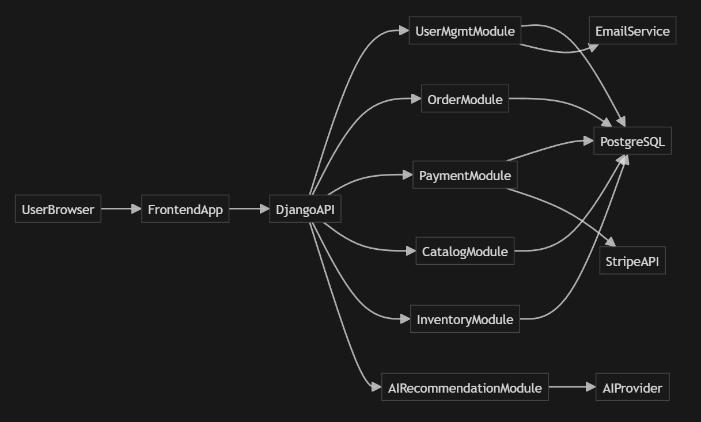
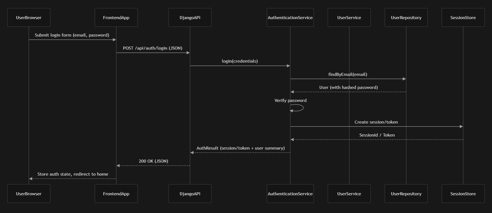
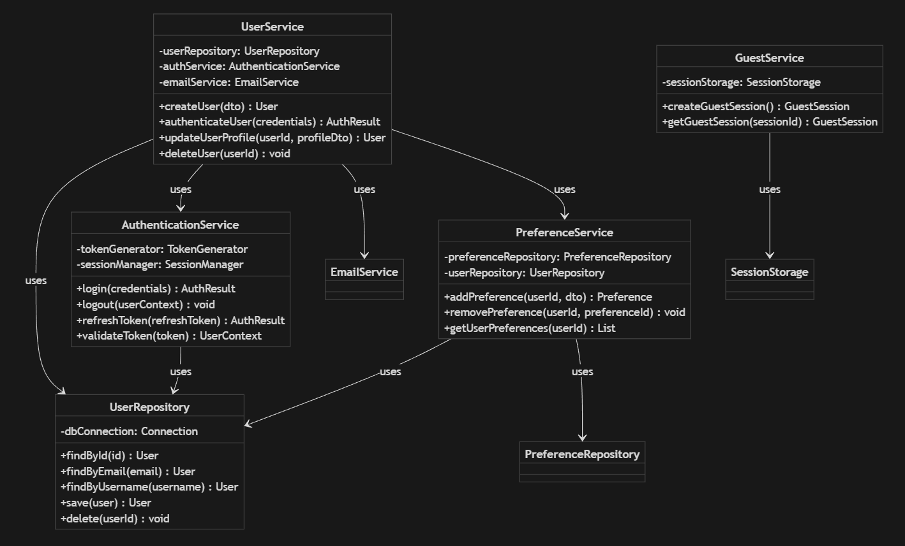

# CodePop Low-Level Design Document

## Document Overview & Introduction

This document is the **Low-Level Design (LLD)** which outlines user accounts, orders, payments, inventory, AI recommendations, and manager/admin tooling. It translates the High-Level Design into concrete technical specifications for our team to implement.

The LLD covers:

- **System architecture** — Client-server, three-tier layout (Frontend, Backend, Database), and how components interact.
- **Subsystem designs** — User management, orders, payments, catalog, inventory, and AI recommendations, with class-level responsibilities and interfaces.
- **Data and persistence** — Database schema (PostgreSQL), tables, normalization, indexes, and data access patterns.
- **Cross-cutting concerns** — Security, performance, monitoring, deployment, and consistency (naming, docs, testing).

Each major area is specified with classes, methods, relationships, design choices, and (where applicable) UML diagrams and ERDs, so the team can build from a single, consistent blueprint.

---

### **Section 1: System Architecture & User Management Subsystem**

---

#### 1.1 System Architecture Overview

**Architecture style and tiers**

CodePop follows a **client–server**, **three-tier** architecture:

- **Presentation tier (frontend)** — React-based single-page application(s) serving the customer ordering experience, manager dashboard, and admin interface. The frontend communicates with the backend exclusively over HTTPS via REST APIs; no direct database access.
- **Application tier (backend)** — Django-based REST API that implements business logic, authentication, authorization, and integrations with external services (Stripe, AI provider, email, maps). All user-facing and internal operations flow through this tier.
- **Data tier** — PostgreSQL database storing users, orders, payments, catalog, inventory, preferences, and related data. Access is only through the backend (Django ORM); see Section 4 for schema and data access.

**Core runtime components**

| Component                      | Responsibility                                                    | Technology / Interaction                                           |
| ----------------------------- | ----------------------------------------------------------------- | ------------------------------------------------------------------ |
| Web client(s)                 | Customer UI, manager UI, admin UI                                 | React; HTTP/JSON to backend                                       |
| Django API server             | Request routing, auth middleware, business logic                  | Gunicorn/uWSGI + Django; HTTP to DB and external APIs              |
| User Management module        | Registration, login, profiles, preferences, guests                | Part of Django backend; uses `users`, `preferences` tables (Section 4) |
| Order Management module       | Order lifecycle, status, QR codes                                 | Part of Django backend; depends on User Management, Catalog, Payment |
| Payment module                | Payment processing, refunds                                       | Part of Django backend; integrates with Stripe                     |
| Catalog module                | Products, drinks, customization                                   | Part of Django backend; uses catalog and inventory data           |
| Inventory module              | Stock levels, alerts, restock                                     | Part of Django backend                                             |
| AI Recommendation module      | Personalized recommendations, chatbot                             | Part of Django backend; uses preferences; calls external AI API    |
| PostgreSQL                    | Persistent storage                                                | Accessed via Django ORM / repositories                             |
| Stripe                        | Payment processing                                                | HTTPS API; webhooks for async events                               |
| Email / notification service  | Verification, password reset, order/alert notifications           | HTTPS or SMTP from backend                                         |
| AI provider (e.g., Claude API)| Recommendation and complaint chatbot                             | HTTPS API from backend                                             |
| Maps / geolocation provider   | Store locator, delivery/pickup                                    | HTTPS API from frontend or backend                                 |

**Request/response flow — User login and authenticated request**

1. User submits login credentials from the React login form.
2. Frontend sends `POST /api/auth/login` with credentials (e.g., email + password) over HTTPS.
3. Django API receives the request; middleware may attach CORS and security headers.
4. `AuthenticationService.login(credentials)` is invoked: credentials are validated (e.g., against hashed password in `users` table via `UserRepository`); on success, a session or token is created and stored (e.g., Django session in DB or signed cookie).
5. Backend returns success response with session cookie or token (and optionally user profile summary).
6. For a subsequent authenticated request (e.g., "Get my profile"): frontend sends `GET /api/users/me` with session cookie or `Authorization` token.
7. `AuthenticationService.validateToken(sessionOrToken)` (or Django auth middleware) resolves the current user; `UserService` or a profile endpoint returns the user's profile from `UserRepository.findById(userId)`.
8. Response is returned as JSON to the frontend.

**Request/response flow — User signup**

1. User submits registration form (email, username, password, optional profile fields).
2. Frontend sends `POST /api/auth/register` (or `/api/users/`) with payload.
3. Backend invokes `UserService.createUser(dto)`: validates input, checks uniqueness (e.g., `UserRepository.findByEmail`, `findByUsername`), hashes password, persists user via `UserRepository.save()`; optionally triggers `emailService` for verification email.
4. Backend automatically logs in the user: calls `AuthenticationService.login(credentials)` (or issues a session/token for the new user), then returns the same kind of auth payload as login (session/token + user summary) so the client can stay in an authenticated state without a separate login request.

**Architecture justification**

- **Client–server and three-tier** — Fits project scope and team size: clear separation of UI, business logic, and data; single backend simplifies deployment, security, and consistency. Aligns with typical course/assignment expectations for a full-stack application.
- **Monolithic backend (Django) rather than microservices** — Reduces operational and networking complexity; shared database and in-process calls simplify transactions and debugging. Microservices would add deployment and coordination overhead without clear benefit at current scale.
- **No serverless for core logic** — Keeps control flow and state in one place; serverless is reserved for optional/event-driven use cases if needed. Detailed technology comparisons are in **Section 6**.

**Technology stack summary**

- **Frontend:** React, with HTTP client for REST API calls.
- **Backend:** Django (Python), REST API (Django REST framework or equivalent), PostgreSQL driver/ORM.
- **Database:** PostgreSQL (see Section 4 for schema).
- **External:** Stripe (payments), AI provider (e.g., Claude API), email service, maps/geolocation (e.g., Mapbox).

Detailed justifications for framework and service choices are in **Section 6**.

---

#### 1.2 User Management Subsystem

**Subsystem overview**

The User Management subsystem is responsible for identity, authentication, profile management, drink preferences, and guest sessions. It ensures that only authorized users (or designated guest sessions) can perform actions that require identity (e.g., placing orders, viewing history, managing preferences).

- **Purpose and responsibilities**
  - User registration and account lifecycle (create, update, delete).
  - Authentication: login, logout, session or token issuance and validation.
  - Profile management: read/update of user attributes (name, contact, role, etc.).
  - Drink preference CRUD and retrieval for use by the Catalog and AI Recommendation subsystems.
  - Guest session creation and lookup so unauthenticated users can browse and build orders before optionally converting to a registered account.

- **Dependencies**
  - **Database:** `users` (and any extended/auth tables), `preferences`; see **Section 4.2** for table definitions.
  - **External:** Email service (verification, password reset); optionally notification service for account-related alerts.
  - **Internal:** Order Management (orders tied to `user_id`); AI Recommendation (consumes preferences via `PreferenceService` or shared interfaces).

- **Key interfaces (API surface)**
  - `POST /api/auth/register` — Create new user (calls `UserService.createUser`); on success, auto-login and return session/token + user (same shape as login).
  - `POST /api/auth/login` — Login (calls `AuthenticationService.login`).
  - `POST /api/auth/logout` — Logout (calls `AuthenticationService.logout`).
  - `GET /api/users/me`, `PATCH /api/users/me` — Current user profile (calls `UserService` / `UserRepository`).
  - `GET /api/preferences/`, `POST /api/preferences/`, `DELETE /api/preferences/:id` — Preferences (calls `PreferenceService`).
  - Guest endpoints (e.g., `POST /api/guest/session`, `GET /api/guest/session`) — `GuestService.createGuestSession`, `getGuestSession`.

Security hardening (password hashing, RBAC, rate limiting, session configuration) is detailed in **Section 5**.

**Detailed class breakdown**

**UserService**

- **Responsibility:** Orchestrates user CRUD and profile operations; delegates persistence to `UserRepository`, auth to `AuthenticationService`, and outbound email to `EmailService`. Does not perform password hashing directly—relies on auth layer or Django's user model.
- **Fields:**
  - `userRepository` (UserRepository) — Data access for user entities.
  - `authService` (AuthenticationService) — For token/session creation after registration or login.
  - `emailService` (interface to email provider) — Sends verification or password-reset emails.
- **Methods:**
  - `createUser(dto: CreateUserDto): User` — Validates dto (email format, username uniqueness, password policy); checks uniqueness via `userRepository.findByEmail`, `findByUsername`; creates user entity (password hashed by auth/django); `userRepository.save(user)`; optionally sends verification email via `emailService`; returns created user (or throws on validation/duplicate); The register API handler calls `AuthenticationService.login(credentials)` after a successful `createUser()` and returns the resulting AuthResult to the client.”.
  - `authenticateUser(credentials: LoginCredentials): AuthResult` — Delegates to `authService.login(credentials)`; returns session/token and user summary.
  - `updateUserProfile(userId: Id, profileDto: UpdateProfileDto): User` — Ensures caller is authorized for `userId`; updates allowed profile fields; `userRepository.save(user)`; returns updated user.
  - `deleteUser(userId: Id): void` — Ensures authorization; performs soft delete or hard delete per policy; clears or anonymizes related data as defined (e.g., preferences, orders reference); `userRepository.delete(userId)`.
- **Error handling:** Validation errors and duplicate email/username return client-friendly errors; not-found and unauthorized return appropriate HTTP status codes.

**AuthenticationService**

- **Responsibility:** Verifies credentials, issues and invalidates sessions or tokens, and validates incoming requests. Encapsulates whether the system uses Django sessions, JWT, or both.
- **Fields:**
  - `tokenGenerator` (or session backend) — Creates and signs tokens or session identifiers.
  - `sessionManager` — Stores and retrieves session data (e.g., DB-backed sessions, or token blocklist for logout).
- **Methods:**
  - `login(credentials: LoginCredentials): AuthResult` — Looks up user (e.g., via `UserRepository.findByEmail`); verifies password (Django/auth library); creates session or token via `tokenGenerator`; stores session via `sessionManager`; returns `AuthResult` (token/session id + user summary).
  - `logout(userContext: UserContext): void` — Invalidates session or token (e.g., remove from store or add to blocklist).
  - `refreshToken(refreshToken: string): AuthResult` — If refresh tokens are used: validates refresh token, issues new access token/session; returns new `AuthResult`.
  - `validateToken(tokenOrSessionId: string): UserContext | null` — Verifies signature and expiry; resolves user id; returns `UserContext` for downstream use or `null` if invalid/expired.
- **Integration:** Used by Django middleware or view layer to set `request.user` for protected endpoints.

**UserRepository**

- **Responsibility:** Single place for all persistence operations on the `users` table (and any Django auth tables). Abstracts Django ORM or raw SQL; returns domain entities or ORM models as agreed.
- **Fields:**
  - `dbConnection` or ORM handle — Django model layer / database connection.
- **Methods:**
  - `findById(id: Id): User | null` — Returns user by primary key; null if not found.
  - `findByEmail(email: string): User | null` — Returns user by email (unique).
  - `findByUsername(username: string): User | null` — Returns user by username (unique).
  - `save(user: User): User` — Inserts or updates user; returns saved entity (e.g., with generated id).
  - `delete(userId: Id): void` — Deletes or soft-deletes user by id.
- **Conventions:** Methods raise an exception or return null for "not found" consistently; constraint violations (e.g., duplicate email) surface as specific errors for the service layer to map to HTTP responses.

**PreferenceService**

- **Responsibility:** Manages per-user drink preferences (e.g., favorite base sodas, syrups, or saved customizations). Used by the AI Recommendation subsystem to personalize suggestions; by Catalog/UI to prefill or highlight options.
- **Fields:**
  - `preferenceRepository` — Data access for `preferences` table (Section 4.2).
  - `userRepository` — To validate that the user exists and to enforce ownership.
- **Methods:**
  - `addPreference(userId: Id, preferenceDto: PreferenceDto): Preference` — Validates user exists; validates preference payload; persists via `preferenceRepository.save`; returns created preference.
  - `removePreference(userId: Id, preferenceId: Id): void` — Ensures preference belongs to `userId`; deletes or soft-deletes.
  - `getUserPreferences(userId: Id): List<Preference>` — Returns all active preferences for the user (e.g., for profile page or recommendation engine).
- **Dependencies:** AI Recommendation (Section 3) may call `getUserPreferences` or consume preference data via a shared interface or API.

**GuestService**

- **Responsibility:** Creates and retrieves guest sessions so unauthenticated users can have a temporary identity (e.g., for cart or preferences stored server-side). Supports upgrade path: when a guest registers or logs in, their session data can be merged into the new or existing user.
- **Fields:**
  - `sessionStorage` — Backing store for guest session data (e.g., Django session keyed by guest id, or Redis/DB keyed by `guest_session_id`). Stores minimal data: guest id, created_at, optional cart/preference snapshot.
- **Methods:**
  - `createGuestSession(): GuestSession` — Generates a unique guest session id; stores a new record in `sessionStorage`; returns `GuestSession` (id, optional expiry).
  - `getGuestSession(sessionId: string): GuestSession | null` — Looks up session by id; returns session or null if expired/invalid.
- **Upgrade path:** When guest converts to user (register/login), the application layer merges guest cart/preferences into the user and then invalidates or disassociates the guest session. Order history is attached to the user from that point forward.

**UML class diagram — User Management Subsystem**

*Note:* `EmailService` and `PreferenceRepository` are interfaces or external modules; their implementations may live in other packages. Section 4 describes the `users` and `preferences` table schemas.

**Design decisions**

- **Django built-in User model vs custom User model**
  - **Choice:** Use Django's built-in `User` model (and `AbstractUser` extension if extra fields are needed, e.g., `role`, `phone_number`).
  - **Rationale:** Built-in model provides battle-tested password hashing, group/permission hooks, and admin integration; reduces custom security code. Extending with a one-to-one or subclass satisfies CodePop's need for roles and contact info without maintaining a full custom auth stack.

- **Token-based vs session-based auth**
  - **Choice:** Session-based auth (Django sessions stored in DB or cache) for the primary web app; optional JWT or signed tokens for mobile or third-party API access if required later.
  - **Rationale:** Sessions simplify logout (invalidate server-side), CSRF handling with cookies, and integration with Django middleware. Tokens are stateless but require explicit refresh/revocation and storage considerations.

- **Guest user handling**
  - **Choice:** Server-side guest sessions: backend issues a guest session id (e.g., in a cookie or returned to client); cart and temporary preferences stored keyed by that id. On register/login, merge guest data into the authenticated user and retire the guest session.
  - **Rationale:** Allows "continue as guest" without polluting the `users` table; clear upgrade path and single source of truth for active cart/state. Limits abuse by tying sessions to a short-lived or single-device identity.

---

### **Section 2: Order Management & Payment Subsystem**
**Assigned to: Team Member 2**

#### 2.1 Order Management Subsystem
- **Subsystem Overview**
  - Purpose: Handle order lifecycle from creation to completion
  - Integration points: User Management, Catalog, Payment, Notifications
  
- **Detailed Class Breakdown**
  - `OrderService` class
    - Fields: orderRepository, paymentService, notificationService, inventoryService
    - Methods: createOrder(), updateOrderStatus(), cancelOrder(), getOrderHistory()
    - Responsibilities: Order business logic and orchestration
  - `OrderRepository` class
    - Fields: dbConnection
    - Methods: save(), findById(), findByUserId(), findByStatus()
    - Responsibilities: Order data persistence
  - `OrderItem` class
    - Fields: drinkId, quantity, customization, price
    - Methods: calculateSubtotal()
    - Responsibilities: Represent individual items in an order
  - `OrderStatusManager` class
    - Fields: statusTransitionRules
    - Methods: canTransition(), updateStatus(), getStatusHistory()
    - Responsibilities: Order status state machine management
  - `QRCodeService` class
    - Fields: codeGenerator, expirationManager
    - Methods: generateQRCode(), validateQRCode(), expireQRCode()
    - Responsibilities: QR code generation and validation for pickup

- **UML Class Diagram** for Order Management Subsystem
  - Classes, relationships, and dependencies

#### 2.2 Payment Integration Subsystem
- **Subsystem Overview**
  - Integration with Stripe payment processing
  - Payment method management
  
- **Detailed Class Breakdown**
  - `PaymentService` class
    - Fields: stripeClient, paymentRepository, orderService
    - Methods: processPayment(), refundPayment(), getPaymentStatus()
    - Responsibilities: Payment processing orchestration
  - `StripeIntegration` class
    - Fields: apiKey, webhookSecret
    - Methods: createPaymentIntent(), confirmPayment(), handleWebhook()
    - Responsibilities: Stripe API communication
  - `PaymentRepository` class
    - Fields: dbConnection
    - Methods: save(), findByOrderId(), findByUserId()
    - Responsibilities: Payment transaction persistence

- **UML Class Diagram** for Payment Subsystem
  - Integration with Order Management
  - External dependency on Stripe

- **Design Decisions & Alternatives**
  - Stripe vs Square vs PayPal
  - Payment tokenization approach
  - Webhook handling strategy

---

### **Section 3: Catalog, Inventory & AI Recommendation Subsystems**
**Assigned to: Team Member 3**

#### 3.1 Soda Catalog Subsystem
- **Subsystem Overview**
  - Product catalog management
  - Custom drink creation
  - Menu management
  
- **Detailed Class Breakdown**
  - `CatalogService` class
    - Fields: productRepository, inventoryService
    - Methods: getProducts(), getProductById(), searchProducts(), getAvailableProducts()
    - Responsibilities: Product catalog operations
  - `ProductRepository` class
    - Fields: dbConnection
    - Methods: findAll(), findById(), findByCategory(), save()
    - Responsibilities: Product data access
  - `DrinkBuilder` class
    - Fields: validationRules, pricingCalculator
    - Methods: buildDrink(), validateDrink(), calculatePrice()
    - Responsibilities: Drink object construction and validation
  - `CustomizationService` class
    - Fields: ingredientRepository, validationService
    - Methods: addSyrup(), addAddIn(), removeIngredient(), validateCustomization()
    - Responsibilities: Drink customization logic

- **UML Class Diagram** for Catalog Subsystem

#### 3.2 Inventory Management Subsystem
- **Subsystem Overview**
  - Inventory tracking and management
  - Low stock alerts
  - Supply hub coordination
  
- **Detailed Class Breakdown**
  - `InventoryService` class
    - Fields: inventoryRepository, alertService, supplyHubService
    - Methods: updateInventory(), checkStockLevel(), getLowStockItems(), requestRestock()
    - Responsibilities: Inventory operations and coordination
  - `InventoryRepository` class
    - Fields: dbConnection
    - Methods: findByItemName(), updateQuantity(), findAllBelowThreshold()
    - Responsibilities: Inventory data access
  - `StockAlertService` class
    - Fields: notificationService, thresholdRules
    - Methods: checkThresholds(), sendAlert(), updateThreshold()
    - Responsibilities: Low stock monitoring and alerts

- **UML Class Diagram** for Inventory Subsystem

#### 3.3 AI Recommendation Subsystem
- **Subsystem Overview**
  - Personalized drink recommendations
  - Random drink generation
  - Complaint handling chatbot
  
- **Detailed Class Breakdown**
  - `RecommendationService` class
    - Fields: contentBasedModel, collaborativeFilteringModel, userPreferenceService
    - Methods: getPersonalizedRecommendations(), getRandomRecommendation(), trainModel()
    - Responsibilities: Recommendation generation
  - `ContentBasedFilter` class
    - Fields: scikitLearnModel, featureExtractor
    - Methods: calculateSimilarity(), generateRecommendations()
    - Responsibilities: Content-based filtering using Scikit-Learn
  - `AIChatbotService` class
    - Fields: claudeClient, conversationHistory, responseValidator
    - Methods: processComplaint(), generateResponse(), validateResponse()
    - Responsibilities: AI-powered complaint handling using Claude API

- **UML Class Diagram** for AI Recommendation Subsystem

- **Design Decisions & Alternatives**
  - Scikit-Learn vs TensorFlow for recommendations
  - Claude vs GPT-4 vs local models for chatbot
  - Model training and update strategies

---

### **Section 4: Database Design & Data Access Layer**
**Assigned to: Team Member 4**

#### 4.1 Database Schema Design
- **Database Overview**
  - PostgreSQL selection justification
  - Database normalization approach (3NF minimum)
  - Indexing strategy

#### 4.2 Detailed Table Definitions
For each table, provide:
- **Table Name**
- **Purpose**: What the table stores and why
- **Columns**: 
  - Column name
  - Data type (with precision if applicable)
  - Constraints (NOT NULL, UNIQUE, CHECK, DEFAULT)
  - Foreign key relationships
- **Primary Key**: Column(s) that uniquely identify rows
- **Foreign Keys**: Relationships to other tables
- **Indexes**: Indexed columns and justification
- **Normalization**: How 3NF is achieved

**Tables to Detail:**
1. **users** (extends Django's auth_user)
   - Additional fields: role, phone_number, created_at, updated_at
   - Relationships: One-to-many with orders, preferences, payments
   
2. **preferences**
   - Columns: id, user_id (FK), preference_type, preference_value, created_at
   - Normalization: Separate table for 1NF compliance (no comma-separated lists)
   
3. **orders**
   - Columns: id, user_id (FK), status, payment_status, pickup_time, creation_time, total_amount
   - Relationships: One-to-many with order_items, one-to-one with payments
   
4. **order_items**
   - Columns: id, order_id (FK), drink_id (FK), quantity, customization_json, price
   - Normalization: Separate table for many-to-many relationship
   
5. **drinks**
   - Columns: id, name, base_soda, size, ice_level, syrups_json, add_ins_json, price, rating_avg, rating_count, is_user_created, created_at
   - JSON fields for flexible ingredient storage
   
6. **inventory**
   - Columns: id, item_name, item_type, quantity, threshold_level, unit_cost, last_updated, store_id (FK)
   - Relationships: Many-to-many with drinks (via drink_ingredients junction table)
   
7. **payments**
   - Columns: id, order_id (FK), user_id (FK), amount, payment_method, stripe_payment_intent_id, status, refund_status, created_at
   - Security: No raw card data stored (Stripe tokens only)
   
8. **notifications**
   - Columns: id, user_id (FK), message, type, is_read, created_at, qr_code_id (FK, nullable)
   
9. **qr_codes**
   - Columns: id, order_id (FK), code_data, expiration_time, is_used, created_at
   
10. **revenue**
    - Columns: id, store_id (FK), total_amount, date, period_type (daily/weekly/monthly), manager_id (FK)
    
11. **drink_ingredients** (Junction table)
    - Columns: drink_id (FK), ingredient_id (FK), quantity
    - Purpose: Many-to-many relationship between drinks and inventory items

#### 4.3 Entity Relationship Diagram (ERD)
- Visual representation of all tables
- Relationships clearly labeled (1:1, 1:N, N:M)
- Foreign key constraints shown

#### 4.4 Data Access Layer Design
- **ORM Strategy**: Django ORM usage patterns
- **Repository Pattern**: How data access is abstracted
- **Query Optimization**: 
  - Eager loading strategies (select_related, prefetch_related)
  - Query optimization techniques
  - Caching strategies
- **Transaction Management**: 
  - When to use transactions
  - Atomic operations for orders and payments
- **Migration Strategy**: 
  - Django migrations approach
  - Data migration procedures

#### 4.5 Database Performance Considerations
- **Indexing Strategy**: 
  - Primary indexes (automatic)
  - Foreign key indexes
  - Composite indexes for common queries
  - Full-text search indexes (if needed)
- **Query Performance**: 
  - Slow query identification
  - Query optimization examples
- **Connection Pooling**: 
  - PgBouncer configuration
  - Connection limits

---

### **Section 5: Security, Performance & Monitoring**
**Assigned to: Team Member 5**

#### 5.1 Security Architecture
- **Authentication & Authorization**
  - Django authentication system details
  - Role-based access control (RBAC) implementation
  - Permission system design
  - Token management (JWT vs Django sessions)
  - Password policies and hashing (Argon2 vs PBKDF2)

#### 5.2 Security Risks & Mitigations
**Identify and address:**
1. **SQL Injection**
   - Risk: Malicious SQL queries
   - Mitigation: Django ORM parameterization, input validation
   
2. **Cross-Site Scripting (XSS)**
   - Risk: Malicious script injection
   - Mitigation: React's built-in XSS protection, input sanitization
   
3. **Cross-Site Request Forgery (CSRF)**
   - Risk: Unauthorized actions
   - Mitigation: Django CSRF tokens, SameSite cookies
   
4. **Authentication Bypass**
   - Risk: Unauthorized access
   - Mitigation: Strong password policies, rate limiting, account lockout
   
5. **Sensitive Data Exposure**
   - Risk: Payment info, email, geolocation leaks
   - Mitigation: Encryption at rest and in transit, PCI-DSS compliance via Stripe
   
6. **Insecure Direct Object References**
   - Risk: Accessing other users' data
   - Mitigation: Authorization checks, user context validation
   
7. **Security Misconfiguration**
   - Risk: Exposed secrets, default credentials
   - Mitigation: Environment variables, secure defaults, security audits

#### 5.3 Data Protection
- **Encryption at Rest**
  - Database encryption (PostgreSQL TDE or application-level)
  - Sensitive field encryption (email, geolocation)
  - Encryption algorithms: AES-256
  - Key management strategy
  
- **Encryption in Transit**
  - TLS 1.3 for all communications
  - HTTPS enforcement
  - Certificate management
  - API endpoint security

- **Sensitive Data Handling**
  - Payment information: Never stored (Stripe tokens only)
  - Email addresses: Encrypted at rest
  - Geolocation: Encrypted, 24-hour retention policy
  - Passwords: Hashed with Argon2, never stored in plaintext

#### 5.4 Compliance
- **GDPR Compliance**
  - Right to access
  - Right to erasure (data deletion)
  - Data portability
  - Consent management
  
- **CCPA Compliance**
  - California privacy rights
  - Data disclosure requirements
  
- **PCI-DSS Compliance**
  - Stripe handles card data (we remain out of scope)
  - No card data storage

#### 5.5 System Performance
- **Performance Bottlenecks Identified**
  1. **Database Query Performance**
     - Risk: Slow queries during peak hours
     - Mitigation: Indexing, query optimization, connection pooling
     
  2. **Payment Processing Latency**
     - Risk: Stripe API delays
     - Mitigation: Async processing, retry logic, fallback mechanisms
     
  3. **AI Recommendation Latency**
     - Risk: Model inference time
     - Mitigation: Caching, pre-computation, timeout handling
     
  4. **Concurrent Order Processing**
     - Risk: Race conditions, inventory conflicts
     - Mitigation: Database transactions, optimistic locking
     
  5. **Geolocation API Rate Limits**
     - Risk: Mapbox API throttling
     - Mitigation: Caching, request batching, paid tier upgrade

- **Load Handling Strategy**
  - **Horizontal Scaling**: Multiple Django instances behind load balancer
  - **Database Scaling**: Read replicas for reporting queries
  - **Caching Strategy**: 
    - Redis for session storage
    - CDN for static assets
    - Application-level caching for frequently accessed data
  - **Auto-scaling**: Cloud-based auto-scaling configuration
  - **Load Testing**: Target metrics (requests/second, response time)

#### 5.6 Monitoring & Observability
- **Application Monitoring**
  - Error tracking (Sentry or similar)
  - Performance monitoring (APM tools)
  - Log aggregation (centralized logging)
  
- **Infrastructure Monitoring**
  - Server metrics (CPU, memory, disk)
  - Database performance metrics
  - Network latency monitoring
  
- **Business Metrics**
  - Order completion rate
  - Payment success rate
  - User engagement metrics
  
- **Alerting Strategy**
  - Critical alerts: Database down, payment failures
  - Warning alerts: High error rates, slow response times
  - Notification channels: Email, Slack, PagerDuty

#### 5.7 Automated Testing Strategy
- **Unit Testing**
  - Framework: Django TestCase, pytest
  - Coverage targets: 80%+ for critical paths
  - Test categories: Service layer, repository layer, utility functions
  
- **Integration Testing**
  - API endpoint testing
  - Database integration tests
  - External service mocking (Stripe, Mapbox, Claude)
  
- **End-to-End Testing**
  - Critical user flows
  - Payment flow testing
  - Order lifecycle testing
  
- **Performance Testing**
  - Load testing tools: Apache JMeter, Locust
  - Stress testing scenarios
  - Capacity planning

---

### **Section 6: User Interfaces, Technology Stack, Deployment & Integrations**
**Assigned to: Team Member 6**

#### 6.1 User Interface Prototypes
**For each user type, provide:**
- **Screenshots/Mockups** of key interfaces
- **UI Component Specifications**
- **Usability Features**
- **Accessibility Features**

**User Types:**
1. **Customer (Account User)**
   - Home page
   - Drink creation page
   - Cart page
   - Payment/checkout page
   - Order confirmation page
   - Account preferences page
   - Order history page
   
2. **Customer (Guest User)**
   - Home page (simplified)
   - Drink creation page
   - Cart page
   - Payment/checkout page
   
3. **Manager**
   - Manager dashboard
   - Revenue reports
   - Inventory management
   
4. **Admin**
   - Admin dashboard
   - User management interface
   - Account creation/editing
   
5. **Super Admin**
   - System-wide dashboard
   - Multi-store analytics
   
6. **Logistics Manager**
   - Supply hub dashboard
   - Inventory distribution interface
   - CSV import/export interface
   
7. **Repair Staff**
   - Maintenance dashboard
   - Machine status interface
   - Repair scheduling interface

#### 6.2 Usability & Accessibility
- **Usability Principles**
  - Consistency: Design language across all pages
  - Simplicity: Minimal clicks to complete tasks
  - Feedback: Clear status indicators
  - Error prevention: Input validation, confirmation dialogs
  
- **Accessibility Implementation**
  - **WCAG 2.1 Compliance**: Level AA target
  - **Screen Reader Support**: ARIA labels, semantic HTML
  - **Keyboard Navigation**: Tab order, focus indicators
  - **Color Contrast**: WCAG contrast ratios (4.5:1 for text)
  - **Color Blindness**: Color palette tested for common types
  - **Text Alternatives**: Alt text for images, icons
  - **Responsive Design**: Mobile-first approach, flexible layouts

#### 6.3 User Flow Diagrams
**Key User Interactions:**
1. **Order Placement Flow**
   - Start → Browse/Design Drink → Add to Cart → Checkout → Payment → Confirmation
   - Decision points: Account vs Guest, Payment method, Pickup option
   
2. **Account Creation Flow**
   - Sign up → Email verification → Set preferences → Home
   
3. **Order Pickup Flow**
   - Order ready → QR code generation → User arrives → QR scan → Pickup
   
4. **Manager Dashboard Flow**
   - Login → Dashboard → Select report → View data → Export (optional)

#### 6.4 Technology Stack & Justifications
**Programming Languages:**
- **Python**: Backend development
  - Justification: Django framework, AI/ML libraries (Scikit-Learn), extensive ecosystem
  - Alternatives considered: Node.js (less mature ML support), Java (more verbose)
  
- **JavaScript/TypeScript**: Frontend development
  - Justification: React Native compatibility, large ecosystem
  - Alternatives considered: Dart/Flutter (smaller team expertise), native Swift/Kotlin (more development overhead)

**Frameworks:**
- **Django**: Backend framework
  - Justification: Built-in admin, ORM, security features, rapid development
  - Alternatives considered: Flask (more manual setup), FastAPI (less mature ecosystem)
  
- **React Native**: Frontend framework
  - Justification: Cross-platform, component reusability, hot reload
  - Alternatives considered: Native apps (more development time), Flutter (team expertise)

**Libraries:**
- **Django REST Framework**: API development
- **Stripe Python SDK**: Payment processing
- **Mapbox GL JS**: Mapping and geolocation
- **Scikit-Learn**: Machine learning
- **Anthropic SDK**: Claude API integration
- **Firebase Admin SDK**: Push notifications
- **PostgreSQL adapter (psycopg2)**: Database connectivity

**Justification for each**: Cost, performance, maintainability, team expertise, community support

#### 6.5 Third-Party Integrations
**Detailed integration specifications for each:**

1. **Stripe Payment Processing**
   - Integration type: REST API + Webhooks
   - Authentication: API keys (secret + publishable)
   - Key endpoints: Payment Intents, Webhooks
   - Error handling: Retry logic, fallback mechanisms
   - Security: Webhook signature verification, PCI-DSS compliance
   - Alternatives considered: Square, PayPal (justification for Stripe choice)

2. **Mapbox Geolocation**
   - Integration type: REST API + Client SDK
   - Authentication: Bearer tokens
   - Key features: Geocoding, routing, proximity detection
   - Rate limits: 600 req/min (free tier)
   - Fallback: Time-based pickup when unavailable
   - Alternatives considered: Google Maps, Apple MapKit

3. **Firebase Cloud Messaging (FCM)**
   - Integration type: REST API / Admin SDK
   - Authentication: Service account credentials
   - Features: Push notifications, device token management
   - Fallback: Email notifications
   - Alternatives considered: OneSignal, AWS SNS

4. **Claude AI (Anthropic)**
   - Integration type: REST API
   - Authentication: API key
   - Features: Complaint handling, drink recommendations
   - Rate limits: 50K tokens/min
   - Timeout handling: 10-second timeout, fallback to canned responses
   - Alternatives considered: GPT-4, local models

5. **Scikit-Learn**
   - Integration type: In-process Python library
   - Features: Content-based filtering, demand forecasting
   - Model storage: Serialized models on disk
   - Alternatives considered: TensorFlow, cloud ML services

6. **Django Email (SMTP)**
   - Integration type: SMTP protocol
   - Provider: TBD (SendGrid, AWS SES, etc.)
   - Features: Account verification, password reset
   - Alternatives considered: Twilio SendGrid API, Mailgun

#### 6.6 Deployment Plan
**Deployment Strategy:**
- **Containerization**: Docker containers for Django app
- **Orchestration**: Docker Compose for local, Kubernetes for production (optional)
- **Cloud Services**: 
  - Frontend: CDN (AWS CloudFront, Netlify, or Vercel)
  - Backend: Cloud hosting (AWS EC2, DigitalOcean, Heroku)
  - Database: Managed PostgreSQL (AWS RDS, Heroku Postgres)
  
**Deployment Environments:**
1. **Development**
   - Local Docker setup
   - Hot reload enabled
   - Debug mode active
   
2. **Staging**
   - Production-like environment
   - Test data
   - Integration testing
   
3. **Production**
   - Optimized builds
   - SSL/TLS certificates
   - Monitoring enabled
   - Backup procedures

**CI/CD Pipeline:**
- **Continuous Integration**: 
  - Automated testing on pull requests
  - Code quality checks (linting, formatting)
  - Security scanning
- **Continuous Deployment**:
  - Automated deployment to staging
  - Manual approval for production
  - Rollback procedures

**Deployment Steps:**
1. Code freeze and final testing
2. Database migrations
3. Build and push Docker images
4. Deploy to staging for validation
5. Production deployment (blue-green or rolling)
6. Post-deployment verification
7. Monitoring and rollback plan

**Backup & Recovery:**
- Database backups: Daily automated backups, 30-day retention
- Disaster recovery: RTO (Recovery Time Objective) < 4 hours
- Data retention policies

---

## Cross-Cutting Concerns (All Team Members)

### Consistency Requirements
- **Naming Conventions**: 
  - Classes: PascalCase (e.g., `OrderService`)
  - Methods: camelCase (e.g., `createOrder()`)
  - Database tables: snake_case (e.g., `order_items`)
- **Documentation Standards**: 
  - Inline comments for complex logic
  - Method documentation (docstrings)
  - API documentation (OpenAPI/Swagger)

### Task Assignment Matrix
**Tasks identified, prioritized, and assigned to feature teams:**

| Task | Priority | Assigned Team | Dependencies |
|------|----------|---------------|--------------|
| User authentication system | Must Have | Backend | Database schema |
| Order creation flow | Must Have | Backend + Frontend | User auth, Catalog |
| Payment integration | Must Have | Backend | Order system |
| Database schema implementation | Must Have | Backend | None |
| UI prototypes | Must Have | Frontend | None |
| AI recommendation engine | Should Have | Backend | User preferences |
| Geolocation integration | Should Have | Frontend + Backend | Mapbox API |
| Admin dashboard | Must Have | Frontend + Backend | User management |
| Manager dashboard | Must Have | Frontend + Backend | Revenue, Inventory |
| Security implementation | Must Have | Backend | All subsystems |
| Performance optimization | Should Have | Backend | All subsystems |
| Automated testing | Should Have | All teams | All features |

---

## Document Quality Checklist

Before finalizing, ensure:
- [ ] All UML diagrams are clear, legible, and consistent with written descriptions
- [ ] All design decisions include alternatives considered and rationale
- [ ] Database tables are normalized to at least 3NF
- [ ] All classes follow Single Responsibility Principle
- [ ] Inheritance is used appropriately (not overcomplicated)
- [ ] Composition is used where objects work together
- [ ] Security risks are identified with mitigation strategies
- [ ] Performance bottlenecks are addressed with solutions
- [ ] UI prototypes are included for all user types
- [ ] User flows are clearly described
- [ ] Technology choices are justified
- [ ] Deployment plan is detailed and feasible
- [ ] Third-party integrations are thoroughly explained
- [ ] Low-level design is consistent with high-level design
- [ ] Tasks are assigned to appropriate teams

---

## Team Member Responsibilities Summary

**Team Member 1**: System Architecture + User Management Subsystem
- Architecture overview, User Management classes, UML diagrams, design decisions

**Team Member 2**: Order Management + Payment Subsystems  
- Order classes, Payment classes, UML diagrams, Stripe integration details

**Team Member 3**: Catalog + Inventory + AI Recommendation Subsystems
- Catalog classes, Inventory classes, AI classes, UML diagrams, ML model details

**Team Member 4**: Database Design + Data Access Layer
- All table definitions, ERD, normalization, indexing, ORM patterns, performance

**Team Member 5**: Security + Performance + Monitoring
- Security risks/mitigations, encryption, compliance, performance bottlenecks, monitoring, testing

**Team Member 6**: UI/UX + Technology Stack + Deployment + Integrations
- UI prototypes, accessibility, user flows, tech stack justifications, deployment plan, third-party integrations

---

## Next Steps

1. **Team Meeting**: Review this structure and assign sections
2. **Template Creation**: Create a shared document template with section headers
3. **Parallel Work**: Each team member works on their assigned section
4. **Integration Meeting**: Review sections for consistency and completeness
5. **Final Review**: Ensure all assignment requirements are met
6. **Documentation**: Compile into final Low-Level Design document

---

**Note**: This structure ensures comprehensive coverage of all assignment requirements while allowing independent work. Regular team sync meetings are recommended to ensure consistency and address dependencies.
