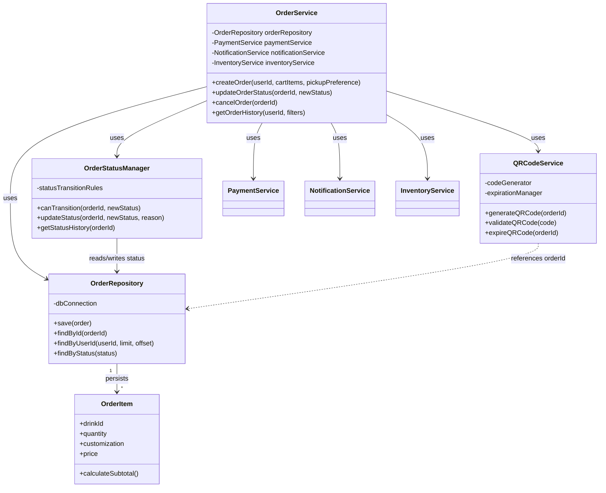
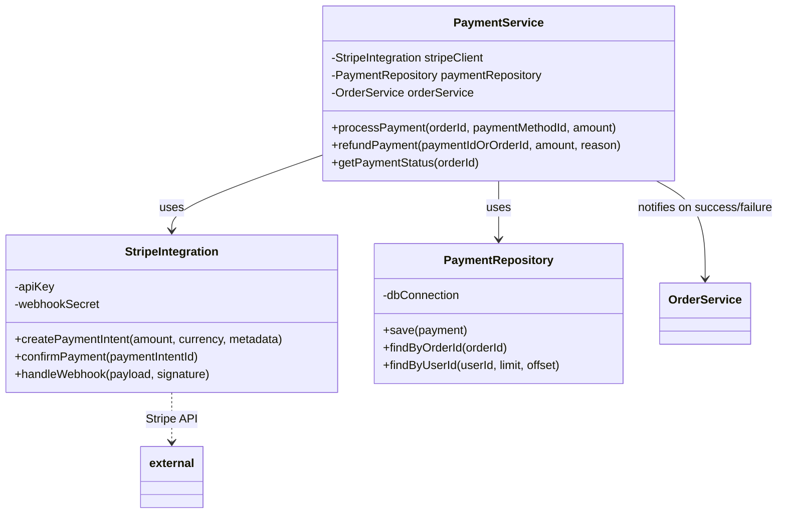

# Section 2: Order Management & Payment Subsystem

**Assigned to: Maddax**
---

## 2.1 Order Management Subsystem

### Subsystem Overview

The Order Management Subsystem is responsible for the full order lifecycle from creation through completion. It ensures that orders are created consistently, status changes follow valid transitions, and customers receive pickup credentials (QR codes) and notifications at the right times.

- **Purpose**: Handle order lifecycle from creation to completion; coordinate cart → payment → fulfillment → pickup.
- **Integration points**:
  - **User Management**: Resolve user/guest for order ownership and notifications.
  - **Catalog**: Resolve drink/product details and pricing for order items.
  - **Payment**: Trigger payment and react to payment success/failure before confirming the order.
  - **Notifications**: Send status updates (e.g., order confirmed, ready for pickup).
- **Key interfaces**: Order creation (cart + user + pickup preference), status updates (internal and from external triggers), and QR code generation/validation for pickup.

### Detailed Class Breakdown

#### `OrderService` class

- **Fields**
  - `orderRepository`: OrderRepository — persistence of orders and order items.
  - `paymentService`: PaymentService — process payment and refunds.
  - `notificationService`: NotificationService — send order status notifications.
  - `inventoryService`: InventoryService — reserve/release or check inventory for items.
- **Methods**
  - `createOrder(userId, cartItems, pickupPreference)`: Validates cart, checks inventory, creates order in PENDING state, triggers payment flow; on payment success finalizes order and triggers notification and QR generation.
  - `updateOrderStatus(orderId, newStatus)`: Delegates to OrderStatusManager for validity, then persists and sends notifications.
  - `cancelOrder(orderId)`: Validates cancellability, initiates refund if paid, updates status to CANCELLED, releases inventory, notifies user.
  - `getOrderHistory(userId, filters)`: Returns paginated list of orders for the user (via OrderRepository).
- **Responsibilities**: Order business logic and orchestration; single entry point for order operations used by API layer.

#### `OrderRepository` class

- **Fields**
  - `dbConnection`: Database connection/ORM session (e.g., Django ORM).
- **Methods**
  - `save(order)`: Persists order and its OrderItems; used for create and update.
  - `findById(orderId)`: Returns order with items by primary key.
  - `findByUserId(userId, limit, offset)`: Returns orders for a user (e.g., for history).
  - `findByStatus(status)`: Returns orders in a given status (e.g., for fulfillment queue).
- **Responsibilities**: Order and order-item data persistence; no business rules.

#### `OrderItem` class

- **Fields**
  - `drinkId`: Reference to catalog/drink.
  - `quantity`: int.
  - `customization`: JSON or structured object (e.g., syrups, add-ins).
  - `price`: Decimal (unit price at time of order).
- **Methods**
  - `calculateSubtotal()`: Returns `quantity * price` (or sum of line-level adjustments if any).
- **Responsibilities**: Represent a single line item in an order; immutable after order confirmation for auditability.

#### `OrderStatusManager` class

- **Fields**
  - `statusTransitionRules`: Map or table of allowed (currentStatus → newStatus) transitions.
- **Methods**
  - `canTransition(orderId, newStatus)`: Returns whether the order’s current status may transition to `newStatus`.
  - `updateStatus(orderId, newStatus, reason?)`: Performs transition (via OrderRepository), records in status history.
  - `getStatusHistory(orderId)`: Returns chronological list of status changes for the order.
- **Responsibilities**: Enforce order status state machine; prevent invalid transitions (e.g., CANCELLED → IN_PROGRESS).

#### `QRCodeService` class

- **Fields**
  - `codeGenerator`: Generates unique QR payload (e.g., UUID or signed token).
  - `expirationManager`: Tracks and enforces QR expiration (e.g., time-to-live after “ready for pickup”).
- **Methods**
  - `generateQRCode(orderId)`: Creates unique code, stores mapping orderId ↔ code and expiration, returns code/payload for display.
  - `validateQRCode(code)`: Returns orderId and validity (e.g., not expired, not already used); used at pickup.
  - `expireQRCode(orderId)`: Marks code as used or expired so it cannot be reused.
- **Responsibilities**: QR code generation and validation for pickup; no payment or order-creation logic.

### UML Class Diagram — Order Management Subsystem



- **Relationships**: OrderService orchestrates repositories and external services. OrderRepository persists aggregates that include OrderItems. OrderStatusManager and QRCodeService are used by OrderService and may interact with the same persistence (orders table) for status and QR metadata.

### Code samples — Order Management

Plain Python samples; can be adapted to Django ORM. Persistence is in-memory for illustration.

```python
from dataclasses import dataclass
from decimal import Decimal
from typing import Any, Optional
from enum import Enum

class OrderStatus(str, Enum):
    PENDING = "pending"
    CONFIRMED = "confirmed"
    IN_PROGRESS = "in_progress"
    READY_FOR_PICKUP = "ready_for_pickup"
    COMPLETED = "completed"
    CANCELLED = "cancelled"

@dataclass
class OrderItem:
    drink_id: int
    quantity: int
    customization: dict[str, Any]
    price: Decimal

    def calculate_subtotal(self) -> Decimal:
        return self.price * self.quantity

@dataclass
class Order:
    order_id: Optional[int]
    user_id: int
    items: list[OrderItem]
    status: OrderStatus
    total_amount: Decimal = Decimal("0")

    def __post_init__(self):
        if self.total_amount == 0 and self.items:
            self.total_amount = sum(i.calculate_subtotal() for i in self.items)

class OrderRepository:
    def __init__(self, db_connection: Any = None):
        self._db = db_connection or {}
        self._next_id = 1

    def save(self, order: Order) -> Order:
        if order.order_id is None:
            order.order_id = self._next_id
            self._next_id += 1
        self._db[order.order_id] = order
        return order

    def find_by_id(self, order_id: int) -> Optional[Order]:
        return self._db.get(order_id)

    def find_by_user_id(self, user_id: int, limit: int = 20, offset: int = 0) -> list[Order]:
        orders = [o for o in self._db.values() if o.user_id == user_id]
        orders.sort(key=lambda o: o.order_id or 0, reverse=True)
        return orders[offset : offset + limit]

    def find_by_status(self, status: OrderStatus) -> list[Order]:
        return [o for o in self._db.values() if o.status == status]

class OrderStatusManager:
    STATUS_TRANSITION_RULES: dict[OrderStatus, list[OrderStatus]] = {
        OrderStatus.PENDING: [OrderStatus.CONFIRMED, OrderStatus.CANCELLED],
        OrderStatus.CONFIRMED: [OrderStatus.IN_PROGRESS, OrderStatus.CANCELLED],
        OrderStatus.IN_PROGRESS: [OrderStatus.READY_FOR_PICKUP],
        OrderStatus.READY_FOR_PICKUP: [OrderStatus.COMPLETED],
        OrderStatus.COMPLETED: [],
        OrderStatus.CANCELLED: [],
    }

    def __init__(self, order_repository: OrderRepository):
        self._order_repository = order_repository
        self._status_history: dict[int, list[tuple[OrderStatus, str | None]]] = {}

    def can_transition(self, order_id: int, new_status: OrderStatus) -> bool:
        order = self._order_repository.find_by_id(order_id)
        if not order:
            return False
        allowed = self.STATUS_TRANSITION_RULES.get(order.status, [])
        return new_status in allowed

    def update_status(self, order_id: int, new_status: OrderStatus, reason: Optional[str] = None) -> bool:
        if not self.can_transition(order_id, new_status):
            return False
        order = self._order_repository.find_by_id(order_id)
        if not order:
            return False
        order.status = new_status
        self._order_repository.save(order)
        self._status_history.setdefault(order_id, []).append((new_status, reason))
        return True

    def get_status_history(self, order_id: int) -> list[tuple[OrderStatus, str | None]]:
        return self._status_history.get(order_id, [])

class QRCodeService:
    def __init__(self, code_generator=None, expiration_manager=None):
        self._code_generator = code_generator or (lambda: f"QR-{id(object())}")
        self._codes: dict[str, tuple[int, bool]] = {}

    def generate_qr_code(self, order_id: int) -> str:
        code = self._code_generator()
        self._codes[code] = (order_id, False)
        return code

    def validate_qr_code(self, code: str) -> tuple[Optional[int], bool]:
        if code not in self._codes:
            return None, False
        order_id, used = self._codes[code]
        return order_id, not used

    def expire_qr_code(self, order_id: int) -> None:
        for code, (oid, _) in list(self._codes.items()):
            if oid == order_id:
                self._codes[code] = (oid, True)
                break

class OrderService:
    def __init__(self, order_repository: OrderRepository, payment_service: Any,
                 notification_service: Any, inventory_service: Any,
                 order_status_manager: OrderStatusManager, qr_code_service: QRCodeService):
        self.order_repository = order_repository
        self.payment_service = payment_service
        self.notification_service = notification_service
        self.inventory_service = inventory_service
        self.order_status_manager = order_status_manager
        self.qr_code_service = qr_code_service

    def create_order(self, user_id: int, cart_items: list[dict], pickup_preference: str) -> tuple[Optional[Order], Optional[str]]:
        items = [OrderItem(drink_id=c["drink_id"], quantity=c["quantity"],
                          customization=c.get("customization", {}), price=Decimal(str(c["price"])))
                 for c in cart_items]
        order = Order(order_id=None, user_id=user_id, items=items, status=OrderStatus.PENDING)
        order = self.order_repository.save(order)
        return order, None

    def update_order_status(self, order_id: int, new_status: OrderStatus) -> bool:
        return self.order_status_manager.update_status(order_id, new_status)

    def cancel_order(self, order_id: int) -> bool:
        if not self.order_status_manager.can_transition(order_id, OrderStatus.CANCELLED):
            return False
        self.order_status_manager.update_status(order_id, OrderStatus.CANCELLED)
        return True

    def get_order_history(self, user_id: int, limit: int = 20, offset: int = 0) -> list[Order]:
        return self.order_repository.find_by_user_id(user_id, limit=limit, offset=offset)
```

---

## 2.2 Payment Integration Subsystem

### Subsystem Overview

The Payment Integration Subsystem handles all payment processing for orders. It uses Stripe as the payment provider, keeps a local record of transactions for reconciliation and support, and supports refunds and webhook-driven status updates.

- **Purpose**: Process payments for orders, manage refunds, and keep payment status in sync with Stripe (e.g., via webhooks).
- **Integration**: Tight integration with Order Management—payment is triggered after order creation (pending) and order confirmation depends on payment success.
- **Key interfaces**: Create payment intent, confirm payment, handle Stripe webhooks, and query payment status for an order.

### Detailed Class Breakdown

#### `PaymentService` class

- **Fields**
  - `stripeClient`: StripeIntegration — Stripe API and webhook handling.
  - `paymentRepository`: PaymentRepository — local payment transaction records.
  - `orderService`: OrderService — to confirm or cancel order based on payment outcome.
- **Methods**
  - `processPayment(orderId, paymentMethodId, amount)`: Creates/confirms PaymentIntent via StripeIntegration, persists result in PaymentRepository; on success notifies OrderService to confirm order; on failure returns error for client.
  - `refundPayment(paymentId | orderId, amount?, reason?)`: Calls Stripe refund API, updates local record and optionally triggers order cancellation/partial refund flow via OrderService.
  - `getPaymentStatus(orderId)`: Returns current payment status for the order (from PaymentRepository, optionally refreshed from Stripe for disputed states).
- **Responsibilities**: Payment processing orchestration; single place for the rest of the app to request payments or refunds.

#### `StripeIntegration` class

- **Fields**
  - `apiKey`: Stripe secret key (from environment).
  - `webhookSecret`: Stripe webhook signing secret for verifying incoming events.
- **Methods**
  - `createPaymentIntent(amount, currency, metadata)`: Calls Stripe API; returns client_secret and payment_intent id for client-side confirmation.
  - `confirmPayment(paymentIntentId)`: Confirms the PaymentIntent server-side if needed; returns final status.
  - `handleWebhook(payload, signature)`: Verifies signature, parses event (e.g., payment_intent.succeeded, payment_intent.payment_failed), updates PaymentRepository and may call back into PaymentService/OrderService for order state updates.
- **Responsibilities**: All Stripe API communication and webhook verification; no direct order or business logic.

#### `PaymentRepository` class

- **Fields**
  - `dbConnection`: Database connection/ORM.
- **Methods**
  - `save(payment)`: Persists payment record (orderId, amount, stripe_payment_intent_id, status, etc.).
  - `findByOrderId(orderId)`: Returns payment(s) for an order (typically one per order).
  - `findByUserId(userId, limit, offset)`: Returns payment history for a user (e.g., receipts, support).
- **Responsibilities**: Payment transaction persistence; no card data stored (Stripe tokens/IDs only).

### UML Class Diagram — Payment Subsystem



- **Integration with Order Management**: PaymentService calls OrderService to confirm order on payment success or to support cancellation/refund flows. Order Management triggers PaymentService.processPayment when the user completes checkout.
- **External dependency**: StripeIntegration is the only class that talks to Stripe; all secrets and API details are encapsulated there.

### Code samples — Payment Integration

Stripe calls are stubbed; replace with real Stripe SDK in production.

```python
from dataclasses import dataclass
from decimal import Decimal
from enum import Enum
from typing import Any, Optional

class PaymentStatus(str, Enum):
    PENDING = "pending"
    SUCCEEDED = "succeeded"
    FAILED = "failed"
    REFUNDED = "refunded"

@dataclass
class Payment:
    payment_id: Optional[int]
    order_id: int
    user_id: int
    amount: Decimal
    payment_method_id: str
    stripe_payment_intent_id: Optional[str]
    status: PaymentStatus

class PaymentRepository:
    def __init__(self, db_connection: Any = None):
        self._db: dict[int, Payment] = {}
        self._by_order: dict[int, int] = {}
        self._next_id = 1

    def save(self, payment: Payment) -> Payment:
        if payment.payment_id is None:
            payment.payment_id = self._next_id
            self._next_id += 1
        self._db[payment.payment_id] = payment
        self._by_order[payment.order_id] = payment.payment_id
        return payment

    def find_by_order_id(self, order_id: int) -> Optional[Payment]:
        pid = self._by_order.get(order_id)
        return self._db.get(pid) if pid else None

    def find_by_user_id(self, user_id: int, limit: int = 50, offset: int = 0) -> list[Payment]:
        list_ = [p for p in self._db.values() if p.user_id == user_id]
        list_.sort(key=lambda p: p.payment_id or 0, reverse=True)
        return list_[offset : offset + limit]

class StripeIntegration:
    def __init__(self, api_key: str = "", webhook_secret: str = ""):
        self.api_key = api_key
        self.webhook_secret = webhook_secret

    def create_payment_intent(self, amount_cents: int, currency: str = "usd", metadata: Optional[dict] = None) -> dict:
        metadata = metadata or {}
        return {"id": f"pi_{id(self)}", "client_secret": "pi_xxx_secret_xxx",
                "amount": amount_cents, "currency": currency, "metadata": metadata}

    def confirm_payment(self, payment_intent_id: str) -> dict:
        return {"id": payment_intent_id, "status": "succeeded"}

    def handle_webhook(self, payload: bytes, signature: str) -> Optional[dict]:
        return {"type": "payment_intent.succeeded", "data": {}}

class PaymentService:
    def __init__(self, stripe_client: StripeIntegration, payment_repository: PaymentRepository, order_service: Any):
        self.stripe_client = stripe_client
        self.payment_repository = payment_repository
        self.order_service = order_service

    def process_payment(self, order_id: int, payment_method_id: str, amount: Decimal, user_id: int) -> tuple[bool, Optional[str]]:
        amount_cents = int(amount * 100)
        intent = self.stripe_client.create_payment_intent(amount_cents=amount_cents, currency="usd", metadata={"order_id": str(order_id)})
        result = self.stripe_client.confirm_payment(intent["id"])
        status = PaymentStatus.SUCCEEDED if result.get("status") == "succeeded" else PaymentStatus.FAILED
        payment = Payment(payment_id=None, order_id=order_id, user_id=user_id, amount=amount,
                          payment_method_id=payment_method_id, stripe_payment_intent_id=intent["id"], status=status)
        self.payment_repository.save(payment)
        if status == PaymentStatus.SUCCEEDED:
            if self.order_service and hasattr(self.order_service, "confirm_order"):
                self.order_service.confirm_order(order_id)
            return True, None
        return False, "Payment failed"

    def refund_payment(self, payment_id_or_order_id: int, amount: Optional[Decimal] = None, reason: Optional[str] = None) -> tuple[bool, Optional[str]]:
        payment = self.payment_repository.find_by_order_id(payment_id_or_order_id)
        if not payment:
            payment = self.payment_repository._db.get(payment_id_or_order_id)
        if not payment:
            return False, "Payment not found"
        payment.status = PaymentStatus.REFUNDED
        self.payment_repository.save(payment)
        return True, None

    def get_payment_status(self, order_id: int) -> Optional[PaymentStatus]:
        payment = self.payment_repository.find_by_order_id(order_id)
        return payment.status if payment else None
```

---

## Design Decisions & Alternatives

### Stripe vs Square vs PayPal

- **Choice**: Stripe.
- **Rationale**: Strong API and documentation, Payment Intents API suitable for SCA and mobile flows, robust webhooks, and we do not store card data (PCI scope minimized). Square fits in-person POS; PayPal adds a different UX. Stripe was chosen for consistent in-app UX and developer experience.
- **Alternatives**: Square (if physical terminals are needed); PayPal (if buyer preference is strong). Both can be integrated behind the same PaymentService interface later.

### Payment tokenization approach

- **Choice**: Stripe Elements / Stripe.js on the client to tokenize card data; server only receives `payment_method` ID or similar and never touches raw card numbers.
- **Rationale**: Keeps the application and database out of PCI scope for card data; Stripe handles storage and tokenization. Server creates PaymentIntent and optionally confirms it; client uses Stripe’s SDK to confirm with 3DS if required.
- **Alternatives**: Custom tokenization on our server (increases PCI scope and risk—rejected). Stored payment methods (Stripe Customer + PaymentMethod) can be added later for “save card” without changing this tokenization approach.

### Webhook handling strategy

- **Choice**: Idempotent webhook handler that verifies signature, parses event type, and updates PaymentRepository and order state (via PaymentService/OrderService) in a single transaction where possible; duplicate events (same Stripe event id) are ignored or applied idempotently.
- **Rationale**: Stripe may retry webhooks; duplicate handling must be safe. Signature verification prevents spoofing. Updating our DB and order status in one place keeps order and payment consistent.
- **Implementation notes**: Store processed Stripe event IDs to reject duplicates; handle at least `payment_intent.succeeded`, `payment_intent.payment_failed`; consider idempotent order confirmation (e.g., “confirm order if still PENDING”) to avoid double-processing.
- **Alternatives**: Polling Stripe for status (higher latency and load; used only as fallback if webhooks are unreliable). Queue (e.g., Celery) for webhook handling to avoid timeouts and enable retries without blocking Stripe’s retry schedule.

---
