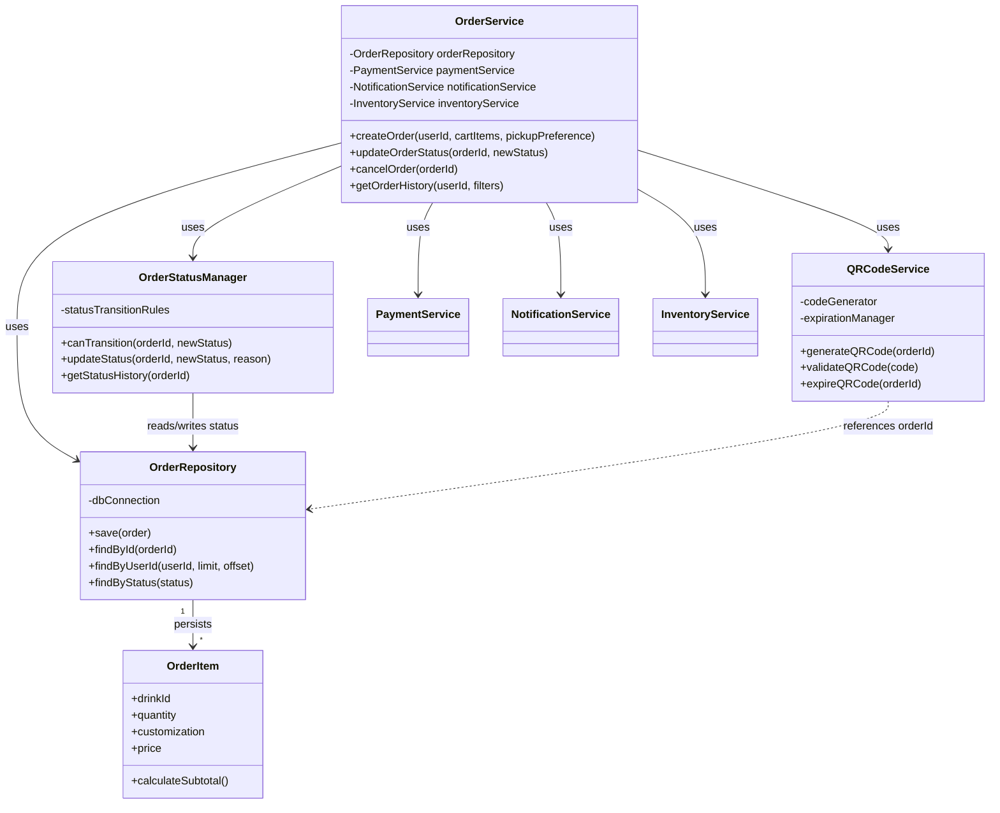
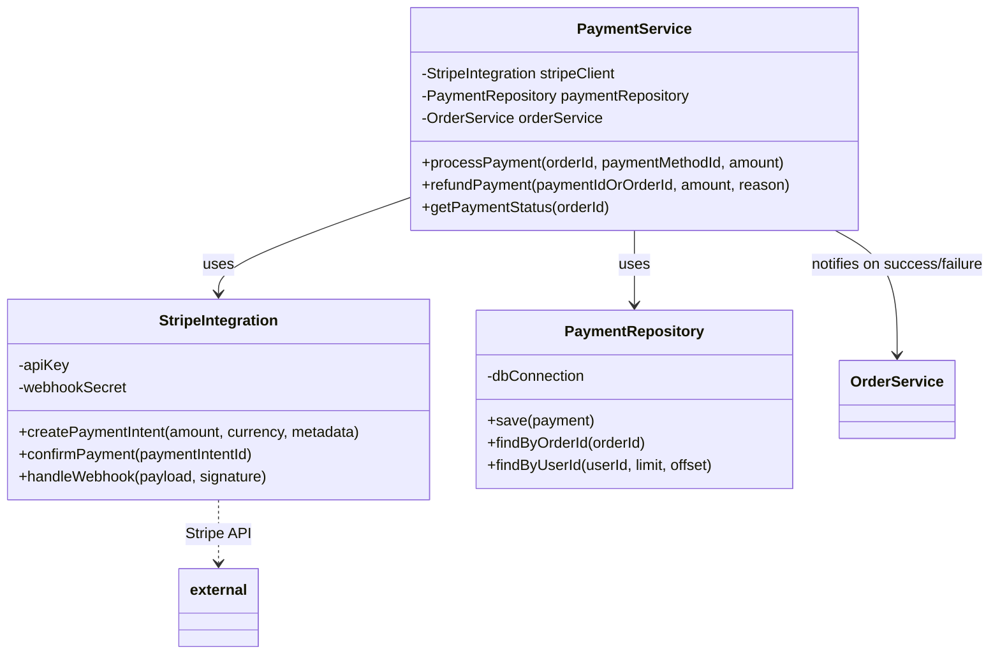

# Section 2: Order Management & Payment Subsystem

**Assigned to: Maddax**
---

## 2.1 Order Management Subsystem

### Subsystem Overview

The Order Management Subsystem is responsible for the full order lifecycle from creation through completion. It ensures that orders are created consistently, status changes follow valid transitions, and customers receive pickup credentials (QR codes) and notifications at the right times.

- **Purpose**: Handle order lifecycle from creation to completion; coordinate cart → payment → fulfillment → pickup.
- **Integration points**:
  - **User Management**: Resolve user/guest for order ownership and notifications.
  - **Catalog**: Resolve drink/product details and pricing for order items.
  - **Payment**: Trigger payment and react to payment success/failure before confirming the order.
  - **Notifications**: Send status updates (e.g., order confirmed, ready for pickup).
- **Key interfaces**: Order creation (cart + user + pickup preference), status updates (internal and from external triggers), and QR code generation/validation for pickup.

### Detailed Class Breakdown

#### `OrderService` class

- **Fields**
  - `orderRepository`: OrderRepository — persistence of orders and order items.
  - `paymentService`: PaymentService — process payment and refunds.
  - `notificationService`: NotificationService — send order status notifications.
  - `inventoryService`: InventoryService — reserve/release or check inventory for items.
- **Methods**
  - `createOrder(userId, cartItems, pickupPreference)`: Validates cart, checks inventory, creates order in PENDING state, triggers payment flow; on payment success finalizes order and triggers notification and QR generation.
  - `updateOrderStatus(orderId, newStatus)`: Delegates to OrderStatusManager for validity, then persists and sends notifications.
  - `cancelOrder(orderId)`: Validates cancellability, initiates refund if paid, updates status to CANCELLED, releases inventory, notifies user.
  - `getOrderHistory(userId, filters)`: Returns paginated list of orders for the user (via OrderRepository).
- **Responsibilities**: Order business logic and orchestration; single entry point for order operations used by API layer.

#### `OrderRepository` class

- **Fields**
  - `dbConnection`: Database connection/ORM session (e.g., Django ORM).
- **Methods**
  - `save(order)`: Persists order and its OrderItems; used for create and update.
  - `findById(orderId)`: Returns order with items by primary key.
  - `findByUserId(userId, limit, offset)`: Returns orders for a user (e.g., for history).
  - `findByStatus(status)`: Returns orders in a given status (e.g., for fulfillment queue).
- **Responsibilities**: Order and order-item data persistence; no business rules.

#### `OrderItem` class

- **Fields**
  - `drinkId`: Reference to catalog/drink.
  - `quantity`: int.
  - `customization`: JSON or structured object (e.g., syrups, add-ins).
  - `price`: Decimal (unit price at time of order).
- **Methods**
  - `calculateSubtotal()`: Returns `quantity * price` (or sum of line-level adjustments if any).
- **Responsibilities**: Represent a single line item in an order; immutable after order confirmation for auditability.

#### `OrderStatusManager` class

- **Fields**
  - `statusTransitionRules`: Map or table of allowed (currentStatus → newStatus) transitions.
- **Methods**
  - `canTransition(orderId, newStatus)`: Returns whether the order’s current status may transition to `newStatus`.
  - `updateStatus(orderId, newStatus, reason?)`: Performs transition (via OrderRepository), records in status history.
  - `getStatusHistory(orderId)`: Returns chronological list of status changes for the order.
- **Responsibilities**: Enforce order status state machine; prevent invalid transitions (e.g., CANCELLED → IN_PROGRESS).

#### `QRCodeService` class

- **Fields**
  - `codeGenerator`: Generates unique QR payload (e.g., UUID or signed token).
  - `expirationManager`: Tracks and enforces QR expiration (e.g., time-to-live after “ready for pickup”).
- **Methods**
  - `generateQRCode(orderId)`: Creates unique code, stores mapping orderId ↔ code and expiration, returns code/payload for display.
  - `validateQRCode(code)`: Returns orderId and validity (e.g., not expired, not already used); used at pickup.
  - `expireQRCode(orderId)`: Marks code as used or expired so it cannot be reused.
- **Responsibilities**: QR code generation and validation for pickup; no payment or order-creation logic.

### UML Class Diagram — Order Management Subsystem

- **Relationships**: OrderService orchestrates repositories and external services. OrderRepository persists aggregates that include OrderItems. OrderStatusManager and QRCodeService are used by OrderService and may interact with the same persistence (orders table) for status and QR metadata.

---

## 2.2 Payment Integration Subsystem

### Subsystem Overview

The Payment Integration Subsystem handles all payment processing for orders. It uses Stripe as the payment provider, keeps a local record of transactions for reconciliation and support, and supports refunds and webhook-driven status updates.

- **Purpose**: Process payments for orders, manage refunds, and keep payment status in sync with Stripe (e.g., via webhooks).
- **Integration**: Tight integration with Order Management—payment is triggered after order creation (pending) and order confirmation depends on payment success.
- **Key interfaces**: Create payment intent, confirm payment, handle Stripe webhooks, and query payment status for an order.

### Detailed Class Breakdown

#### `PaymentService` class

- **Fields**
  - `stripeClient`: StripeIntegration — Stripe API and webhook handling.
  - `paymentRepository`: PaymentRepository — local payment transaction records.
  - `orderService`: OrderService — to confirm or cancel order based on payment outcome.
- **Methods**
  - `processPayment(orderId, paymentMethodId, amount)`: Creates/confirms PaymentIntent via StripeIntegration, persists result in PaymentRepository; on success notifies OrderService to confirm order; on failure returns error for client.
  - `refundPayment(paymentId | orderId, amount?, reason?)`: Calls Stripe refund API, updates local record and optionally triggers order cancellation/partial refund flow via OrderService.
  - `getPaymentStatus(orderId)`: Returns current payment status for the order (from PaymentRepository, optionally refreshed from Stripe for disputed states).
- **Responsibilities**: Payment processing orchestration; single place for the rest of the app to request payments or refunds.

#### `StripeIntegration` class

- **Fields**
  - `apiKey`: Stripe secret key (from environment).
  - `webhookSecret`: Stripe webhook signing secret for verifying incoming events.
- **Methods**
  - `createPaymentIntent(amount, currency, metadata)`: Calls Stripe API; returns client_secret and payment_intent id for client-side confirmation.
  - `confirmPayment(paymentIntentId)`: Confirms the PaymentIntent server-side if needed; returns final status.
  - `handleWebhook(payload, signature)`: Verifies signature, parses event (e.g., payment_intent.succeeded, payment_intent.payment_failed), updates PaymentRepository and may call back into PaymentService/OrderService for order state updates.
- **Responsibilities**: All Stripe API communication and webhook verification; no direct order or business logic.

#### `PaymentRepository` class

- **Fields**
  - `dbConnection`: Database connection/ORM.
- **Methods**
  - `save(payment)`: Persists payment record (orderId, amount, stripe_payment_intent_id, status, etc.).
  - `findByOrderId(orderId)`: Returns payment(s) for an order (typically one per order).
  - `findByUserId(userId, limit, offset)`: Returns payment history for a user (e.g., receipts, support).
- **Responsibilities**: Payment transaction persistence; no card data stored (Stripe tokens/IDs only).

### UML Class Diagram — Payment Subsystem

- **Integration with Order Management**: PaymentService calls OrderService to confirm order on payment success or to support cancellation/refund flows. Order Management triggers PaymentService.processPayment when the user completes checkout.
- **External dependency**: StripeIntegration is the only class that talks to Stripe; all secrets and API details are encapsulated there.

### Payment tokenization approach

- **Choice**: Stripe Elements / Stripe.js on the client to tokenize card data; server only receives `payment_method` ID or similar and never touches raw card numbers.
- **Rationale**: Keeps the application and database out of PCI scope for card data; Stripe handles storage and tokenization. Server creates PaymentIntent and optionally confirms it; client uses Stripe’s SDK to confirm with 3DS if required.
- **Alternatives**: Custom tokenization on our server (increases PCI scope and risk—rejected). Stored payment methods (Stripe Customer + PaymentMethod) can be added later for “save card” without changing this tokenization approach.

### Webhook handling strategy

- **Choice**: Idempotent webhook handler that verifies signature, parses event type, and updates PaymentRepository and order state (via PaymentService/OrderService) in a single transaction where possible; duplicate events (same Stripe event id) are ignored or applied idempotently.
- **Rationale**: Stripe may retry webhooks; duplicate handling must be safe. Signature verification prevents spoofing. Updating our DB and order status in one place keeps order and payment consistent.
- **Implementation notes**: Store processed Stripe event IDs to reject duplicates; handle at least `payment_intent.succeeded`, `payment_intent.payment_failed`; consider idempotent order confirmation (e.g., “confirm order if still PENDING”) to avoid double-processing.
- **Alternatives**: Polling Stripe for status (higher latency and load; used only as fallback if webhooks are unreliable). Queue (e.g., Celery) for webhook handling to avoid timeouts and enable retries without blocking Stripe’s retry schedule.

---
