# CodePop User Manual (Easy Step-by-Step)

This manual is written for **non-technical users**. It explains **what each screen does**, **where to tap/click**, and what you should see.

## What this manual covers

- **Mobile App (Customer Frontend)**: store selection, drink building, cart, checkout, live tracking, preferences, support chatbot.
- **Web Dashboard**: manager dashboard and other role dashboards (Admin, Super Admin, Logistics, Repair, etc.).

## Quick visual guide (helps you find buttons fast)

### Mobile app common colors & layout

- **Most main action buttons** are **teal** with **white text** (example teal: `#1F7A8C`).  
Examples: **Start AI Drink Builder**, **Add to Cart**, **Pay Now**, **Login**, **Create Account**.
- **Big “header/hero” cards** are often **dark navy** (example: `#022B3A`) with **white text**.
- The **bottom navigation bar**:
  - Sits **at the bottom** of the screen in a rounded bar.
  - The **active tab** is a dark navy pill with **white** icon and label.

## Table of Contents

- [Mobile App (Customer Frontend)](#mobile-app-customer-frontend)
  - [How to move around (bottom tabs)](#how-to-move-around-bottom-tabs)
  - [1) Select a Store](#1-select-a-store-required-to-start)
  - [2) Login](#2-login-optional-but-recommended)
  - [3) Home](#3-home-your-main-starting-point)
  - [4) Order screen (Create Drink)](#4-order-screen-create-drink)
  - [5) Cart screen](#5-cart-screen-review-edit-pay)
  - [6) Tracking screen](#6-tracking-screen-live-status--eta--map)
  - [7) Preferences](#7-preferences-favorites)
  - [8) Support (Bob chatbot)](#8-support-bob-chatbot)
- [Web Dashboard](#web-dashboard-manager-dashboard--role-dashboards)
  - [Manager Dashboard](#manager-dashboard)
  - [Admin Dashboard](#admin-dashboard)
  - [Super Admin Dashboard](#super-admin-dashboard)
  - [Logistics Manager Dashboard](#logistics-manager-dashboard)
  - [Repair Staff Dashboard](#repair-staff-dashboard)
- [Most common tasks](#most-common-tasks-fast-checklist)
- [Troubleshooting](#troubleshooting)

---

## Mobile App (Customer Frontend)

### How to move around (bottom tabs)

Look at the bottom of the screen for the navigation bar. It has 5 tabs:

- **Home** (house icon)
- **Order** (cup icon) — drink builder
- **Cart** (cart icon)
- **Tracking** (location icon)
- **Support** (chat icon)

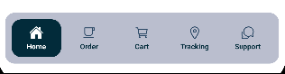

If you ever get lost, tap **Home**.

---

### 1) Select a Store (required to start)

#### Where you’ll see it

Usually on first launch: **Select a Store** screen.

#### What it looks like

- Title: **Select a Store**
- Subtitle: **Choose where you'd like to pick up your order**
- A list of store cards with:
  - Store name
  - Status badge: **🟢 Open** or **🔴 Closed**
  - Address (pin icon)
  - Hours (clock icon)
  - Staff count (people icon)
  - A teal button that says **Select Store** (or **✓ Selected** if already chosen)

#### Steps

1. Tap the store card you want.
2. A pop-up appears: **Success** → **Selected Store Name**
3. Tap **Continue** in the pop-up.

Tip: Selected stores usually show a **teal border** and a light tinted background.

---

### 2) Login (optional, but recommended)

You can place orders as a guest, but **Preferences** is designed for logged-in users.

#### Login screen

- Logo at the top
- Title text: **CodePop**
- Fields:
  - **Username**
  - **Password**
- Two teal buttons next to each other:
  - **Create Account**
  - **Login**

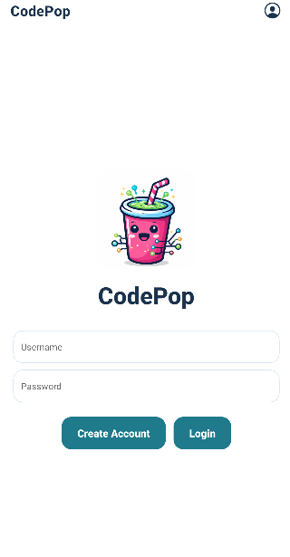

#### Create an account

1. On the login screen, tap **Create Account** (teal button).
2. Fill in:
  - **First Name**
  - **Username**
  - **Email**
  - **Password**
3. Tap **Create Account** (teal button).
4. You’ll return to the login screen. Tap **Login**.

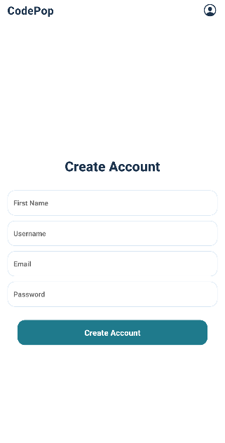

---

### 3) Home (your main starting point)

Tap the **Home** tab.

#### What you’ll see

##### A) Top “CodePop AI” hero card (dark navy)

- Small label: **CodePop AI**
- Title: **Build your next drink from a prompt**
- Big teal button (centered): **Start AI Drink Builder** (sparkles icon)

##### B) Quick action cards (two small cards below)

- Left card: **Track Order** (location icon)
  - Shows **Order #123** if you have one, or **No active order**
- Right card: **Cart** (cart icon)

##### C) Account card

You’ll see one of these depending on your state:

- **Logged in**: “Welcome back, Name” + **Logout** (teal button)
- **Guest**: “Browsing as Guest” + **Login** (teal button)
- **Not logged in**: “Sign in to save preferences…” + **Login** (teal button)

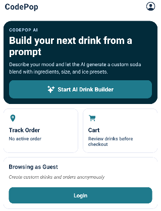

##### D) Drinks of The Day

- Header: **Drinks of The Day**
- 3 drink cards labeled **Drink #1**, **Drink #2**, **Drink #3**
- Each card has a teal button: **Add to Cart**

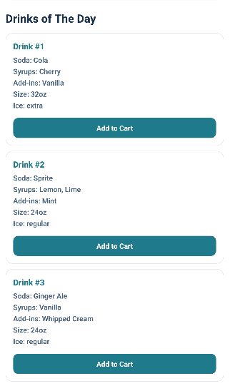

#### Common Home actions

##### Start building a drink

1. Tap **Start AI Drink Builder** (big teal button in the dark navy card).
2. You go to the **Order** screen from the navbar.

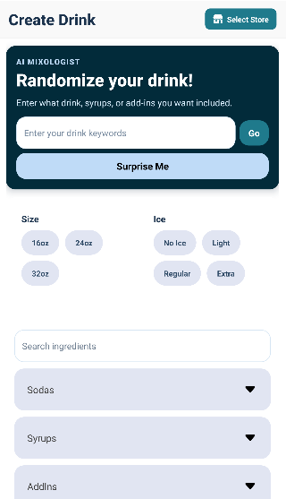

##### Track an order

1. Tap the **Track Order** button on the navbar.

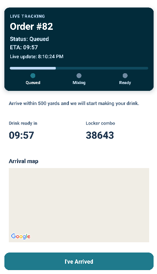

2. If you don’t have an order yet, you’ll see a message telling you to place one first.

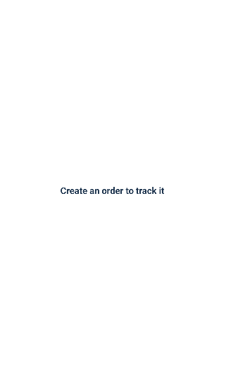

##### Add a daily drink to your cart

1. Scroll to **Drinks of The Day**
2. Tap **Add to Cart**
3. A pop-up appears: **Success** → **Drink added to cart!**
4. Tap **OK** to jump to **Cart**

##### Store prompt pop-up (when required)

If the app needs a store selection, it opens a bottom pop-up titled **Select a Store**.

- Tap a store row (storefront icon + name/address)
- Tap the **X** (top-right) to close without choosing

---

### 4) Order screen (Create Drink)

Tap the **Order** tab.

#### Top header area

- Left: title **Create Drink**
- Right: a small teal store button with a storefront icon (shows your store name or “Select Store”)
  - Tap it to change stores

---

#### Section A: AI Mixologist (top dark navy card)

What you’ll see:

- Label: **AI Mixologist**
- Title: **Randomize your drink!**
- Text: “Enter what drink, syrups, or add-ins you want included.”
- Text box placeholder: **Enter your drink keywords**
- Button to the right of the box: **Go** (teal).  
  - When generating, it shows **...**
- Button below: **Surprise Me**
  - This is usually a lighter blue button with dark text.

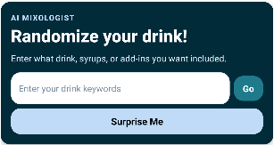

##### Use AI with a prompt (Go)

1. Tap the prompt box.
2. Type keywords (example: “cherry vanilla” or “fruity with light ice”).
3. Tap **Go** (teal button next to the box).
4. A result pop-up appears showing the generated drink.

##### Use AI randomly (Surprise Me)

1. Tap **Surprise Me**.
2. Wait for “Generating...” to finish.
3. A result pop-up appears.

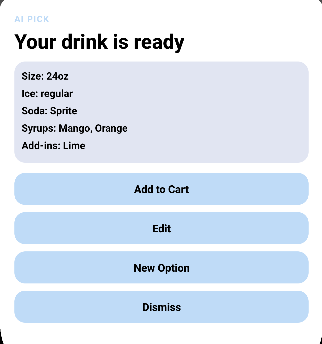

##### In the AI result pop-up

You’ll have options to continue (exact options may vary), typically:

- **Add to Cart**
- **New Option** / regenerate
- **Dismiss**

---

#### Section B: Build your drink manually

##### Step 1 — Choose Size

Look for the **Size** box with pill buttons:

- **16oz**, **24oz**, **32oz**

When selected, the pill turns **teal** with white text.

##### Step 2 — Choose Ice

Look for the **Ice** box with pill buttons:

- **No Ice**, **Light**, **Regular**, **Extra**

When selected, the pill turns **teal** with white text.

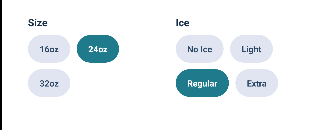

##### Step 3 — Choose ingredients (search + dropdowns)

1. Use the **Search ingredients** box to find items quickly.
2. Open each dropdown section:
  - **Sodas**
  - **Syrups**
  - **AddIns**
3. Tap items to select/deselect them.

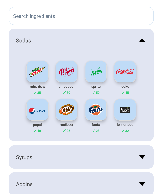

Inventory note:

- If the store has inventory data loaded, ingredients that are out of stock may not appear, and some may show low-stock cues.

##### “Current Drink” summary

Scroll down to see **Current Drink** showing:

- Size
- Ice
- Soda list
- Syrups list
- Add-ins list

---

#### Add your drink to Cart

At the bottom, tap **Add to Cart** (large teal button).

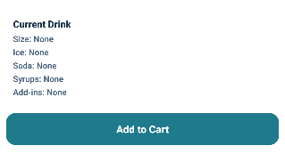

If something is missing, you may see an alert like:

- **Choose soda, size, and ice before adding your drink.**

When successful, you are taken to **Cart**.

---

### 5) Cart screen (review, edit, pay)

Tap the **Cart** tab.

#### Top header area

- Title: **Your Drinks**
- Top-right: teal store button (storefront icon + store name)

#### Drink cards (one per cart item)

Each drink card shows:

- Title like **24oz Drink**
- Details:
  - Soda
  - Ice
  - Syrups (if any)
  - Add-ins (if any)
- Price shown in bold (example: `$2.60`)

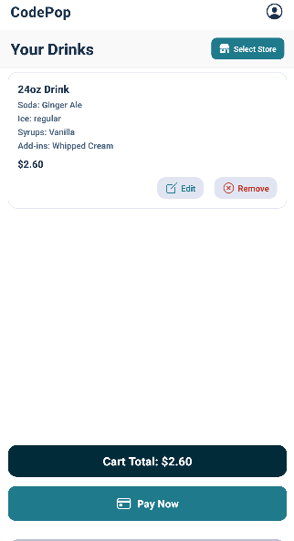

At the bottom-right of each drink card, you’ll see two small buttons:

- **Edit** (pencil icon, teal text)
- **Remove** (red text, close-circle icon)

##### Edit a drink

1. Tap **Edit** on the drink card.
2. Make changes.
3. Tap **Update** to save and return to Cart.

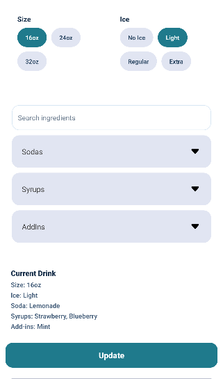

##### Remove a drink

1. Tap **Remove** on the drink card.
2. The drink disappears from your list.

#### Cart total

Below the list you’ll see:

- **Cart Total: $X.XX** displayed in a dark navy bar with white text.

#### Pay Now (checkout)

At the bottom, tap **Pay Now** (big teal button with a card icon).

If the app needs a store selection first:

- A **Select a Store** pop-up appears
- Tap a store row to continue (the payment flow may open right after)

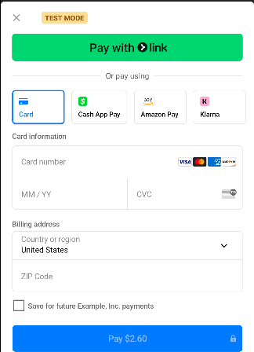

After checkout:

- The cart is cleared
- You are taken to **Tracking**

---

### 6) Tracking screen (live status + ETA + map)

Tap the **Tracking** tab.

#### If you have no order

You’ll see:

- **Create an order to track it**

#### If you have an order

At the top you’ll see a dark navy **Live Tracking** card showing:

- **Order #number**
- **Status**:  
  - **Queued** (pending)  
  - **Mixing** (processing)  
  - **Ready** (completed)
- **ETA** countdown timer (MM:SS)
- “Last update” line
- A progress bar and 3 dots labeled **Queued / Mixing / Ready**

#### Presentation fallback (network issues)

If the network is unstable, you may see:

- **Presentation fallback active**

This means the app is keeping the tracking screen readable while it reconnects. It will usually recover automatically.

#### “Arrival” message and button

Below the tracking card, you’ll see one of these:

- If you are close enough: **You are close by. The team is preparing your drink now.**
- If you are not close enough: **Arrive within 500 yards and we will start making your drink.**

If you are NOT nearby, you’ll see a big teal button:

- **I've Arrived**

Tap it if you’re at the store and want to continue.

#### Locker combo and map

You’ll also see:

- **Locker combo** (a 5-digit number)
- **Arrival map** with:
  - Store marker (teal pin)
  - Your marker (if location permission is allowed)

When the order is **Ready**, the button changes to:

- **Back To Home Page** (teal)

---

### 7) Preferences (favorites)

This helps save ingredient favorites.

#### If you are not logged in

- Message: **Login to create drink preferences**
- Button: **Login** (teal)

#### If you are logged in

- Title: **Name's Preferences**
- Dropdown sections:
  - **Sodas**
  - **Syrups**
  - **Add Ins**

##### How to use

1. Tap a dropdown title to open it.
2. Tap items to toggle on/off.
  - Tapping again removes it.

---

### 8) Support (Bob chatbot)

Tap the **Support** tab.

#### What it looks like

- Title: **Complain to Bob**
- Chat bubbles:
  - Bob (bot): light gray/purple bubble
  - You: teal bubble with white text
- Bottom:
  - Text box: **Type your complaint...**
  - Send button (paper-plane icon) in a teal square

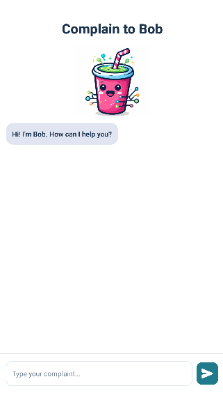

#### Steps

1. Tap the message box and type what happened.
2. Tap the **send** icon.
3. Wait for Bob’s response.

Sometimes Bob may help locate your order and route you to **Tracking** automatically.

---

## Web Dashboard (Manager Dashboard + Role Dashboards)

### 1) Login

1. Open the dashboard website.
2. Enter **username** and **password**.
3. Click **Sign in**.

### 2) How the dashboard is laid out

The dashboard home page can show **multiple dashboard sections stacked vertically** (one per role).  
If you don’t see what you need, **scroll down**.

You’ll also see a **Sign out** button near the top of the page.

---

## Web Dashboard by Role (what to click)

### Manager Dashboard

This is the “store operations” view.

#### Store selector

Near the top of the Manager Dashboard:

- Label: **Store**
- Dropdown like **Store 1**, **Store 2**, … up to **Store 12**

Changing this updates the data below.

#### Store Revenue Reports

- Shows a revenue message and a chart placeholder.
- If you don’t have permission, you’ll see a note explaining revenue requires an admin account.

#### Low Inventory Notifications

You may see:

- Orbit reorder notifications list (if any)
- Alerts list with item name and current quantity vs threshold

Items with high severity can appear in a stronger warning style.

#### Order Inventory When Low

This section includes:

- **Item** dropdown
- **Quantity** input
- Buttons:
  - **Restock hint** (explains how restocking is handled in your system)
  - **Reset to alert** (prefills item/quantity from the current alert)

#### Inventory & Usage Reports

- Table shows **Item** and **On Hand**
- “Usage (30d)” and “Trend” may show **—** (placeholders)

#### AI Supply Ordering Recommendations

- May list suggestions, or say it’s unavailable.
- Buttons **Apply Recommendations** and **Export** are visible but typically **disabled**.

---

### Admin Dashboard

Admins manage inventory, users, reports, notifications, and audit history.

#### Inventory Tracking (edit quantities)

- Section title: **Inventory Tracking**
- There is a **Refresh** button near the section header.
- Table columns include: Item, Type, Qty, Threshold, Status, Save

**To change an inventory quantity**

1. Find the item row.
2. Click inside the **Qty** box.
3. Type the new number.
4. Click **Save** (small outline-style button on that row).
5. Use **Refresh** if you want to reload from the backend.

#### User accounts (change roles, delete users)

- Section title: **User accounts**
- There is a **Refresh** button near the section header.

**To change a user’s role**

1. Find the user row.
2. Open the **Role** dropdown.
3. Pick the new role.
4. Click **Save role**.

Note: you cannot change your own role.

**To delete a user**

1. Click **Delete**
2. Confirm the pop-up

#### Cost tracking (inventory report)

- Section title: **Cost tracking (inventory report)**
- Click **Refresh**
- Click **Export report CSV** to download the report

#### Revenue totals

- Section title: **Revenue totals**
- Click **Refresh** to reload last-30-days totals

#### Complaints & inbound messages

- Section title: **Complaints & inbound messages**
- Click **Refresh** to reload
- Complaint-like rows may show a subtle highlighted background

#### Inventory audit

- Section title: **Inventory audit (derived)**
- Read-only table showing recent changes

---

### Super Admin Dashboard

Super Admins can see the widest set of system tools (multi-store reporting, system reports, and user creation).

Typical actions you’ll see:

- KPI tiles (big numbers)
- Store checkboxes to set report scope
- Buttons like **Refresh report** and **Export CSV**
- Create user form (username/password/email/name/role)

Some builds include “preview” links for other dashboards; these are for viewing layout and do not override permissions.

---

### Logistics Manager Dashboard

Used for transfers/assignments and planning.

You may see:

- Region/store context picker
- Inventory sections
- CSV upload + preview
- Transfers list with a **Status** dropdown
- Export buttons

Some schedule/forecast tools may be visible but disabled (placeholders).

---

### Repair Staff Dashboard

Used for maintenance workflows.

You may see:

- Assigned machines with status filters
- Update status form (select machine, status, reason, submit)
- History table with paging controls
- CSV import + export buttons

Some optimized planning tools may be visible but disabled (placeholders).

---

## “Most common tasks” (fast checklist)

### Place an order (mobile)

1. Select a store (if prompted)
2. Tap **Order**
3. Choose **Size**, **Ice**, and at least **one Soda**
4. Tap **Add to Cart**
5. Tap **Cart**
6. Tap **Pay Now**
7. Tap **Tracking** to watch ETA and status

### Add a daily special (mobile)

1. Tap **Home**
2. Scroll to **Drinks of The Day**
3. Tap **Add to Cart**
4. Tap **OK** to open Cart

### Update inventory quantity (web, Admin)

1. Scroll to **Admin Dashboard**
2. In **Inventory Tracking**, edit the **Qty** box
3. Click **Save**
4. Click **Refresh** if needed

---

## Troubleshooting

### “No active order” / “Create an order to track it”

- You haven’t completed checkout yet.
- Place an order from **Cart → Pay Now**, then return to **Tracking**.

### Tracking shows “Presentation fallback active”

- The network is unstable.
- Leave the Tracking screen open; it should recover automatically.

### I can’t find the store button (mobile)

- On **Order** and **Cart**, it’s the small **teal button on the top-right** of the header (storefront icon).
- If you see a **Select a Store** pop-up, choose a store row there.

